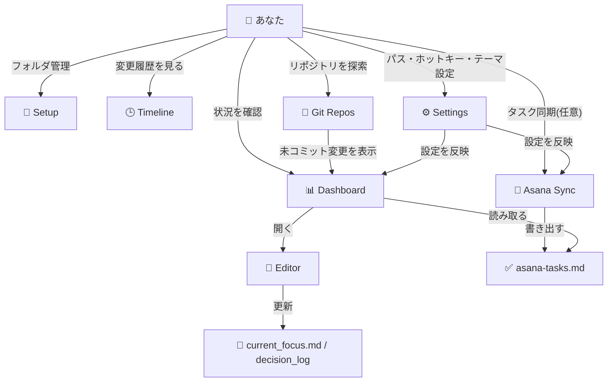
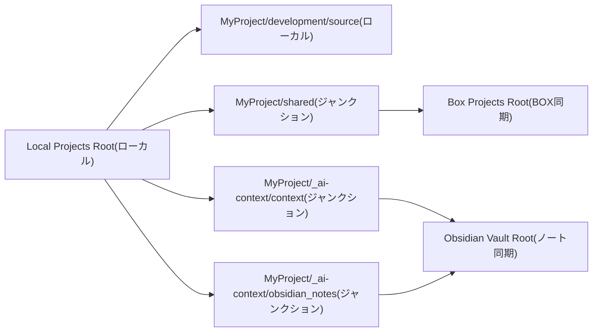
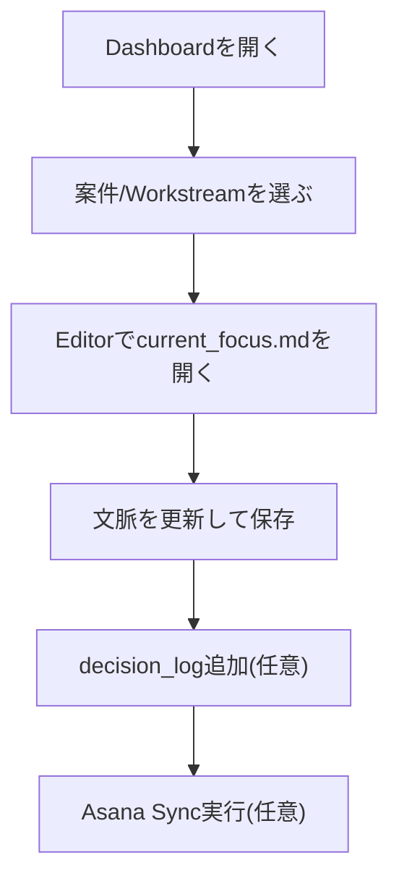

# ProjectCurator


複数のプロジェクトを横断管理する、Windows向けデスクトップアプリです。

## このアプリで何が便利になるか

ProjectCurator は、次の「面倒な行き来」を減らすためのツールです。

- プロジェクトの状態確認: フォルダを開き回らなくても、Dashboardで全体の鮮度とタスクを一望
- コンテキスト編集: `current_focus.md` や `decision_log` を専用Editorで素早く更新
- Asana連携: タスクをMarkdownへ同期して、プロジェクト状況を追いやすく管理

「複数案件を同時に進めると、どこを見るべきか迷う」を減らし、今やることに集中できます。

## こんな人向け
- 複数プロジェクトを並行して進めている
- Asanaタスクをプロジェクト文脈(Markdown)で管理したい

## 機能マップ



## 5分で使い始める

### 1. GitHub Releases からアプリをダウンロード

- 最新の GitHub Release を開く
- Windows 向けビルド(`.exe` または `.zip`)をダウンロード
- 任意のフォルダに配置(例: `C:\Tools\ProjectCurator\`)
- `.zip` の場合は展開してから使う

### 2. `ProjectCurator.exe` を起動

- `ProjectCurator.exe` をダブルクリック
- Windows SmartScreen が出る場合は `詳細情報` -> `実行`

### 3. 最初に設定する場所

`Settings` で以下を設定して保存します。

- `Local Projects Root`
- `Box Projects Root`
- `Obsidian Vault Root`

保存時に必要な設定ファイルは自動生成されます。

### 4. Asana連携の初期設定(任意)

<details>
<summary>Asana設定手順を表示</summary>

- Asanaトークンは Developer Console(`https://app.asana.com/0/my-apps`)で作成・確認
- `Settings` を開いて Asana のグローバル値を入力
  - `asana_token`
  - `workspace_gid`
  - `user_gid`
- `Asana Sync` を開く
- 必要ならスケジュールを有効化して保存
- 手動同期を1回実行してタスクファイルを作成/更新

</details>

### 5. まず使うページ

- `Dashboard`: 今日見るべきプロジェクトを把握
- `Editor`: `current_focus.md` を更新
- `Asana Sync` (任意): タスクを同期してToday Queueへ反映

## フォルダ構成(ローカル管理 / BOX同期)



```text
Local Projects Root/
└── MyProject/
    ├── development/
    │   └── source/                  # ローカル作業用リポジトリ(BOX外)
    ├── shared/                      # ジャンクション -> Box Projects Root/MyProject/
    │   ├── _work/
    │   │   ├── <workstream-id>/      # Setupタブで作る Workstream ごとの共有作業ディレクトリ
    │   │   └── 2026/
    │   │       └── 202603/
    │   │           └── 20260321_fix-login-bug/
    │   │                                 # Command Palette の resume で作る日付管理ディレクトリ
    │   ├── docs/                    # 共有ドキュメント(例)
    │   └── assets/                  # 共有素材(例)
    └── _ai-context/
        ├── context/                 # ジャンクション -> Obsidian Vault Root/Projects/MyProject/ai-context/
        └── obsidian_notes/          # ジャンクション -> Obsidian Vault Root/Projects/MyProject/
```

要点:
- `development/source/` はローカル作業領域です。
- `shared/` は BOX 側のパスにリンクして管理します。
- `_ai-context/` 配下は Obsidian 側パスにリンクして扱います。
- `shared/_work/<workstream-id>/` は Workstream 単位の共有作業に使います。
- 日付管理の作業フォルダ例: `shared/_work/2026/202603/20260321_fix-login-bug/`

## 日々のおすすめ運用フロー

1. `Dashboard` を開く
2. 気になるプロジェクト/Workstreamをクリックして `current_focus.md` を開く
3. `Editor` で更新して `Ctrl+S` で保存
4. 必要なら `decision_log` を1件追加
5. Asanaを使う場合は `Asana Sync` を実行してToday Queueを更新



## Daily Standup 自動生成

ProjectCurator には、standup の自動生成機能があります。

- アプリ起動時に開始し、その後は1時間ごとにチェック
- 当日ファイルが未作成の場合のみ生成(冪等)
- 出力先: `{ObsidianVaultRoot}\standup\YYYY-MM-DD_standup.md`
- Command Palette の `standup` コマンドで手動生成/オープンも可能

生成内容は次の3セクションです。
- `Yesterday` (focus history / decision log / 完了済みAsanaタスク)
- `Today` (優先度の高いToday Queue項目)
- `This Week` (今週対応予定のQueue項目)

## 主要機能

| ページ | 何ができるか |
|---|---|
| Dashboard | プロジェクトヘルス、Today Queue、Workstreamごとの状況確認 |
| Editor | コンテキスト用Markdown編集、検索、リンクジャンプ、decision_log追加 |
| Timeline | 最近の変更履歴を時系列で確認 |
| Git Repos | ワークスペース内のGitリポジトリを再帰スキャン |
| Asana Sync | Asanaタスクをプロジェクト別/Workstream別Markdownに同期 |
| Setup | プロジェクト作成、構成チェック、Tier変換、Workstream管理 |
| Settings | テーマ、ホットキー、パス、自動更新設定 |

## キーボードショートカット(よく使うもの)

| Shortcut | Action |
|---|---|
| `Ctrl+K` | Command Paletteを開く |
| `Ctrl+1` - `Ctrl+7` | 各ページへ移動 |
| `Ctrl+S` | Editorで保存 |
| `Ctrl+F` / `F3` / `Shift+F3` | Editor検索 |
| `Ctrl+Shift+P` | アプリ表示/非表示(既定) |

## Asana連携(任意)

Asanaを使う場合のみ設定します。

### Asana Sync タブの設定手順

1. `Settings` で Asana 連携を有効にし、必要項目を保存する
2. `Asana Sync` タブを開き、同期対象プロジェクトを選ぶ
3. まず `Run Sync` を1回実行する
   - 成功すると、次のファイルが更新されます
   - `_ai-context/obsidian_notes/asana-tasks.md`
   - 必要に応じて `_ai-context/obsidian_notes/workstreams/<id>/asana-tasks.md`
4. `Dashboard` に戻り、Today Queue を確認する
   - Today Queue は上記 `asana-tasks.md` を読み取って表示します
5. 定期同期したい場合だけ `Enable Schedule` を ON にする
6. 同期間隔を選び、`Save Schedule` を押す

うまく表示されないとき:
- `Run Sync` 実行後に `asana-tasks.md` が更新されているか確認
- `Dashboard` を再読み込みして Today Queue を更新

補足(通常は直接編集不要):
- Asana の設定値は `Documents\Projects\_config\asana_global.json` に保存されます
- プロジェクト単位の詳細設定は `{BoxProject}\asana_config.json` に保存されます

## 設定ファイル

`ConfigService` は次のフォルダを利用します。

```text
%USERPROFILE%\Documents\Projects\_config\
├── settings.json
├── hidden_projects.json
├── asana_global.json
└── pinned_folders.json
```

`settings.json` / `asana_global.json` は `.gitignore` 対象です。

## 前提環境

- Windows
- .NET 9 Runtime(ソースビルドする場合はSDK)
- Git
- PowerShell 7+
- Python 3.10+(Asana同期を使う場合)

## 技術スタック

- .NET 9 + WPF
- wpf-ui 3.x
- AvalonEdit
- CommunityToolkit.Mvvm
- Microsoft.Extensions.DependencyInjection

## 補足

- アプリはシステムトレイ常駐が基本です。
- 通常の閉じる操作は最小化(終了しません)。
- `Shift` を押しながら閉じると完全終了します。
