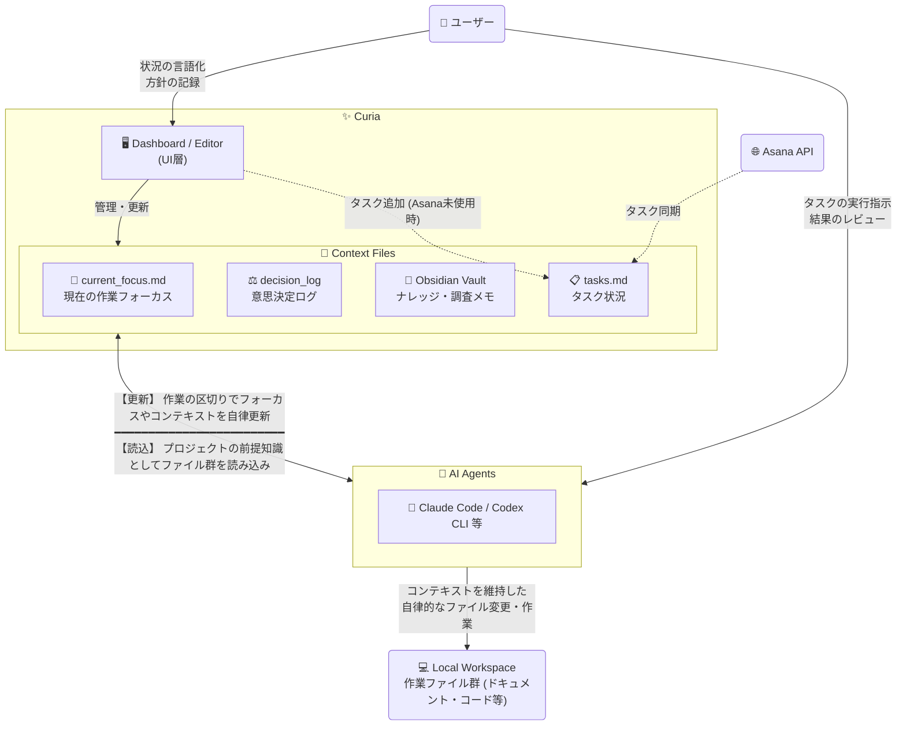

# Curia

プロジェクトの横断管理や複雑なコンテキストの維持を支援する、Windows向けデスクトップアプリです。

https://github.com/user-attachments/assets/092f578e-d4bf-4b08-90dd-7b4d151ab0a7

## こんな人向け

- 複数プロジェクトを並行して進めている、または複雑な単一プロジェクトを長期管理している
- AIエージェント(Claude Code等)に渡すコンテキストを日頃から整備したい
- プロジェクト状態をDashboardで俯瞰しながら、`current_focus.md` と `decision_log` を中心に文脈を積み上げていきたい

Asana連携は任意です。タスクツールを使わなくてもコンテキストマネージャーとして単独で機能します。

## 主要機能

| ページ | 何ができるか |
|---|---|
| Dashboard | プロジェクトヘルス、Today Queue、AI機能有効時はWhat's Nextによる優先アクション提案 |
| Editor | コンテキスト用Markdown編集、AI機能有効時はフォーカス自動更新・意思決定ログ生成・会議メモ取り込み |
| Timeline | 最近の変更履歴を時系列で確認 |
| Wiki | ソースを取り込み LLM がナレッジベースを自動構築。Query で Wiki に質問、Lint で整合性チェック |
| Git Repos | ワークスペース内のGitリポジトリを再帰スキャン |
| Asana Sync | Asanaタスクをプロジェクト別/Workstream別Markdownに同期 |
| Agent Hub | サブエージェント/コンテキストルールのライブラリ管理と、CLI別Deploy/Undeploy |
| Setup | プロジェクト作成、構成チェック、Tier変換、Workstream管理 |
| Settings | ホットキー、ワークスペースルート、LLM API設定 |

## 画面イメージ

| Dashboard | Editor |
|---|---|
|  |  |

| Agent Hub | Wiki |
|---|---|
|  |  |

| AI: What's Next | AI: Import Meeting Notes |
|---|---|
|  |  |

全ページのスクリーンショットと操作ガイドは[画面ガイド](docs/ui-guide-ja.md)を参照してください。

## 5分で使い始める

### 1. GitHub Releases からアプリをダウンロード

- [最新の GitHub Release](https://github.com/yt3trees/Curia/releases) を開く
- `.zip` ファイルをダウンロード
- 任意のフォルダに展開(例: `C:\Tools\Curia\`)

### 2. `Curia.exe` を起動

- `Curia.exe` をダブルクリック
- Windows SmartScreen が出る場合は `詳細情報` -> `実行`

### 3. 最初に設定する場所

`Settings` で以下を設定して保存します。
※Box等の同期アプリやObsidianを使わない場合は、PC上の任意のローカルフォルダを指定するだけで動作します。

- `Local Projects Root` (ローカル作業用の親フォルダ)
- `Cloud Sync Root` (クラウド同期される共有フォルダの親)
- `Obsidian Vault Root` (Obsidianの保管庫、またはただのメモ用フォルダの親)

保存時に必要な設定ファイルは自動生成されます。

### 4. Asana連携の初期設定(任意)

詳細な設定手順は [Asana連携設定](docs/asana-setup-ja.md) を参照してください。

### 5. LLM / AI機能の初期設定(任意)

OpenAI / Azure OpenAI / Claude Code CLI / Gemini CLI / Codex CLI / GitHub Copilot CLI に対応しています。詳細な設定手順は [AI機能](docs/ai-features-ja.md#setup-ja) を参照してください。

### 6. 最初のプロジェクトを作成する

1. `Setup` ページを開く
2. `Project Name` にプロジェクト名を入力 (例: `TestProject`)
3. `Setup Project` ボタンをクリック (フォルダ構成や必要な Markdown ファイルが一式自動生成されます)
4. `Dashboard` に移動して、作成したプロジェクトを確認
5. `Editor` で `current_focus.md` を開いて作業を開始

これで準備は完了です。必要に応じて Asana Sync 等を設定してください。

## 前提環境

- Windows
- Git
- ソースからビルドする場合のみ .NET 9 SDK が必要(リリース版は自己完結型のため Runtime 不要)

技術スタック: .NET 9 + WPF, wpf-ui 3.x, AvalonEdit, CommunityToolkit.Mvvm

## ドキュメント

- [日々のワークフロー](docs/daily-workflow-ja.md) - おすすめ運用フロー、主要コンテキストファイル、機能マップ
- [AI機能](docs/ai-features-ja.md) - LLM設定、What's Next、Decision Log、会議メモ取り込み、Quick Capture
- [Wiki機能](docs/wiki-features-ja.md) - プロジェクトナレッジベースの構築: ソース取り込み、質問応答、Lintによる品質チェック
- [AIエージェント協業 & Agent Hub](docs/ai-agent-collaboration-ja.md) - Claude Code / Codex CLIとの連携、コンテキストファイルの運用、エージェント定義・ルールのライブラリ管理
- [画面ガイド](docs/ui-guide-ja.md) - 全ページのスクリーンショットと操作ガイド
- [Asana連携設定](docs/asana-setup-ja.md) - 認証情報、同期設定、Asana Syncページのリファレンス
- [フォルダ構成](docs/folder-layout-ja.md) - プロジェクトフォルダ構成、ジャンクション、Setupが生成するもの
- [設定リファレンス](docs/configuration-ja.md) - 設定ファイル一覧、キーボードショートカット

## 補足

- アプリはシステムトレイ常駐が基本です。
- 通常の閉じる操作は最小化(終了しません)。
- `Shift` を押しながら閉じると完全終了します。
