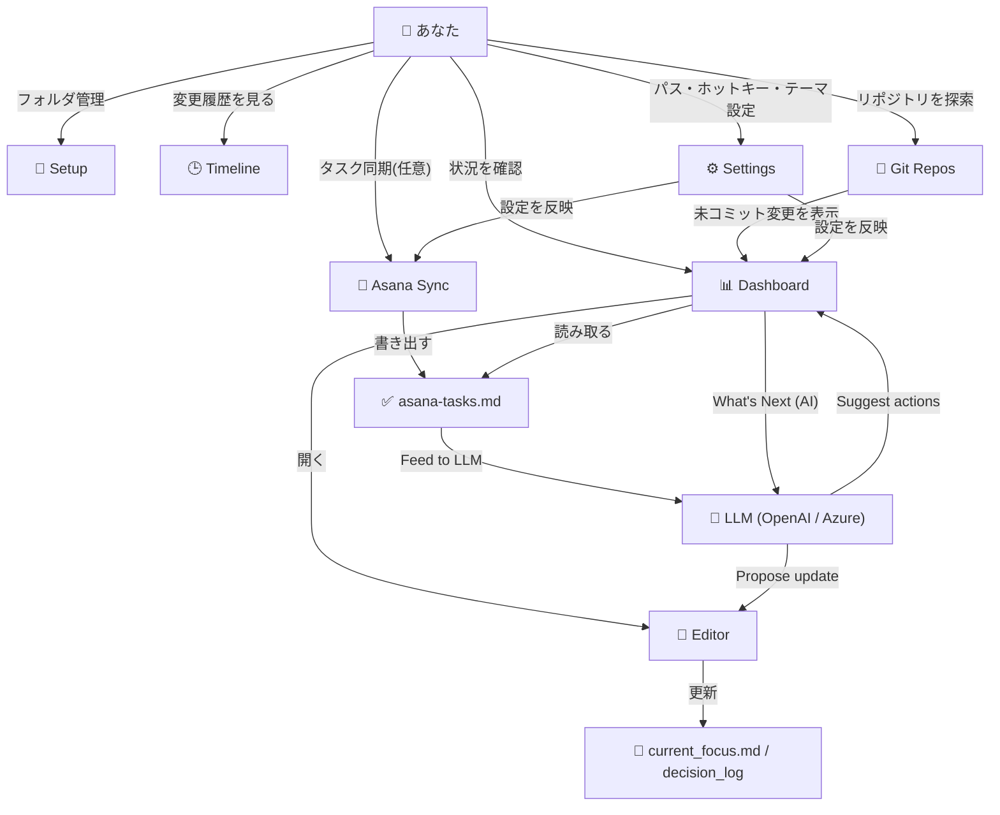
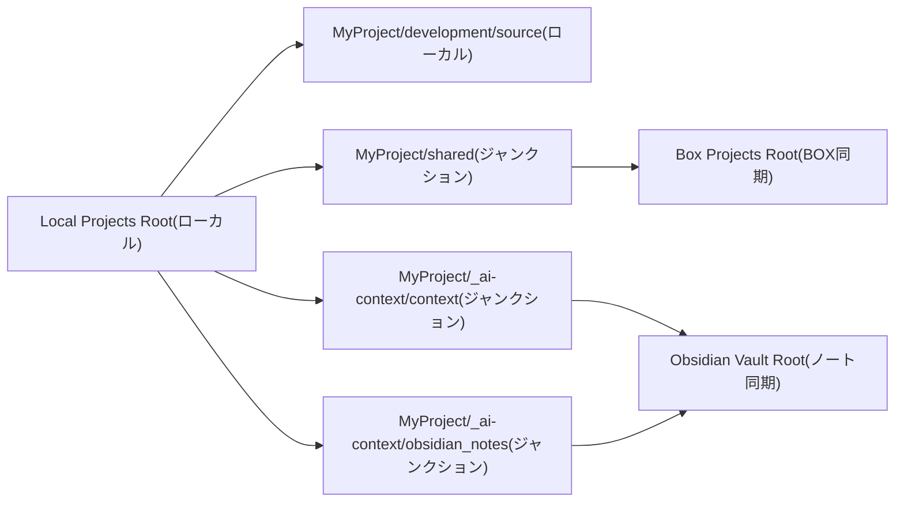
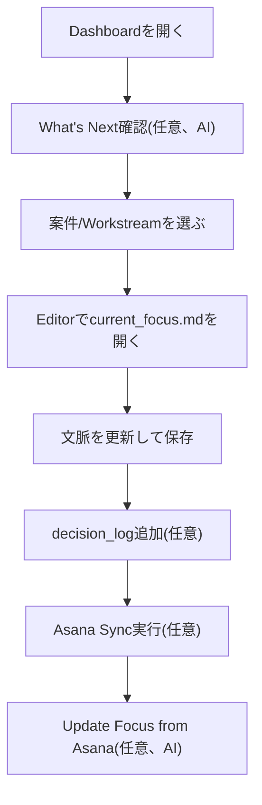
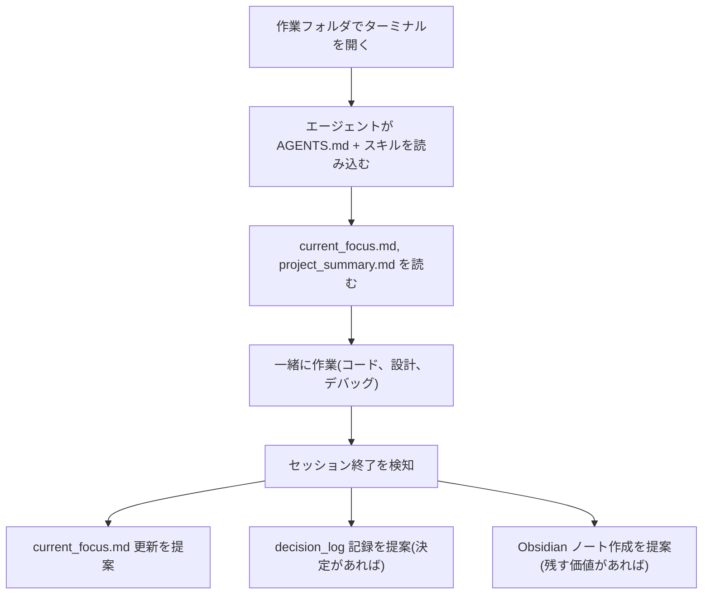

# ProjectCurator


複数のプロジェクトを横断管理する、Windows向けデスクトップアプリです。


## このアプリで何が便利になるか

ProjectCurator は、次の「面倒な行き来」を減らすためのツールです。

- プロジェクトの状態確認: フォルダを開き回らなくても、Dashboardで全体の鮮度とタスクを一望
- コンテキスト編集: `current_focus.md` や `decision_log` を専用Editorで素早く更新
- Asana連携: タスクをMarkdownへ同期して、プロジェクト状況を追いやすく管理

「複数案件を同時に進めると、どこを見るべきか迷う」を減らし、今やることに集中できます。

## こんな人向け
- 複数プロジェクトを並行して進めている
- Asanaタスクをプロジェクト文脈(Markdown)で管理したい

## 機能マップ



## 5分で使い始める

### 1. GitHub Releases からアプリをダウンロード

- [最新の GitHub Release](https://github.com/yt3trees/ProjectCurator/releases) を開く
- `.zip` ファイルをダウンロード
- 任意のフォルダに展開(例: `C:\Tools\ProjectCurator\`)

### 2. `ProjectCurator.exe` を起動

- `ProjectCurator.exe` をダブルクリック
- Windows SmartScreen が出る場合は `詳細情報` -> `実行`

### 3. 最初に設定する場所

`Settings` で以下を設定して保存します。

- `Local Projects Root` (ローカル作業用の親フォルダ)
  例: `C:\Users\<あなたのユーザー名>\Documents\Projects`
- `Box Projects Root` (BOX同期される共有フォルダの親)
  例: `C:\Users\<あなたのユーザー名>\Box\Projects`
- `Obsidian Vault Root` (Obsidian保管庫の親フォルダ)
  例: `C:\Users\<あなたのユーザー名>\Box\ObsidianVault`

保存時に必要な設定ファイルは自動生成されます。

### 4. Asana連携の初期設定(任意)

<details>
<summary>Asana設定手順を表示</summary>

- Asanaトークンは Developer Console(`https://app.asana.com/0/my-apps`)で作成・確認
- `Settings` を開いて Asana のグローバル値を入力
  - `asana_token`
  - `workspace_gid`
  - `user_gid`
- `Asana Sync` を開く
- 必要ならスケジュールを有効化して保存
- 手動同期を1回実行してタスクファイルを作成/更新

</details>

### 5. LLM / AI機能の初期設定(任意)

<details>
<summary>LLM設定手順を表示</summary>

- `Settings` を開き `LLM API` セクションを見つける
- プロバイダーを選択: `openai` または `azure_openai`
- API Key、Model、(Azure の場合は) Endpoint と API Version を入力
- `Test Connection` をクリックして接続を確認
- テストが成功したら `Enable AI Features` をオンにして保存
- Dashboard のツールバーに `What's Next` ボタン(💡)が表示される
- Editor のツールバーに `Update Focus from Asana` ボタンと `AI Decision Log` ボタンが表示される

</details>

### 6. まず使うページ

- `Setup`: まず、Setupページの機能で作業環境を準備する
  - `Setup Project` / `Check` で、プロジェクトフォルダと `_work` 作業場所を作成または確認する
  - Setupのオプションで、共有用フォルダとAIコンテキスト用フォルダのリンク設定を行う
  - 準備後に `Dashboard` と `Editor` で対象プロジェクトを開いて作業開始する
- `Dashboard`: 今日見るべきプロジェクトを把握
- `Editor`: `current_focus.md` を更新
- `Asana Sync` (任意): タスクを同期してToday Queueへ反映

## フォルダ構成(ローカル管理 / BOX同期)



```text
Local Projects Root/
└── MyProject/
    ├── development/
    │   └── source/                  # ローカル作業用リポジトリ(BOX外)
    ├── shared/                      # ジャンクション -> Box Projects Root/MyProject/
    │   ├── _work/
    │   │   ├── <workstream-id>/      # Setupタブで作る Workstream ごとの共有作業ディレクトリ
    │   │   └── 2026/
    │   │       └── 202603/
    │   │           └── 20260321_fix-login-bug/
    │   │                                 # Command Palette の resume で作る日付管理ディレクトリ
    │   ├── docs/                    # 共有ドキュメント(例)
    │   └── assets/                  # 共有素材(例)
    └── _ai-context/
        ├── context/                 # ジャンクション -> Obsidian Vault Root/Projects/MyProject/ai-context/
        └── obsidian_notes/          # ジャンクション -> Obsidian Vault Root/Projects/MyProject/
```

要点:
- `development/source/` はローカル作業領域です。
- `shared/` は BOX 側のパスにリンクして管理します。
- `_ai-context/` 配下は Obsidian 側パスにリンクして扱います。
- `shared/_work/<workstream-id>/` は Workstream 単位の共有作業に使います。
- 日付管理の作業フォルダ例: `shared/_work/2026/202603/20260321_fix-login-bug/`

## 日々のおすすめ運用フロー

1. `Dashboard` を開く
2. AI機能が有効な場合は What's Next ボタン(💡)をクリックして、全プロジェクト横断の優先アクション提案を確認
3. 気になるプロジェクト/Workstreamをクリックして `current_focus.md` を開く
4. `Editor` で更新して `Ctrl+S` で保存
5. 必要なら `decision_log` を1件追加(AI機能有効時は Dec Log ボタンでAI支援ダイアログが開く)
6. Asanaを使う場合は `Asana Sync` を実行してToday Queueを更新
7. AI機能が有効な場合は `Update Focus from Asana` ボタンでLLMによる更新提案を取得



## AIエージェント協業 (Claude Code / Codex CLI)

ProjectCurator は Claude Code や Codex CLI などの AI コーディングエージェントとの協業を前提に設計されています。

### 仕組み

ProjectCurator で管理されるプロジェクトには、プロジェクトルートに `AGENTS.md` と `.claude/skills/`(および `.codex/skills/`)にスキル定義が配置されます。日付管理の作業フォルダ内でターミナルを開くと:

```
shared/_work/2026/202603/20260321_fix-login-bug/
```

Claude Code や Codex CLI は上位ディレクトリの `AGENTS.md` とスキル定義を自動的に読み込みます。これにより、エージェントは以下を把握した状態で作業を開始します:

- プロジェクト構成と主要パス
- AIコンテキストファイル(`current_focus.md`、`decision_log`、`tensions.md`)
- Obsidian Knowledge Layer のノート
- Asana タスク(同期済みの場合)

### エージェントの自律的な動作

組み込みスキルにより、明示的なコマンドなしで以下が自動的に行われます:

| スキル | 動作 |
|---|---|
| context-session-end | 作業の区切りを検知し、`current_focus.md` への追記を `[AI]` プレフィックス付きで提案 |
| context-decision-log | 会話中の暗黙の意思決定を検出し、`decision_log/` への構造化記録を提案 |
| obsidian-knowledge | セッション要約、技術メモ、会議記録などの Obsidian への記録を提案 |
| update-focus-from-asana | Asana タスク状況を `current_focus.md` に反映するスラッシュコマンド |

すべての提案はユーザーの承認後に書き込まれます。既存の人間が書いた内容は変更しません。

### エージェントのセッションフロー



### スキルの配置

ProjectCurator は Setup ページでプロジェクト作成・チェック時にスキルファイルを自動配置します:

- `.claude/skills/` (Claude Code 用)
- `.codex/skills/` (Codex CLI 用)

スキルはアプリ内蔵の `Assets/ContextCompressionLayer/skills/` から配置され、ジャンクション経由で共有フォルダと同期されます。

## 主要機能

| ページ | 何ができるか |
|---|---|
| Dashboard | プロジェクトヘルス、Today Queue、Workstreamごとの状況確認、AI機能有効時はWhat's Nextによる全プロジェクト横断の優先アクション提案 |
| Editor | コンテキスト用Markdown編集、検索、リンクジャンプ、decision_log追加、AI機能有効時は "Update Focus from Asana" と "AI Decision Log" ボタンで自動更新・意思決定ログ生成 |
| Timeline | 最近の変更履歴を時系列で確認 |
| Git Repos | ワークスペース内のGitリポジトリを再帰スキャン |
| Asana Sync | Asanaタスクをプロジェクト別/Workstream別Markdownに同期 |
| Setup | プロジェクト作成、構成チェック、Tier変換、Workstream管理 |
| Settings | テーマ、ホットキー、パス、自動更新設定、LLM API設定、AI機能の有効/無効切り替え |

## 画面イメージ

### Dashboard

全プロジェクトのヘルス状態、更新鮮度、Today Queueを一画面で確認できます。


<details>
<summary>Dashboard の詳細</summary>


- 上部バーでは、手動更新(`↻`)、自動更新(`Off / 10 / 15 / 30 / 60 min`)、非表示プロジェクトの表示切り替えができます。
- AI機能が有効な場合、上部バーに What's Next ボタン(💡)が表示されます。クリックすると全プロジェクトのシグナル(期限超過タスク・focusファイルの鮮度・未コミット変更・未記録の決定事項など)をLLMが分析し、優先度順に3〜5件のアクションを提案します。各提案には[Open]ボタンで該当プロジェクト/ファイルへ直接移動でき、[Copy]で一覧をテキストとしてコピーできます。
- 各カードで、プロジェクトの状態を一目で確認できます。表示されるのは名前、Tier(`FULL`/`MINI`)、`DOMAIN`タグ(該当時)、リンク状態ドット、decision log件数、未コミット件数です。
- 未コミット件数をクリックすると、リポジトリごとの変更内容をダイアログで確認できます。
- `Focus` / `Summary` は「最終更新から何日経ったか」を表示し、古くなるほど背景色が変わります。
- 30日分のアクティビティバーはクリックすると Timeline に移動します。
- カード下部のボタンから、フォルダを開く、ターミナル起動(Claude/Gemini/Codex起動含む)、Editorへ移動、作業フォルダのPinができます。
- Workstreamはカードごとに展開できます。各行で `current_focus.md` を開く、workstream `_work` を開く、当日作業フォルダ作成、最近フォルダのPinができます。
- `Pinned Folders` は1件以上Pinすると表示されます。開く、解除、ドラッグ並び替え、`Clear`一括解除に対応しています。
- `Today Queue` は `asana-tasks.md` の未完了タスクを読み込み、`Overdue` / `Today` / `In Nd` / `No due` で表示します。
- Today Queueの各行では、Asanaで開く、翌日までsnooze、Asanaで完了化ができます。
- Today Queueヘッダーでは、プロジェクト/Workstreamフィルタ、`Show All`(`Top 10` と最大`100`件)、snooze一括解除、手動更新、高さ固定/可変の切り替えができます。

</details>

### Editor

AI コンテキストファイル(`current_focus.md`、`decision_log` など)をツリーから選び、シンタックスハイライト付きで編集できます。


<details>
<summary>Editor の詳細</summary>

- 左上のプロジェクト選択ドロップダウンでプロジェクトを切り替え
- 左側のツリーに AI コンテキストファイルを表示: `current_focus.md`、`file_map.md`、`project_summary.md`、`tensions.md`、`decision_log/`、`focus_history/`、`obsidian_notes/`、`workstreams/`、`CLAUDE.md`、`AGENTS.md`
- 右側にシンタックスハイライト付きの Markdown エディタ(セクション単位で色分け)
- ツールバーボタン: Refresh、Dec Log(decision log 簡易追加)、P(フォルダ Pin)、Save
- Update Focus from Asana ボタン(AI機能有効時に表示): `asana-tasks.md` を読み込んで LLM に更新提案を生成させる。Workstream 絞り込み可能。差分表示ダイアログで確認・自然言語による再指示・デバッグ表示が可能。バックアップは `focus_history/` に自動保存
- Dec Log ボタン(AI機能有効時): 直近の `focus_history` 変更から暗黙の意思決定を検出し、決定内容の記述・Status (Confirmed / Tentative)・Trigger (Solo decision / AI session / Meeting)・添付ファイル(.txt / .md)を受け付ける。LLM がオプション比較・Why・Risk・Revisit Trigger を含む構造化ドラフトを生成。プレビューダイアログで自然言語による再指示・デバッグ表示が可能。`tensions.md` の解決済み項目の削除にも対応。`decision_log/` に `YYYY-MM-DD_{topic}.md` として保存
- ヘッダーバーにファイルのフルパスを表示
- ステータスバーに現在のプロジェクト名とファイル名を表示

</details>

### Timeline

プロジェクトや期間でフィルタして、変更履歴を時系列で確認できます。


<details>
<summary>Timeline の詳細</summary>

- Project ドロップダウンでプロジェクトを絞り込み(例: `GenAi [Domain]`)
- Period ドロップダウンで表示期間を設定(例: 30 days)
- Graph scope で単一プロジェクトか全プロジェクトを選択
- Entries タブに日付(曜日付き)と `[Focus]`/`[Decision]`/`[Work]` ラベル付きのエントリ一覧を表示。`[Work]` エントリは `shared/_work/` 配下の日付フォルダ(例: `20260321_fix-login-bug`)が対象で、クリックすると Explorer でフォルダを開く
- Graph タブで選択期間のアクティビティ推移をグラフ表示。Work フォルダのイベントも Focus/Decision と合算してカウントされる

</details>

### Git Repos

ワークスペース内のリポジトリを一覧表示し、リモートURL・ブランチ・最終コミット日を確認できます。


<details>
<summary>Git Repos の詳細</summary>

- Project ドロップダウンでプロジェクト単位にリポジトリを絞り込み
- Scan ボタンでワークスペースルート配下を再帰的にスキャン
- Save to BOX / Load from BOX でクローン情報のバックアップ・復元
- Copy Clone Script で一覧のリポジトリを再クローンするシェルスクリプトを生成
- テーブル列: Project、Repository、Remote URL、Branch、Last Commit

</details>

### Asana Sync

プロジェクトごとにAsana同期のスケジュール、Workstreamマッピング、セクションフィルタを設定できます。


<details>
<summary>Asana Sync の詳細と設定手順</summary>

Asanaを使う場合のみ設定します。

左パネル(同期コントロール):

- Auto Sync チェックボックスと同期間隔(時間単位)の設定
- Save Schedule でスケジュールを保存
- Run Sync Now で即座に1回同期を実行
- Clear ボタンで同期状態をリセット
- Last sync に前回の同期日時を表示

右パネル(プロジェクト別設定):

- プロジェクト選択ドロップダウン(例: `GenAi [Domain]`)と Load ボタン
- Asana Project GIDs: 同期対象の Asana プロジェクト GID を1行ずつ入力
- Workstream Map: `gid` と `workstream-id` の対応を設定し、タスクを適切な Workstream フォルダに振り分け
- Workstream Field: Workstream を識別する Asana カスタムフィールド名
- Project Aliases: Asanaのカスタムフィールド `案件` とこのプロジェクトを紐づける別名(1行ずつ)
- Save ボタンでプロジェクト別 `asana_config.json` を保存

設定手順:

1. `Settings` で Asana 連携を有効にし、必要項目を保存する
2. `Asana Sync` タブを開き、同期対象プロジェクトを選ぶ
3. まず `Run Sync` を1回実行する
   - 成功すると、次のファイルが更新されます
   - `_ai-context/obsidian_notes/asana-tasks.md`
   - 必要に応じて `_ai-context/obsidian_notes/workstreams/<id>/asana-tasks.md`
4. `Dashboard` に戻り、Today Queue を確認する
   - Today Queue は上記 `asana-tasks.md` を読み取って表示します
5. 定期同期したい場合だけ `Enable Schedule` を ON にする
6. 同期間隔を選び、`Save Schedule` を押す

うまく表示されないとき:
- `Run Sync` 実行後に `asana-tasks.md` が更新されているか確認
- `Dashboard` を再読み込みして Today Queue を更新

補足(通常は直接編集不要):
- Asana の設定値は `Documents\Projects\_config\asana_global.json` に保存されます
- プロジェクト単位の詳細設定は `{BoxProject}\asana_config.json` に保存されます

</details>

### Setup - New Project

プロジェクトの新規作成、構成チェック、アーカイブ、Tier 変換をまとめて行えるページです。


<details>
<summary>Setup の詳細 (New Project / Check / Archive / Convert Tier)</summary>

New Project タブ:

- Project Name: 既存プロジェクトを選ぶと Tier/Category を自動補完し、ExternalSharePath の追加や AI Context Setup の実行が可能
- Tier: `full (standard)` または `mini`
- Category: `project (time-bound)` または `domain`
- ExternalSharePath(任意): 共有データ用のカスタムパス
- Also run AI Context Setup: チェックすると `_ai-context/context/` と `_ai-context/obsidian_notes/` のジャンクションも自動作成
- Overwrite existing skills (-Force): `.claude/skills/` と `.codex/skills/` を既存でも再配置
- Setup Project ボタンでフォルダ構成、ジャンクション、スキルファイルを作成
- Output エリアに実行ログを表示

Check タブ:

- 既存プロジェクトのフォルダ構成、ジャンクション、スキルファイルを検証
- 不足や破損があれば報告

Archive タブ:

- プロジェクトをアーカイブ先に移動し、ジャンクションをクリーンアップ

Convert Tier タブ:

- `full` と `mini` の Tier 間でプロジェクトを変換し、フォルダ構成を調整

</details>

### Setup - Workstreams

プロジェクト内の Workstream を作成・ラベル編集・クローズ/再開できます。


<details>
<summary>Workstreams の詳細</summary>

- プロジェクト選択ドロップダウンと Reload ボタン
- Add Workstream: Workstream ID(kebab-case)、ラベル(任意)、表示ラベル(任意)を入力し、Create Workstream で作成
- Existing Workstreams に各 Workstream の ID、ラベル、ステータス(Active / Closed)を一覧表示
- Close ボタンで Closed に変更、Reopen で Active に復帰
- Save Labels でラベルの変更を保存
- Output エリアに実行ログを表示

</details>

## キーボードショートカット(よく使うもの)

| Shortcut | Action |
|---|---|
| `Ctrl+K` | Command Paletteを開く |
| `Ctrl+1` - `Ctrl+7` | 各ページへ移動 |
| `Ctrl+S` | Editorで保存 |
| `Ctrl+F` | Editor検索 |
| `Ctrl+Shift+P` | アプリ表示/非表示(既定) |

## 設定ファイル

`ConfigService` は次のフォルダを利用します。

```text
%USERPROFILE%\Documents\Projects\_config\
├── settings.json
├── hidden_projects.json
├── asana_global.json
└── pinned_folders.json
```

`settings.json` / `asana_global.json` は `.gitignore` 対象です。

## 前提環境

- Windows
- .NET 9 Runtime(ソースビルドする場合はSDK)
- Git
- PowerShell 7+
- Python 3.10+(Asana同期を使う場合)

## 技術スタック

- .NET 9 + WPF
- wpf-ui 3.x
- AvalonEdit
- CommunityToolkit.Mvvm
- Microsoft.Extensions.DependencyInjection

## 便利な追加機能: Daily Standup

ProjectCurator には、standup の自動生成機能があります。

- アプリ起動時に開始し、その後は1時間ごとにチェック
- 当日ファイルが未作成の場合のみ生成(冪等)
- 出力先: `{ObsidianVaultRoot}\standup\YYYY-MM-DD_standup.md`
- Command Palette の `standup` コマンドで手動生成/オープンも可能

生成内容は次の3セクションです。
- `Yesterday` (focus history / decision log / 完了済みAsanaタスク)
- `Today` (優先度の高いToday Queue項目)
- `This Week` (今週対応予定のQueue項目)

## 補足

- アプリはシステムトレイ常駐が基本です。
- 通常の閉じる操作は最小化(終了しません)。
- `Shift` を押しながら閉じると完全終了します。
