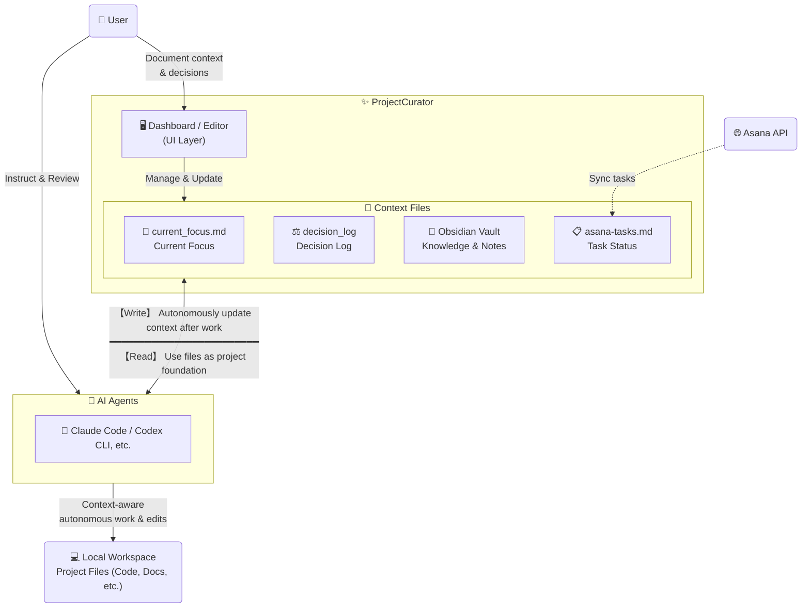

# ProjectCurator

[日本語版はこちら](README-ja.md)

A Windows desktop app for streamlining project management and context switching.

## Why This App Is Useful

ProjectCurator reduces context switching and cognitive load for both you and your AI agents:

- Project visibility: see project health and today's task signals from one Dashboard
- Context maintenance: quickly track "what I'm doing now" (`current_focus.md`) and "what was decided" (`decision_log`) in a focused editor
- AI Agent readiness: the markdown files maintained here serve perfectly as ready-to-read context files for AI agents like Claude Code or Codex CLI
- Optional Asana integration: sync tasks into Markdown so project status stays visible and searchable

Whether you run many projects in parallel or manage a single complex one, ProjectCurator helps both you and your AI jump straight into the flow state without losing time trying to remember where you left off.

## Who It Is For

- People managing multiple active projects, or one complex long-term project
- Users wanting their local folders completely primed for AI agent collaboration
- Users who want Asana tasks mapped into project Markdown context (Asana is completely optional; the app works great as a standalone context manager)

## Core Features

| Page | What You Can Do |
|---|---|
| Dashboard | Project health overview, Today Queue, AI-powered What's Next suggestions |
| Editor | Markdown context editing with AI-powered focus updates, decision logging, and meeting notes import |
| Timeline | Review recent project activity in chronological order |
| Git Repos | Recursively scan workspace roots for repositories |
| Asana Sync | Sync Asana tasks to project/workstream Markdown outputs |
| Agent Hub | Manage reusable sub-agent/context-rule library and deploy per project, per CLI |
| Setup | Create/check/archive projects, tier conversion, workstream management |
| Settings | Hotkey, workspace roots, LLM API configuration |

## Screenshots

| Dashboard | Editor |
|---|---|
|  |  |

| Agent Hub | Timeline |
|---|---|
|  |  |

| AI: What's Next | AI: Import Meeting Notes |
|---|---|
|  |  |

See the [UI Guide](docs/ui-guide.md) for all pages and AI feature screenshots.

## Quick Start (5 Minutes)

### 1. Download the app from GitHub Releases

- Open the [latest GitHub Release](https://github.com/yt3trees/ProjectCurator/releases)
- Download the `.zip` file
- Extract it to any folder you want (for example, `C:\Tools\ProjectCurator\`)

### 2. Launch `ProjectCurator.exe`

- Double-click `ProjectCurator.exe`
- If Windows SmartScreen appears, click `More info` -> `Run anyway`

### 3. Configure required paths

Open `Settings`, set these values, then save:
*(Note: If you don't use Box/OneDrive or Obsidian, you can simply point these to any local folders on your PC.)*

- `Local Projects Root` (parent folder for your local working projects)
- `Cloud Sync Root` (parent folder synced by Box for shared project files)
- `Obsidian Vault Root` (parent folder for your Obsidian vault, or just a general notes folder)

Required config files are created automatically when you save.

### 4. Optional: Set up Asana integration

Show Asana setup steps

- Create/check your Asana token in Developer Console: `https://app.asana.com/0/my-apps`
- Open `Settings` and enter global Asana values
  - `asana_token`
  - `workspace_gid`
  - `user_gid`
- Open `Asana Sync`
- Enable schedule if needed and save
- Run a manual sync once to create/update task files

To distribute personal project tasks across your local projects:

- Add your personal Asana project GIDs to `personal_project_gids` in `Settings`
  - These are Asana projects not tied to any specific local project (e.g. a personal GTD project), separate from per-project `asana_config.json` mappings
- During sync, tasks from `personal_project_gids` are distributed using the task's `Project` custom field
  - If the `Project` field matches a local project name → appended to that project's `asana-tasks.md`
  - If no match is found → written to `asana-tasks-personal.md`

### 5. Optional: Set up LLM / AI features

Show LLM setup steps

- Open `Settings` and find the `LLM API` section
- Choose a provider: `openai` or `azure_openai`
- Enter your API Key, Model, and (for Azure) Endpoint and API Version
- Click `Test Connection` to verify the credentials
- Once the test passes, toggle `Enable AI Features` to on and save

### 6. Create Your First Project

1. Open the `Setup` page
2. Type your project name into `Project Name` (e.g., `TestProject`)
3. Click `Setup Project` (this automatically creates the folder structure and required Markdown files)
4. Go to `Dashboard` to see your new project
5. Open `Editor` and start updating `current_focus.md`

Your environment is now ready. Configure Asana Sync later if needed.

## Requirements

- Windows
- Git
- .NET 9 SDK is needed only when building from source (release builds are self-contained and require no runtime)

Tech stack: .NET 9 + WPF, wpf-ui 3.x, AvalonEdit, CommunityToolkit.Mvvm

## Documentation

- [Daily Workflow](docs/daily-workflow.md) - Recommended daily flow, core context files, feature map
- [Folder Layout](docs/folder-layout.md) - Project folder structure, junctions, and what Setup creates
- [AI Features](docs/ai-features.md) - LLM setup, What's Next, Decision Log, Meeting Notes import, Quick Capture
- [AI Agent Collaboration](docs/ai-agent-collaboration.md) - Working with Claude Code / Codex CLI, Agent Hub, skill deployment
- [UI Guide](docs/ui-guide.md) - Screenshots and detailed operation guide for every page
- [Configuration](docs/configuration.md) - Config file reference and keyboard shortcuts

## Notes

- The app is designed for tray-first usage.
- Normal window close minimizes instead of exiting.
- Hold `Shift` while closing to fully quit.
