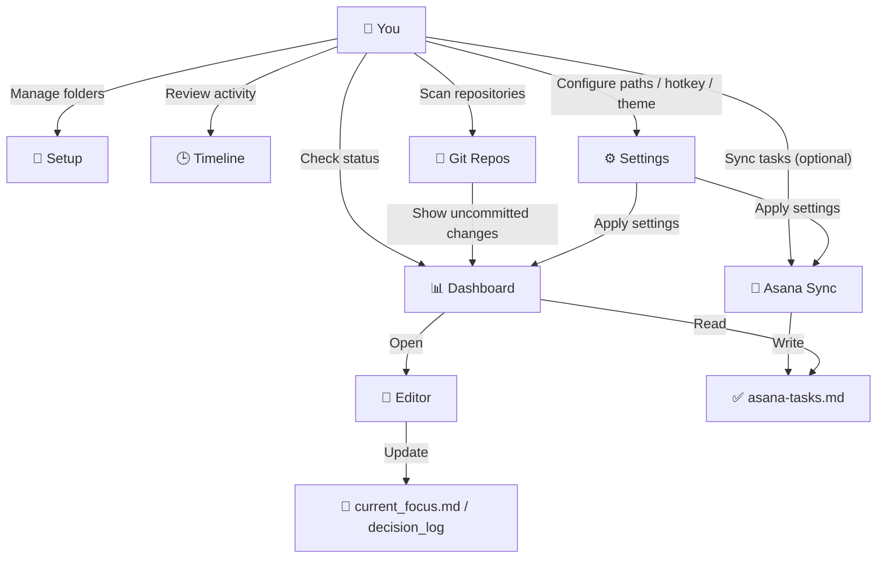
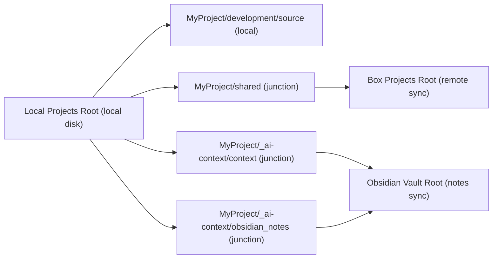
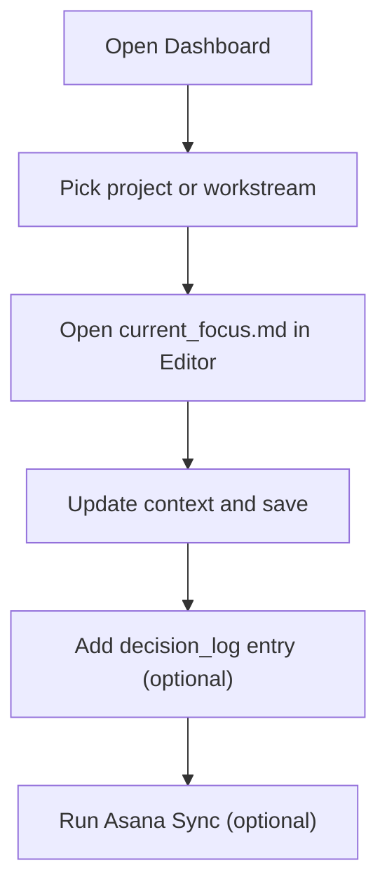

# ProjectCurator

[日本語版はこちら](README-ja.md)


A Windows desktop app for managing projects across multiple workspaces.

## Why This App Is Useful

ProjectCurator reduces context switching in three areas:

- Project visibility: see project health and today’s task signals from one Dashboard
- Context editing: quickly update `current_focus.md` and `decision_log` in a focused editor
- Asana integration: sync tasks into Markdown so project status stays visible and searchable

If you run many projects in parallel, ProjectCurator helps you spend less time searching and more time executing.

## Who It Is For

- People managing multiple active projects
- Users who want Asana tasks mapped into project Markdown context

## Feature Map



## Quick Start (5 Minutes)

### 1. Download the app from GitHub Releases

- Open the latest GitHub Release
- Download the Windows build (`.exe` or `.zip`)
- Place it in any folder you want (for example, `C:\Tools\ProjectCurator\`)
- If you downloaded a `.zip`, extract it first

### 2. Launch `ProjectCurator.exe`

- Double-click `ProjectCurator.exe`
- If Windows SmartScreen appears, click `More info` -> `Run anyway`

### 3. Configure required paths

Open `Settings`, set these values, then save:

- `Local Projects Root`
- `Box Projects Root`
- `Obsidian Vault Root`

Required config files are created automatically when you save.

### 4. Optional: Set up Asana integration

<details>
<summary>Show Asana setup steps</summary>

- Create/check your Asana token in Developer Console: `https://app.asana.com/0/my-apps`
- Open `Settings` and enter global Asana values
  - `asana_token`
  - `workspace_gid`
  - `user_gid`
- Open `Asana Sync`
- Enable schedule if needed and save
- Run a manual sync once to create/update task files

</details>

### 5. Start with these pages

- `Dashboard`: decide what needs attention today
- `Editor`: update `current_focus.md`
- `Asana Sync` (optional): sync tasks into Today Queue sources

## Folder Layout (Local vs BOX Sync)



```text
Local Projects Root/
└── MyProject/
    ├── development/
    │   └── source/                  # Local working repos (not BOX)
    ├── shared/                      # Junction -> Box Projects Root/MyProject/
    │   ├── _work/
    │   │   ├── <workstream-id>/      # Workstream shared directory created from Setup tab
    │   │   └── 2026/
    │   │       └── 202603/
    │   │           └── 20260321_fix-login-bug/
    │   │                                 # Date-based directory created by Command Palette "resume"
    │   ├── docs/                    # Shared documents (example)
    │   └── assets/                  # Shared assets (example)
    └── _ai-context/
        ├── context/                 # Junction -> Obsidian Vault Root/Projects/MyProject/ai-context/
        └── obsidian_notes/          # Junction -> Obsidian Vault Root/Projects/MyProject/
```

In short:
- Local-only working code lives under `development/source/`.
- Data under `shared/` is managed through the Box-linked location.
- Context/notes under `_ai-context/` are linked to your Obsidian vault path.
- `shared/_work/<workstream-id>/` is for workstream-level shared work.
- Date-based work folder example: `shared/_work/2026/202603/20260321_fix-login-bug/`

## Recommended Daily Flow

1. Open `Dashboard`
2. Click a project or workstream and open `current_focus.md`
3. Update context in `Editor` and save with `Ctrl+S`
4. Add a `decision_log` entry if needed
5. If using Asana, run `Asana Sync` to refresh task files



## Daily Standup Automation

ProjectCurator includes an automatic standup generator:

- Starts at app startup and checks every hour
- Generates today's file only if it does not exist yet (idempotent)
- Target file: `{ObsidianVaultRoot}\standup\YYYY-MM-DD_standup.md`
- Command Palette command: `standup` (manual generate/open)

The generated sections are:
- `Yesterday` (focus history, decision logs, completed Asana tasks)
- `Today` (high-priority queue items)
- `This Week` (upcoming queue items)

## Core Features

| Page | What You Can Do |
|---|---|
| Dashboard | Project health overview, Today Queue visibility, workstream status checks |
| Editor | Markdown context editing, search, link open, quick decision log creation |
| Timeline | Review recent project activity in chronological order |
| Git Repos | Recursively scan workspace roots for repositories |
| Asana Sync | Sync Asana tasks to project/workstream Markdown outputs |
| Setup | Create/check/archive projects, tier conversion, workstream management |
| Settings | Theme, hotkey, workspace paths, refresh behavior |

## UI Overview

### Dashboard

Overview of all projects with health indicators, update freshness, and Today Queue at the bottom.


### Editor

Tree-based file browser for AI context files (`current_focus.md`, `decision_log`, etc.) with syntax-highlighted Markdown editing.


### Timeline

Chronological view of project activity filtered by project and time period.


### Git Repos

Scans workspace roots and lists repositories with remote URLs, branches, and last commit dates.


### Asana Sync

Configure per-project Asana sync with scheduling, workstream mapping, and section filters.


## Keyboard Shortcuts (Most Used)

| Shortcut | Action |
|---|---|
| `Ctrl+K` | Open Command Palette |
| `Ctrl+1` - `Ctrl+7` | Navigate pages |
| `Ctrl+S` | Save in Editor |
| `Ctrl+F` / `F3` / `Shift+F3` | Search in Editor |
| `Ctrl+Shift+P` | Toggle app visibility (default) |

## Asana Integration (Optional)

Use this only if your workflow includes Asana.

### Asana Sync Tab Setup

1. Enable Asana integration in `Settings` and save the required fields
2. Open `Asana Sync` and choose the target project
3. Run `Run Sync` once first
   - On success, these files are updated:
   - `_ai-context/obsidian_notes/asana-tasks.md`
   - optionally `_ai-context/obsidian_notes/workstreams/<id>/asana-tasks.md`
4. Go back to `Dashboard` and check Today Queue
   - Today Queue reads tasks from the `asana-tasks.md` files above
5. Only if you want automatic sync, turn on `Enable Schedule`
6. Choose interval and click `Save Schedule`

If tasks do not appear:
- Confirm `asana-tasks.md` was updated after `Run Sync`
- Refresh `Dashboard` to reload Today Queue

Reference (you usually do not edit these directly):
- Global Asana values are stored in `Documents\Projects\_config\asana_global.json`
- Per-project advanced settings are stored in `{BoxProject}\asana_config.json`

## Configuration Files

`ConfigService` reads and writes:

```text
%USERPROFILE%\Documents\Projects\_config\
├── settings.json
├── hidden_projects.json
├── asana_global.json
└── pinned_folders.json
```

`settings.json` and `asana_global.json` are gitignored.

## Requirements

- Windows
- .NET 9 Runtime (SDK if building from source)
- Git
- PowerShell 7+
- Python 3.10+ (only for Asana sync)

## Tech Stack

- .NET 9 + WPF
- wpf-ui 3.x
- AvalonEdit
- CommunityToolkit.Mvvm
- Microsoft.Extensions.DependencyInjection

## Notes

- The app is designed for tray-first usage.
- Normal window close minimizes instead of exiting.
- Hold `Shift` while closing to fully quit.
