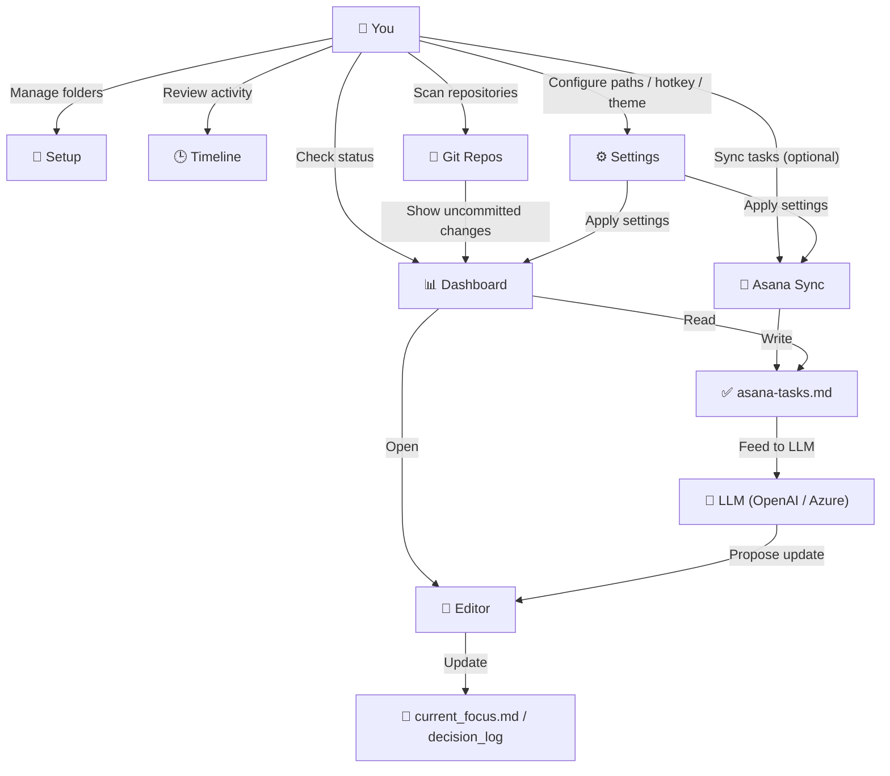
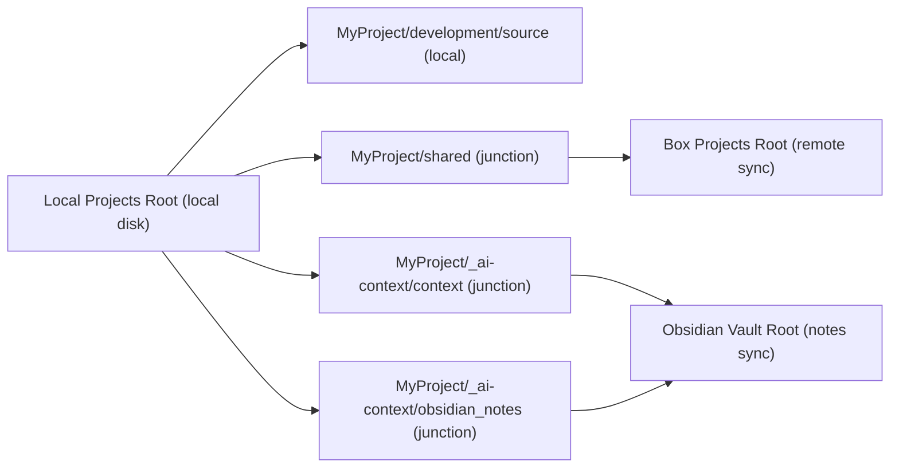
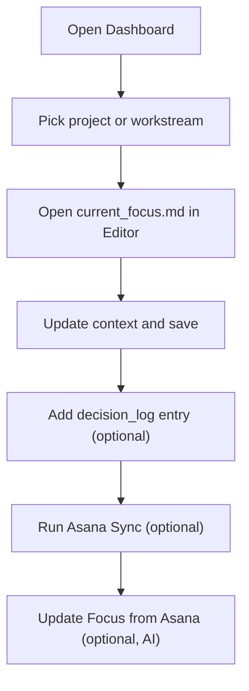
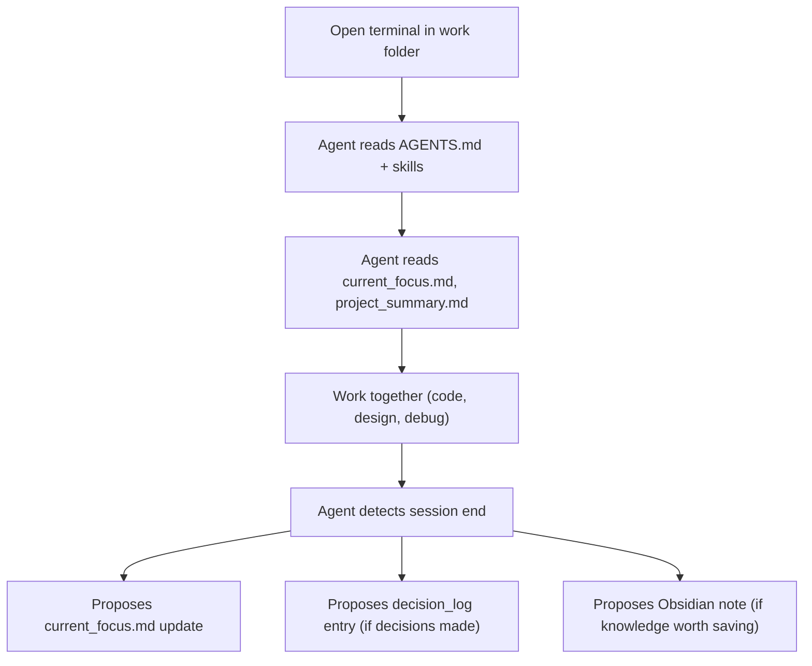

# ProjectCurator

[日本語版はこちら](README-ja.md)


A Windows desktop app for managing projects across multiple workspaces.

## Why This App Is Useful

ProjectCurator reduces context switching in three areas:

- Project visibility: see project health and today’s task signals from one Dashboard
- Context editing: quickly update `current_focus.md` and `decision_log` in a focused editor
- Asana integration: sync tasks into Markdown so project status stays visible and searchable

If you run many projects in parallel, ProjectCurator helps you spend less time searching and more time executing.

## Who It Is For

- People managing multiple active projects
- Users who want Asana tasks mapped into project Markdown context

## Feature Map



## Quick Start (5 Minutes)

### 1. Download the app from GitHub Releases

- Open the [latest GitHub Release](https://github.com/yt3trees/ProjectCurator/releases)
- Download the `.zip` file
- Extract it to any folder you want (for example, `C:\Tools\ProjectCurator\`)

### 2. Launch `ProjectCurator.exe`

- Double-click `ProjectCurator.exe`
- If Windows SmartScreen appears, click `More info` -> `Run anyway`

### 3. Configure required paths

Open `Settings`, set these values, then save:

- `Local Projects Root` (parent folder for your local working projects)
  Example: `C:\Users\<your-user>\Documents\Projects`
- `Box Projects Root` (parent folder synced by Box for shared project files)
  Example: `C:\Users\<your-user>\Box\Projects`
- `Obsidian Vault Root` (parent folder for your Obsidian vault)
  Example: `C:\Users\<your-user>\Box\ObsidianVault`

Required config files are created automatically when you save.

### 4. Optional: Set up Asana integration

<details>
<summary>Show Asana setup steps</summary>

- Create/check your Asana token in Developer Console: `https://app.asana.com/0/my-apps`
- Open `Settings` and enter global Asana values
  - `asana_token`
  - `workspace_gid`
  - `user_gid`
- Open `Asana Sync`
- Enable schedule if needed and save
- Run a manual sync once to create/update task files

</details>

### 5. Optional: Set up LLM / AI features

<details>
<summary>Show LLM setup steps</summary>

- Open `Settings` and find the `LLM API` section
- Choose a provider: `openai` or `azure_openai`
- Enter your API Key, Model, and (for Azure) Endpoint and API Version
- Click `Test Connection` to verify the credentials
- Once the test passes, toggle `Enable AI Features` to on and save
- The `Update Focus from Asana` button will appear in the Editor toolbar

</details>

### 6. Start with these pages

- `Setup`: first, use the Setup page features to prepare your working structure
  - Use `Setup Project` / `Check` to create or validate the project folder and `_work` workspace
  - Use setup options to create the links for shared files and AI context folders
  - After setup, open the project from `Dashboard` and `Editor`
- `Dashboard`: decide what needs attention today
- `Editor`: update `current_focus.md`
- `Asana Sync` (optional): sync tasks into Today Queue sources

## Folder Layout (Local vs BOX Sync)



```text
Local Projects Root/
└── MyProject/
    ├── development/
    │   └── source/                  # Local working repos (not BOX)
    ├── shared/                      # Junction -> Box Projects Root/MyProject/
    │   ├── _work/
    │   │   ├── <workstream-id>/      # Workstream shared directory created from Setup tab
    │   │   └── 2026/
    │   │       └── 202603/
    │   │           └── 20260321_fix-login-bug/
    │   │                                 # Date-based directory created by Command Palette "resume"
    │   ├── docs/                    # Shared documents (example)
    │   └── assets/                  # Shared assets (example)
    └── _ai-context/
        ├── context/                 # Junction -> Obsidian Vault Root/Projects/MyProject/ai-context/
        └── obsidian_notes/          # Junction -> Obsidian Vault Root/Projects/MyProject/
```

In short:
- Local-only working code lives under `development/source/`.
- Data under `shared/` is managed through the Box-linked location.
- Context/notes under `_ai-context/` are linked to your Obsidian vault path.
- `shared/_work/<workstream-id>/` is for workstream-level shared work.
- Date-based work folder example: `shared/_work/2026/202603/20260321_fix-login-bug/`

## Recommended Daily Flow

1. Open `Dashboard`
2. Click a project or workstream and open `current_focus.md`
3. Update context in `Editor` and save with `Ctrl+S`
4. Add a `decision_log` entry if needed
5. If using Asana, run `Asana Sync` to refresh task files
6. If AI Features is enabled, click `Update Focus from Asana` in the Editor toolbar to get an LLM-generated update proposal



## AI Agent Collaboration (Claude Code / Codex CLI)

ProjectCurator is designed to work alongside AI coding agents such as Claude Code and Codex CLI.

### How It Works

Each project managed by ProjectCurator contains an `AGENTS.md` at the project root and a set of embedded skills under `.claude/skills/` (and `.codex/skills/`). When you open a terminal inside a date-based work folder like:

```
shared/_work/2026/202603/20260321_fix-login-bug/
```

Claude Code or Codex CLI automatically reads the `AGENTS.md` and skill definitions above this directory. This gives the agent full awareness of:

- Project structure and key paths
- AI context files (`current_focus.md`, `decision_log`, `tensions.md`)
- Obsidian Knowledge Layer notes
- Active Asana tasks (if synced)

### What the Agent Does Autonomously

The embedded skills enable the agent to act without explicit commands:

| Skill | Behavior |
|---|---|
| context-session-end | Detects natural work boundaries and proposes updates to `current_focus.md` with `[AI]` prefix |
| context-decision-log | Monitors conversation for implicit decisions and proposes structured logging to `decision_log/` |
| obsidian-knowledge | Proposes writing session summaries, technical notes, or meeting records to Obsidian vault |
| update-focus-from-asana | Slash command to sync Asana task status into `current_focus.md` |

All proposals require user confirmation before writing. The agent never modifies existing human-written content.

### Typical Agent Session Flow



### Skill Deployment

ProjectCurator automatically deploys skill files when creating or checking a project from the Setup page:

- `.claude/skills/` for Claude Code
- `.codex/skills/` for Codex CLI

Skills are sourced from the app's embedded `Assets/ContextCompressionLayer/skills/` and kept in sync with the shared folder via junctions.

## Core Features

| Page | What You Can Do |
|---|---|
| Dashboard | Project health overview, Today Queue visibility, workstream status checks |
| Editor | Markdown context editing, search, link open, quick decision log creation, AI-powered "Update Focus from Asana" (requires AI Features enabled) |
| Timeline | Review recent project activity in chronological order |
| Git Repos | Recursively scan workspace roots for repositories |
| Asana Sync | Sync Asana tasks to project/workstream Markdown outputs |
| Setup | Create/check/archive projects, tier conversion, workstream management |
| Settings | Theme, hotkey, workspace paths, refresh behavior, LLM API configuration, Enable AI Features toggle |

## UI Overview

### Dashboard

Overview of all projects with health indicators, update freshness, and Today Queue at the bottom.


<details>
<summary>Dashboard details</summary>


- Use the top bar to refresh the view (`↻`), set auto refresh (`Off / 10 / 15 / 30 / 60 min`), and show hidden projects.
- Each project card gives a quick health check: project name, tier (`FULL`/`MINI`), optional `DOMAIN` tag, link status dots, decision log count, and uncommitted repo count.
- Click the uncommitted badge to see repository-by-repository change details.
- `Focus` and `Summary` show how old each file is (in days), and the background color changes as files get older.
- The 30-day mini activity bar is clickable and opens Timeline.
- Card buttons help you move straight into work: open folder, open terminal (or launch Claude/Gemini/Codex), open Editor, and pin work folders.
- Workstreams can be expanded per project. From each row, you can open `current_focus.md`, open the workstream `_work` folder, create today’s work folder, or pin a recent folder.
- `Pinned Folders` appears when you pin at least one folder. You can open, unpin, drag to reorder, or clear all pins.
- `Today Queue` reads unchecked tasks from `asana-tasks.md` files and shows them by urgency (`Overdue`, `Today`, `In Nd`, `No due`).
- In each Today Queue row, you can open the task in Asana, snooze it until tomorrow, or mark it done in Asana.
- Today Queue also has project/workstream filters, `Show All` (`Top 10` vs up to `100`), unsnooze all, manual refresh, and fixed/resizable height mode.

</details>

### Editor

Tree-based file browser for AI context files (`current_focus.md`, `decision_log`, etc.) with syntax-highlighted Markdown editing.


<details>
<summary>Editor details</summary>

- Project selector dropdown at the top left to switch between projects
- Tree view on the left lists AI context files: `current_focus.md`, `file_map.md`, `project_summary.md`, `tensions.md`, `decision_log/`, `focus_history/`, `obsidian_notes/`, `workstreams/`, `CLAUDE.md`, `AGENTS.md`
- Syntax-highlighted Markdown editor on the right with section-based coloring
- Toolbar buttons: Refresh, Dec Log (quick decision log entry), P (pin folder), Save
- Update Focus from Asana button (visible when AI Features is enabled): reads `asana-tasks.md`, sends it to the configured LLM, and shows a diff-based proposal dialog; optionally filter by workstream; supports natural-language refinement and debug view; backup is saved to `focus_history/` automatically
- Full file path displayed in the header bar
- Status bar at the bottom shows the current project and file name

</details>

### Timeline

Chronological view of project activity filtered by project and time period.


<details>
<summary>Timeline details</summary>

- Project dropdown to filter by a specific project (e.g. `GenAi [Domain]`)
- Period dropdown to set the time range (e.g. 30 days)
- Graph scope selector to choose between single project and all projects
- Entries tab shows a list of timeline entries (`[Focus]`, `[Decision]`, `[Work]`) with dates (including day of week); `[Work]` entries come from `shared/_work/` date folders (e.g. `20260321_fix-login-bug`) and clicking them opens the folder in Explorer
- Graph tab visualizes activity trends over the selected period; Work folder events are counted alongside Focus and Decision entries

</details>

### Git Repos

Scans workspace roots and lists repositories with remote URLs, branches, and last commit dates.


<details>
<summary>Git Repos details</summary>

- Project dropdown to filter repositories by project
- Scan button to trigger a recursive repository search under workspace roots
- Save to BOX / Load from BOX buttons to back up or restore clone metadata
- Copy Clone Script button generates a shell script to re-clone all listed repositories
- Table columns: Project, Repository, Remote URL, Branch, Last Commit date

</details>

### Asana Sync

Configure per-project Asana sync with scheduling, workstream mapping, and section filters.


<details>
<summary>Asana Sync details and setup</summary>

Use this only if your workflow includes Asana.

Left panel (sync controls):

- Auto Sync checkbox and interval setting (in hours)
- Save Schedule to persist the schedule
- Run Sync Now to execute a one-time sync immediately
- Clear button to reset sync state
- Last sync timestamp displayed for reference

Right panel (per-project config):

- Project selector dropdown (e.g. `GenAi [Domain]`) with Load button
- Asana Project GIDs: one GID per line to specify which Asana projects to sync
- Workstream Map: maps `gid` to `workstream-id` for routing tasks to the correct workstream folder
- Workstream Field: the custom field name in Asana used to identify the workstream
- Project Aliases: aliases used to match Asana custom field `案件` to this project (one per line)
- Save button to persist the per-project `asana_config.json`

Setup steps:

1. Enable Asana integration in `Settings` and save the required fields
2. Open `Asana Sync` and choose the target project
3. Run `Run Sync` once first
   - On success, these files are updated:
   - `_ai-context/obsidian_notes/asana-tasks.md`
   - optionally `_ai-context/obsidian_notes/workstreams/<id>/asana-tasks.md`
4. Go back to `Dashboard` and check Today Queue
   - Today Queue reads tasks from the `asana-tasks.md` files above
5. Only if you want automatic sync, turn on `Enable Schedule`
6. Choose interval and click `Save Schedule`

If tasks do not appear:
- Confirm `asana-tasks.md` was updated after `Run Sync`
- Refresh `Dashboard` to reload Today Queue

Reference (you usually do not edit these directly):
- Global Asana values are stored in `Documents\Projects\_config\asana_global.json`
- Per-project advanced settings are stored in `{BoxProject}\asana_config.json`

</details>

### Setup - New Project

Create new projects, check existing structures, archive, and convert tiers from a single page.


<details>
<summary>Setup details (New Project / Check / Archive / Convert Tier)</summary>

New Project tab:

- Project Name: select an existing project to auto-fill Tier/Category, add ExternalSharePath, or run AI Context Setup on it
- Tier: `full (standard)` or `mini`
- Category: `project (time-bound)` or `domain`
- ExternalSharePath (optional): custom path per files for shared data
- Also run AI Context Setup: when checked, junctions for `_ai-context/context/` and `_ai-context/obsidian_notes/` are created automatically
- Overwrite existing skills (-Force): re-deploys `.claude/skills/` and `.codex/skills/` even if they already exist
- Setup Project button creates the folder structure, junctions, and skill files
- Output area shows the log of operations performed

Check tab:

- Validates an existing project's folder structure, junctions, and skill files
- Reports missing or broken items so you can fix them

Archive tab:

- Moves a project to an archive location and cleans up junctions

Convert Tier tab:

- Converts a project between `full` and `mini` tiers, adjusting folder structure accordingly

</details>

### Setup - Workstreams

Manage workstreams within a project: create, rename labels, and close/reopen.


<details>
<summary>Workstreams details</summary>

- Project selector dropdown with Reload button
- Add Workstream section: enter a Workstream ID (kebab-case), an optional label, and an optional display label, then click Create Workstream
- Existing Workstreams list shows each workstream's ID, label, and status (Active / Closed)
- Close button marks a workstream as Closed; Reopen restores it to Active
- Save Labels persists any label changes
- Output area shows the log of operations performed

</details>

## Keyboard Shortcuts (Most Used)

| Shortcut | Action |
|---|---|
| `Ctrl+K` | Open Command Palette |
| `Ctrl+1` - `Ctrl+7` | Navigate pages |
| `Ctrl+S` | Save in Editor |
| `Ctrl+F` | Search in Editor |
| `Ctrl+Shift+P` | Toggle app visibility (default) |

## Configuration Files

`ConfigService` reads and writes:

```text
%USERPROFILE%\Documents\Projects\_config\
├── settings.json
├── hidden_projects.json
├── asana_global.json
└── pinned_folders.json
```

`settings.json` and `asana_global.json` are gitignored.

## Requirements

- Windows
- .NET 9 Runtime (SDK if building from source)
- Git
- PowerShell 7+
- Python 3.10+ (only for Asana sync)

## Tech Stack

- .NET 9 + WPF
- wpf-ui 3.x
- AvalonEdit
- CommunityToolkit.Mvvm
- Microsoft.Extensions.DependencyInjection

## Helpful Extra: Daily Standup

ProjectCurator includes an automatic standup generator:

- Starts at app startup and checks every hour
- Generates today's file only if it does not exist yet (idempotent)
- Target file: `{ObsidianVaultRoot}\standup\YYYY-MM-DD_standup.md`
- Command Palette command: `standup` (manual generate/open)

The generated sections are:
- `Yesterday` (focus history, decision logs, completed Asana tasks)
- `Today` (high-priority queue items)
- `This Week` (upcoming queue items)

## Notes

- The app is designed for tray-first usage.
- Normal window close minimizes instead of exiting.
- Hold `Shift` while closing to fully quit.
