# ProjectCurator

[日本語版はこちら](README-ja.md)


A Windows desktop app for streamlining project management and context switching.

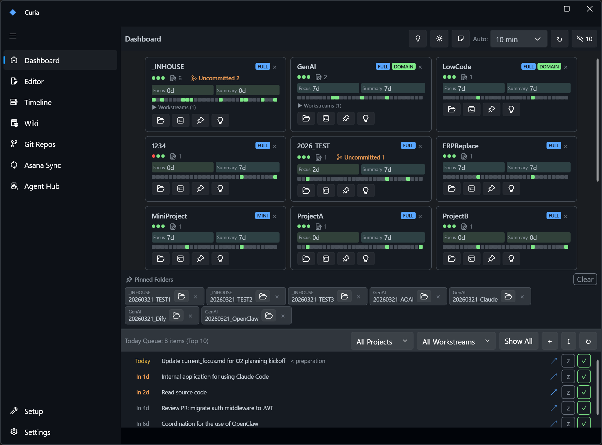

## Why This App Is Useful

ProjectCurator reduces context switching and cognitive load for both you and your AI agents:

- Project visibility: see project health and today's task signals from one Dashboard
- Context maintenance: quickly track "what I'm doing now" (`current_focus.md`) and "what was decided" (`decision_log`) in a focused editor
- AI Agent readiness: the markdown files maintained here serve perfectly as ready-to-read context files for AI agents like Claude Code or Codex CLI
- Optional Asana integration: sync tasks into Markdown so project status stays visible and searchable

Whether you run many projects in parallel or manage a single complex one, ProjectCurator helps both you and your AI jump straight into the flow state without losing time trying to remember where you left off.

## Who It Is For

- People managing multiple active projects, or one complex long-term project
- Users wanting their local folders completely primed for AI agent collaboration
- Users who want Asana tasks mapped into project Markdown context (Asana is completely optional; the app works great as a standalone context manager)

## Feature Map

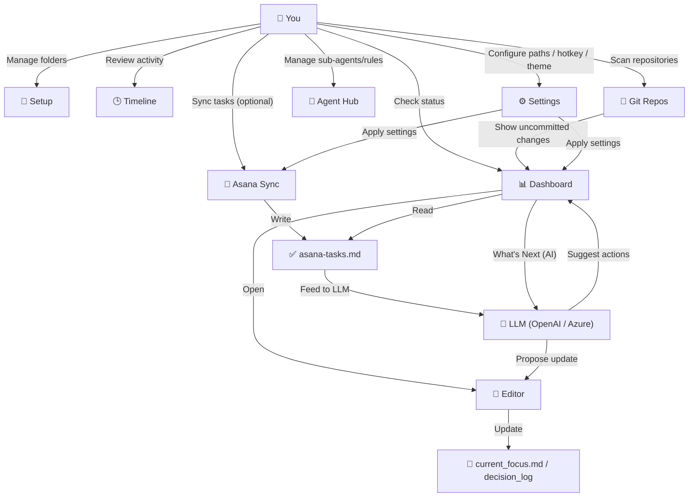
```mermaid
flowchart TD
    U["👤 You"] -->|"Check status"| DB["📊 Dashboard"]
    DB -->|"Open"| ED["📝 Editor"]
    ED -->|"Update"| CTX["🧠 current_focus.md / decision_log"]

    U -->|"Sync tasks (optional)"| AS["🔄 Asana Sync"]
    AS -->|"Write"| TASKS["✅ asana-tasks.md"]
    DB -->|"Read"| TASKS
    TASKS -->|"Feed to LLM"| LLM["🤖 LLM (OpenAI / Azure)"]
    DB -->|"What's Next (AI)"| LLM
    LLM -->|"Propose update"| ED
    LLM -->|"Suggest actions"| DB

    U -->|"Manage folders"| SU["🧰 Setup"]
    U -->|"Review activity"| TL["🕒 Timeline"]
    U -->|"Scan repositories"| GR["🌿 Git Repos"]
    U -->|"Manage sub-agents/rules"| AH["🧩 Agent Hub"]
    U -->|"Configure paths / hotkey / theme"| ST["⚙️ Settings"]

    GR -->|"Show uncommitted changes"| DB
    ST -->|"Apply settings"| DB
    ST -->|"Apply settings"| AS
```

## Core Features

| Page | What You Can Do |
|---|---|
| Dashboard | Project health overview, Today Queue visibility, workstream status checks, AI-powered What's Next suggestions (requires AI Features enabled) |
| Editor | Markdown context editing, search, link open, quick decision log creation, AI-powered "Update Focus from Asana", "AI Decision Log", and "Import Meeting Notes" (all require AI Features enabled) |
| Timeline | Review recent project activity in chronological order |
| Git Repos | Recursively scan workspace roots for repositories |
| Asana Sync | Sync Asana tasks to project/workstream Markdown outputs |
| Agent Hub | Manage reusable sub-agent/context-rule library and deploy/undeploy per project, per CLI (Claude/Codex/Copilot/Gemini) |
| Setup | Create/check/archive projects, tier conversion, workstream management |
| Settings | Theme, hotkey, workspace paths, refresh behavior, LLM API configuration, Enable AI Features toggle |

## Recommended Daily Flow

1. Open `Dashboard`
2. (If AI Features is enabled) Click the What's Next button (💡) to see AI-prioritized action suggestions across all projects
3. Click a project or workstream and open `current_focus.md`
4. Update context in `Editor` and save with `Ctrl+S`
5. Add a `decision_log` entry if needed (when AI Features is enabled, the Dec Log button opens an AI-assisted dialog)
6. If you have meeting notes from a recent meeting, click `Import Meeting Notes` in the Editor toolbar to analyze and apply them
7. If using Asana, run `Asana Sync` to refresh task files
8. If AI Features is enabled, click `Update Focus from Asana` in the Editor toolbar to get an LLM-generated update proposal

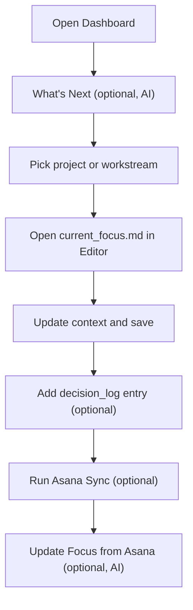
```mermaid
flowchart TD
    A["Open Dashboard"] --> B["What's Next (optional, AI)"]
    B --> C["Pick project or workstream"]
    C --> D["Open current_focus.md in Editor"]
    D --> E["Update context and save"]
    E --> F["Add decision_log entry (optional)"]
    F --> G["Run Asana Sync (optional)"]
    G --> H["Update Focus from Asana (optional, AI)"]
```

## Core Context Files

The application relies on maintaining the following Markdown files to preserve project context:

- **`current_focus.md`**
  The "you are here" map of the project. Tracks what you are currently doing and what's next.
- **`tensions.md`**
  A log of open technical questions, unmitigated risks, and unresolved trade-offs.
- **`decision_log/`**
  A structured folder recording "why we chose this" and "what was decided" for critical architecture choices.

## Quick Start (5 Minutes)

### 1. Download the app from GitHub Releases

- Open the [latest GitHub Release](https://github.com/yt3trees/ProjectCurator/releases)
- Download the `.zip` file
- Extract it to any folder you want (for example, `C:\Tools\ProjectCurator\`)

### 2. Launch `ProjectCurator.exe`

- Double-click `ProjectCurator.exe`
- If Windows SmartScreen appears, click `More info` -> `Run anyway`

### 3. Configure required paths

Open `Settings`, set these values, then save:
*(Note: If you don't use Box/OneDrive or Obsidian, you can simply point these to any local folders on your PC.)*

- `Local Projects Root` (parent folder for your local working projects)
  Example: `C:\Users\<your-user>\Documents\Projects`
- `Cloud Sync Root` (parent folder synced by Box for shared project files)
  Example: `C:\Users\<your-user>\Box\Projects`
- `Obsidian Vault Root` (parent folder for your Obsidian vault, or just a general notes folder)
  Example: `C:\Users\<your-user>\Box\ObsidianVault`

Required config files are created automatically when you save.

### 4. Optional: Set up Asana integration

<details>
<summary>Show Asana setup steps</summary>

- Create/check your Asana token in Developer Console: `https://app.asana.com/0/my-apps`
- Open `Settings` and enter global Asana values
  - `asana_token`
  - `workspace_gid`
  - `user_gid`
- Open `Asana Sync`
- Enable schedule if needed and save
- Run a manual sync once to create/update task files

</details>

### 5. Optional: Set up LLM / AI features

<details>
<summary>Show LLM setup steps</summary>

- Open `Settings` and find the `LLM API` section
- Choose a provider: `openai` or `azure_openai`
- Enter your API Key, Model, and (for Azure) Endpoint and API Version
- Click `Test Connection` to verify the credentials
- Once the test passes, toggle `Enable AI Features` to on and save
- The `What's Next` button (💡) will appear in the Dashboard toolbar
- The `Briefing` button (💡) will appear on each project card in Dashboard
- The `Update Focus from Asana` button, the `AI Decision Log` button, and the `Import Meeting Notes` button will appear in the Editor toolbar

</details>

### 6. Create Your First Project

Let's use the Setup page to create your first project.

1. **Open the `Setup` page**
2. **Type your project name into `Project Name`** (e.g., `TestProject`)
3. **Click `Setup Project`**
   *(This automatically creates the folder structure and required Markdown files)*
4. **Go to `Dashboard` to see your new project**
5. **Open `Editor` and start updating `current_focus.md`**

Your environment is now ready. Configure Asana Sync later if needed.

## Folder Layout (Local vs Cloud Sync)

<details>
<summary>View basic folder structure</summary>

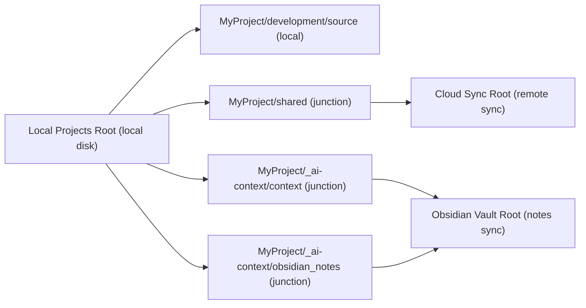
```mermaid
flowchart LR
    L["Local Projects Root (local disk)"]
    B["Cloud Sync Root (remote sync)"]
    O["Obsidian Vault Root (notes sync)"]

    L --> P["MyProject/development/source (local)"]
    L --> J1["MyProject/shared (junction)"]
    L --> J2["MyProject/_ai-context/context (junction)"]
    L --> J3["MyProject/_ai-context/obsidian_notes (junction)"]

    J1 --> B
    J2 --> O
    J3 --> O
```

```text
Local Projects Root/
└── MyProject/
    ├── development/
    │   └── source/                  # Local working repos (not synced to cloud)
    ├── shared/                      # Junction -> Cloud Sync Root/MyProject/
    │   ├── _work/
    │   │   ├── <workstream-id>/      # Workstream shared directory created from Setup tab
    │   │   └── 2026/
    │   │       └── 202603/
    │   │           └── 20260321_fix-login-bug/
    │   │                                 # Date-based directory created by Command Palette "resume"
    │   ├── docs/                    # Shared documents (example)
    │   └── assets/                  # Shared assets (example)
    └── _ai-context/
        ├── context/                 # Junction -> Obsidian Vault Root/Projects/MyProject/ai-context/
        └── obsidian_notes/          # Junction -> Obsidian Vault Root/Projects/MyProject/
```

In short:
- Local-only working code lives under `development/source/`.
- Data under `shared/` is managed through the Cloud-linked location.
- Context/notes under `_ai-context/` are linked to your Obsidian vault path.
- `shared/_work/<workstream-id>/` is for workstream-level shared work.
- Date-based work folder example: `shared/_work/2026/202603/20260321_fix-login-bug/`

</details>

## Template Folder Structure (What Setup Creates)

When you run `Setup Project` with `Also run AI Context Setup` checked, ProjectCurator creates a standardized directory tree across three separate root locations. This section shows what gets created and why.

<details>
<summary>View detailed folder layouts and junctions</summary>

### Overview of the Three Roots

```text
Local Projects Root          ... Your local machine only (not synced)
Cloud Sync Root            ... Cloud-synced via Box Drive (or similar) (shared files)
Obsidian Vault Root          ... Cloud-synced via Box Drive (or similar) (knowledge notes)
```

These three locations are connected by junctions (Windows directory links) so that everything appears as one unified tree under the local project folder.

### Full Tree Created by Setup

```text
Local Projects Root/
├── .context/                          # Workspace-level context (auto-created)
│   ├── workspace_summary.md           # Your role, tools, working principles
│   ├── current_focus.md               # Cross-project focus (workspace level)
│   ├── active_projects.md             # Status list of all projects
│   └── tensions.md                    # Workspace-wide open questions
│
└── MyProject/                         # One project
    ├── _ai-context/
    │   ├── context/        ← junction → Obsidian Vault/Projects/MyProject/ai-context/
    │   └── obsidian_notes/ ← junction → Obsidian Vault/Projects/MyProject/
    ├── _ai-workspace/                 # (full tier only) Local AI working area
    ├── development/
    │   └── source/                    # Git-managed local repositories
    ├── shared/             ← junction → Cloud Sync Root/MyProject/
    ├── external_shared/               # (optional) Junctions to external paths
    ├── .claude/            ← junction → Cloud Sync Root/MyProject/.claude/
    ├── .codex/             ← junction → Cloud Sync Root/MyProject/.codex/
    ├── .gemini/            ← junction → Cloud Sync Root/MyProject/.gemini/
    ├── AGENTS.md                      # AI agent instructions (copied from Cloud)
    └── CLAUDE.md                      # Points to @AGENTS.md

Cloud Sync Root/
└── MyProject/
    ├── docs/                          # Shared documents
    ├── _work/                         # Shared work folders
    │   ├── <workstream-id>/           # Workstream shared directory
    │   └── 2026/202603/20260321_.../  # Date-based work folders
    ├── .claude/skills/project-curator/  # AI skill definitions
    ├── .codex/skills/project-curator/
    ├── .gemini/skills/project-curator/
    ├── .git/forCodex                  # Marker for Codex CLI discovery
    ├── AGENTS.md                      # AI agent instructions (source of truth)
    ├── CLAUDE.md                      # Points to @AGENTS.md
    └── external_shared_paths          # Config file listing external paths

Obsidian Vault Root/
├── ai-context/                        # Global AI context
│   ├── tech-patterns/                 # Cross-project technical patterns
│   └── lessons-learned/               # Cross-project lessons
│
└── Projects/
    └── MyProject/
        ├── ai-context/                # Project AI context (= _ai-context/context/)
        │   ├── current_focus.md       # What you're working on now
        │   ├── project_summary.md     # Project overview, tech stack, architecture
        │   ├── tensions.md            # Open questions, trade-offs, risks
        │   ├── file_map.md            # Junction mappings and key file list
        │   ├── decision_log/          # Structured decision records
        │   │   └── TEMPLATE.md        # Template for new decisions
        │   ├── focus_history/         # Auto-backups of current_focus.md
        │   └── workstreams/           # Per-workstream context (if created)
        │       └── <workstream-id>/
        │           ├── current_focus.md
        │           ├── decision_log/
        │           └── focus_history/
        ├── troubleshooting/           # Obsidian notes: troubleshooting
        ├── daily/                     # Obsidian notes: daily logs
        ├── meetings/                  # Obsidian notes: meeting notes
        └── notes/                     # Obsidian notes: general
```

### Auto-Generated Template Files

Setup populates the following files with starter templates. Existing files are never overwritten.

| File | Template Content |
|---|---|
| `current_focus.md` | Sections: Currently Doing / Recent Updates / Next Actions / Notes |
| `project_summary.md` | Sections: Overview / Tech Stack / Architecture / Notes |
| `tensions.md` | Sections: Open technical questions / Unresolved trade-offs / Risks |
| `file_map.md` | Junction mapping table and key file paths for the project |
| `decision_log/TEMPLATE.md` | Full decision record template: Context / Options / Chosen / Why / Risks / Revisit Trigger |
| `AGENTS.md` | AI agent instructions with project name and directory structure |

Workspace-level files (under `.context/`):

| File | Template Content |
|---|---|
| `workspace_summary.md` | Your role, tools, and working principles |
| `current_focus.md` | Cross-project focus and priorities |
| `active_projects.md` | Status list template for all projects |
| `tensions.md` | Workspace-wide open questions |

### How Junctions Connect Everything

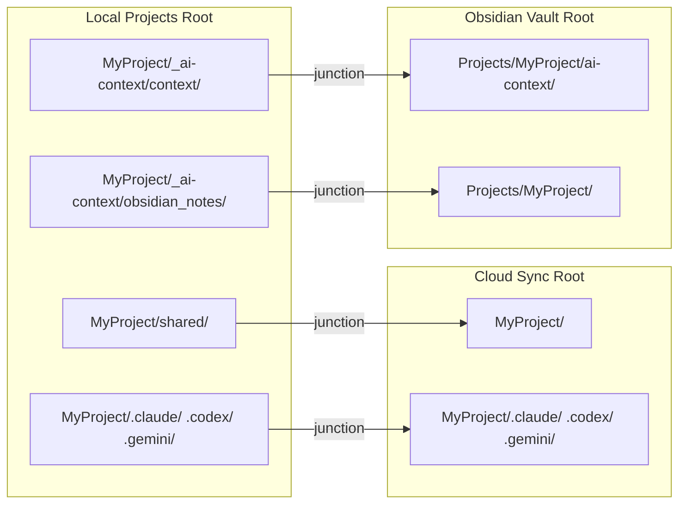
```mermaid
flowchart LR
    subgraph Local["Local Projects Root"]
        LC["MyProject/_ai-context/context/"]
        LO["MyProject/_ai-context/obsidian_notes/"]
        LS["MyProject/shared/"]
        LCLI["MyProject/.claude/ .codex/ .gemini/"]
    end

    subgraph Box["Cloud Sync Root"]
        BS["MyProject/"]
        BCLI["MyProject/.claude/ .codex/ .gemini/"]
    end

    subgraph Obsidian["Obsidian Vault Root"]
        OA["Projects/MyProject/ai-context/"]
        OP["Projects/MyProject/"]
    end

    LC -->|junction| OA
    LO -->|junction| OP
    LS -->|junction| BS
    LCLI -->|junction| BCLI
```

By using junctions, you get a single unified view under the local project folder while the actual data lives in the appropriate synced location. AI agents, Obsidian, and your cloud sync all see their own slice of the same data.

</details>

## AI Features

All AI features require `Enable AI Features` to be on (Settings > LLM API). Supported providers: OpenAI and Azure OpenAI.

### Setup

1. Open `Settings > LLM API`
2. Choose provider, enter API Key and Model (and Endpoint / API Version for Azure)
3. Click `Test Connection`
4. Once the test passes, toggle `Enable AI Features` on and save

### User Profile

Enter a free-text description of your role, priorities, and working style in `Settings > LLM API > User Profile`. This text is prepended as a `## User Profile` section to the system prompt of every LLM call, so the model has your context without repeating it in each prompt.

Example:

```
Role: Engineering manager. I work across 3-4 parallel projects.
Prefer concise bullet points. Flag overloaded days rather than packing in tasks.
Language: respond in Japanese unless the document is already in English.
```

### What's Next (Dashboard)

Click 💡 in the Dashboard toolbar to get 3-5 AI-prioritized action suggestions across all projects. The model analyzes overdue tasks, stale focus files, uncommitted changes, and unrecorded decisions, then ranks actions by urgency. Each suggestion has an Open button to navigate directly to the relevant file.

### Context Briefing (Dashboard Card)

Click 💡 on a project card to generate a project-specific resume briefing. The model reads `current_focus.md`, recent `decision_log` entries, `tensions.md`, active/completed Asana tasks, and uncommitted repo signals, then outputs:

- `Where you left off` (short narrative summary)
- `Suggested next steps` (prioritized action list)
- `Key context` (compact facts to re-enter work quickly)

The dialog supports `Copy`, `Open in Editor`, and `View Debug` (prompt/response inspection).

### Update Focus from Asana (Editor)

Click the `Update Focus from Asana` button in the Editor toolbar to generate a diff-based update proposal for the open `current_focus.md`. The model reads Asana task data and the existing file, then proposes changes while preserving your heading structure and writing style. A backup is saved to `focus_history/` automatically. Supports workstream filtering, natural-language refinement, and a debug view.

### AI Decision Log (Editor)

Click `Dec Log` in the Editor toolbar (AI mode) to open the decision log assistant. Describe what was decided; the model generates a structured draft with Options / Why / Risk / Revisit Trigger sections. Supports natural-language refinement and optionally removes the resolved item from `tensions.md`. Saves as `decision_log/YYYY-MM-DD_{topic}.md`.

### Import Meeting Notes (Editor)

Click the `Import Meeting Notes` button in the Editor toolbar (or press `Ctrl+Enter` in the notes input dialog) to paste raw meeting notes and have the LLM analyze them in a single pass. The model produces four types of output, each shown in a separate tab of the preview dialog:

- Decisions tab: one checkbox per decision detected; click "Show draft" to preview the structured `decision_log` draft; uncheck any decision to skip it
- Focus tab: diff-based view of the AI-generated update to `current_focus.md`; the LLM rewrites the full file integrating new items while preserving the existing structure and writing style
- Tensions tab: preview of items to be appended to `tensions.md` (technical questions, tradeoffs, concerns)
- Asana Tasks tab: list of action items proposed for Asana. Each task has its own controls:
  - Project ComboBox: defaults to the first entry in `personal_project_gids` (`asana_global.json`), or the workstream's mapped project if configured
  - Section ComboBox: auto-selected by matching `anken_aliases` (from `asana_config.json`) against the section name; falls back to `(none)`
  - Due Date picker (optional)
  - Set time checkbox: when checked, reveals Hour / Minute selectors (15-minute increments); produces an ISO 8601 `due_at` value with local timezone offset
  - Check each task to include; uncheck to skip

Select which items to apply and click `Apply Selected`. A `View Debug` button in the dialog shows the full LLM prompt and response. Decision logs are saved as `YYYY-MM-DD_{topic}.md`; `current_focus.md` is backed up to `focus_history/` before updating. Created Asana tasks are appended to `asana-tasks.md` with their GID and due date.

### Quick Capture (Global Hotkey)

Press `Ctrl+Shift+C` from anywhere on your desktop to open a lightweight capture window. Type a free-text note and press Enter. If AI Features is enabled, an LLM classifies the input and routes it automatically:

| Category | Destination |
|---|---|
| `task` | Creates a task in Asana via API (requires confirmation before submitting) |
| `tension` | Appends to the project's `tensions.md` |
| `focus_update` | Opens Editor and triggers the Update Focus from Asana flow with your input as additional context |
| `decision` | Opens Editor and launches the AI Decision Log flow |
| `memo` | Appends a timestamped entry to `_config/capture_log.md` |

When AI Features is disabled, you can still use Quick Capture by selecting the category and project manually.

## AI Agent Collaboration (Claude Code / Codex CLI)

ProjectCurator is designed to work alongside AI coding agents such as Claude Code and Codex CLI.

### How It Works

Each project managed by ProjectCurator contains an `AGENTS.md` at the project root and a set of embedded skills under `.claude/skills/` (and `.codex/skills/`). When you open a terminal inside a date-based work folder like:

```
shared/_work/2026/202603/20260321_fix-login-bug/
```

Claude Code or Codex CLI automatically reads the `AGENTS.md` and skill definitions above this directory. This gives the agent full awareness of:

- Project structure and key paths
- AI context files (`current_focus.md`, `decision_log`, `tensions.md`)
- Obsidian Knowledge Layer notes
- Active Asana tasks (if synced)

### What the Agent Does Autonomously

The `/project-curator` skill enables the agent to act without explicit commands:

| Behavior | Trigger |
|---|---|
| Decision Logging | Architecture / tech decisions detected in conversation → proposes structured logging to `decision_log/` |
| Session End | Wrap-up phrases detected → proposes `current_focus.md` update |
| Obsidian Knowledge | After notable work → proposes writing session summaries or technical notes to the Obsidian vault |
| Update Focus from Asana | Explicit: "update focus from Asana" → syncs Asana task status into `current_focus.md` |
| Cross-project access | Invoke `/project-curator` → query status, today's tasks, and file paths across all projects |

All proposals require user confirmation before writing. The agent never modifies existing human-written content.

### Typical Agent Session Flow

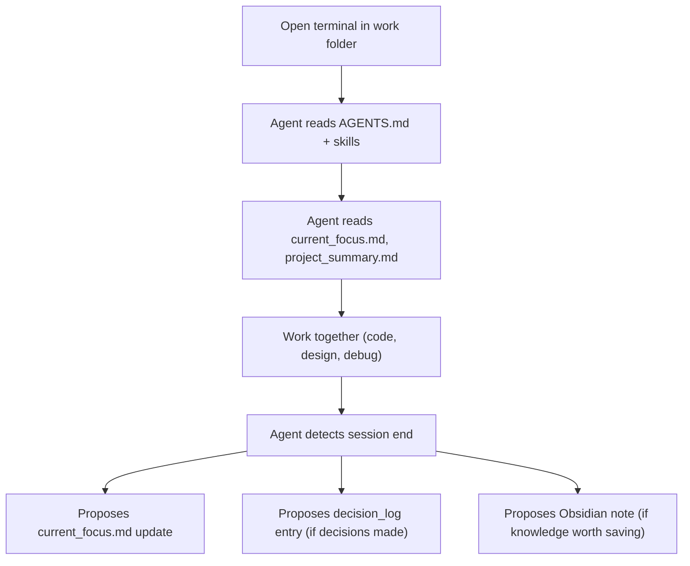
```mermaid
flowchart TD
    A["Open terminal in work folder"] --> B["Agent reads AGENTS.md + skills"]
    B --> C["Agent reads current_focus.md, project_summary.md"]
    C --> D["Work together (code, design, debug)"]
    D --> E["Agent detects session end"]
    E --> F["Proposes current_focus.md update"]
    E --> G["Proposes decision_log entry (if decisions made)"]
    E --> H["Proposes Obsidian note (if knowledge worth saving)"]
```

### Agent Hub (Multi-CLI Deployment)

The `Agent Hub` page is a control center for deploying sub-agent and context-rule definitions to each project with per-CLI toggles (`Cl` / `Cx` / `Cp` / `Gm`).

- Master library files are stored under `{Cloud Sync Root}\_config\agent_hub\` (`agents/` and `rules/` as JSON + Markdown).
- Agent deployment targets:
  - Claude: `.claude/agents/<name>.md`
  - Codex: `.codex/agents/<name>.toml`
  - Copilot: `.github/agents/<name>.md`
  - Gemini: `.gemini/agents/<name>.md`
- Context rules are appended/removed with `<!-- [AgentHub:<id>] -->` markers in CLI-specific files (`CLAUDE.md`, `AGENTS.md`, `.github/copilot-instructions.md`, `GEMINI.md`) so existing content is preserved.
- For `.claude` / `.codex` / `.gemini`, deployment is junction-aware and writes to the junction target when present. `.github` is always written to the local project path.
- Includes status sync, target subfolder deployment, batch deploy to all projects, library ZIP import/export, and AI Builder (enabled only when AI Features is on).

### Skill Deployment

ProjectCurator automatically deploys the `/project-curator` skill when creating or checking a project from the Setup page:

- `.claude/skills/project-curator/` for Claude Code
- `.codex/skills/project-curator/` for Codex CLI
- `.gemini/skills/project-curator/` for Gemini CLI

Skills are sourced from the app's embedded assets and kept in sync with the shared folder via junctions. Use the `Overwrite existing skills` option in Setup to force re-deploy.

## UI Overview

### Dashboard

Overview of all projects with health indicators, update freshness, and Today Queue at the bottom.


<details>
<summary>Dashboard details</summary>

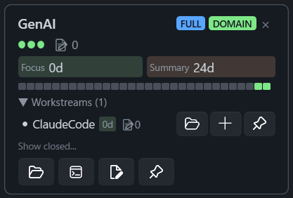

This is the standard project card view with health signals, repository status, and quick actions.

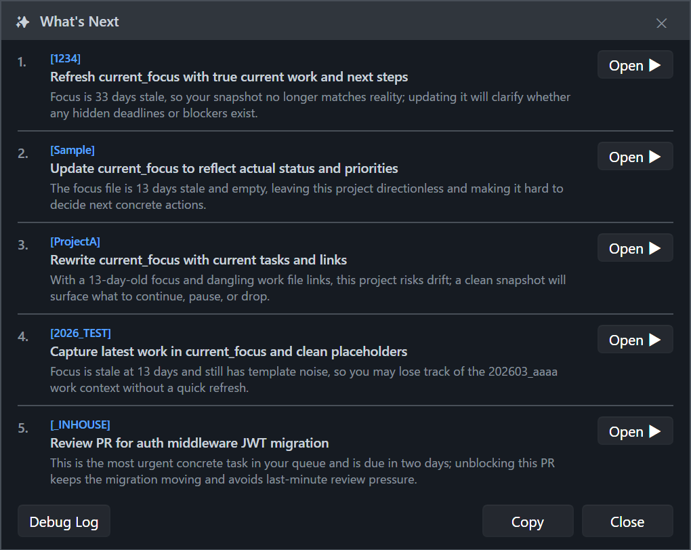

When AI Features is enabled, the What's Next button (💡) in the top bar shows 3-5 prioritized actions across all projects, with an `Open` button for direct navigation and `Copy` for plain-text export.

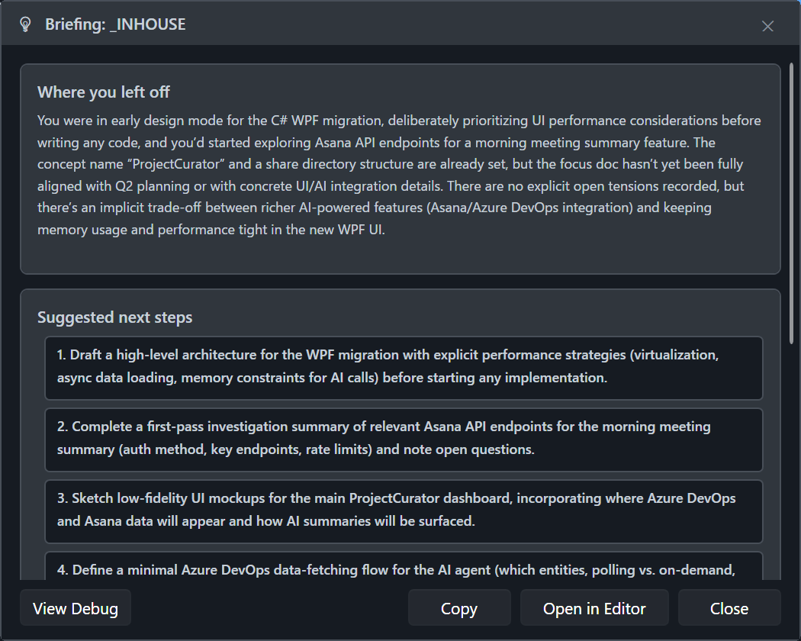

When AI Features is enabled, each project card also shows a Briefing button (💡) that generates a project-specific context-switch summary (`Where you left off` / `Suggested next steps` / `Key context`) with `Copy`, `Open in Editor`, and `View Debug`.

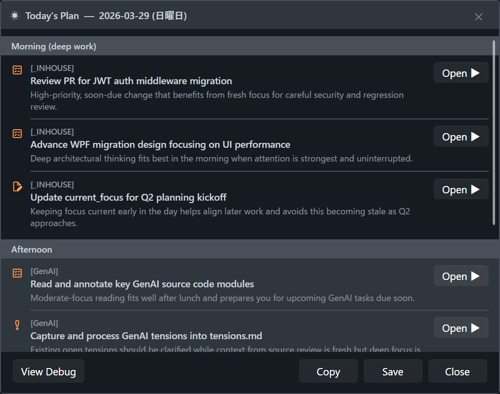

Today's Plan dialog (AI) provides a time-blocked day plan (for example, Morning / Afternoon), with `Open`, `Copy`, `Save`, and `View Debug` actions.

- Use the top bar to refresh the view (`↻`), set auto refresh (`Off / 10 / 15 / 30 / 60 min`), and show hidden projects.
- Each project card gives a quick health check: project name, tier (`FULL`/`MINI`), optional `DOMAIN` tag, link status dots, decision log count, and uncommitted repo count.
- Click the uncommitted badge to see repository-by-repository change details.
- `Focus` and `Summary` show how old each file is (in days), and the background color changes as files get older.
- The 30-day mini activity bar is clickable and opens Timeline.
- Card buttons help you move straight into work: open folder, open terminal (or launch Claude/Gemini/Codex), open Editor, and pin work folders.
- Workstreams can be expanded per project. From each row, you can open `current_focus.md`, open the workstream `_work` folder, create today’s work folder, or pin a recent folder.
- `Pinned Folders` appears when you pin at least one folder. You can open, unpin, drag to reorder, or clear all pins.
- `Today Queue` reads unchecked tasks from `asana-tasks.md` files and shows them by urgency (`Overdue`, `Today`, `In Nd`, `No due`).
- In each Today Queue row, you can open the task in Asana, snooze it until tomorrow, or mark it done in Asana.
- Today Queue also has project/workstream filters, `Show All` (`Top 10` vs up to `100`), unsnooze all, manual refresh, and fixed/resizable height mode.

</details>

### Editor

Tree-based file browser for AI context files (`current_focus.md`, `decision_log`, etc.) with syntax-highlighted Markdown editing.

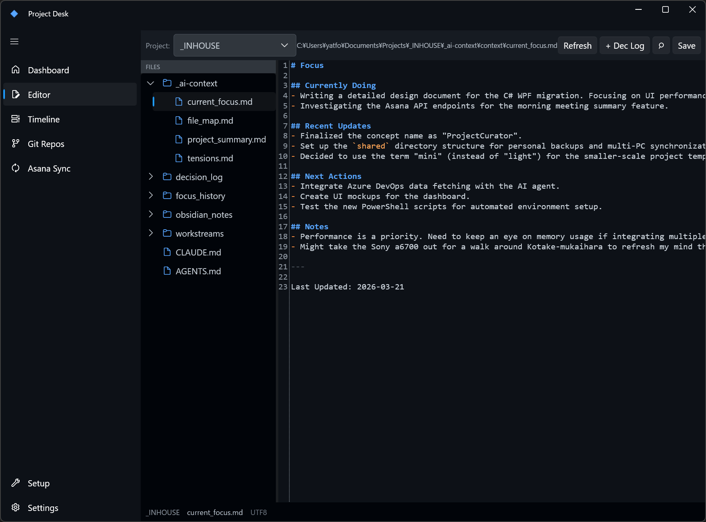

<details>
<summary>Editor details</summary>

- Project selector dropdown at the top left to switch between projects
- Tree view on the left lists AI context files: `current_focus.md`, `file_map.md`, `project_summary.md`, `tensions.md`, `decision_log/`, `focus_history/`, `obsidian_notes/`, `workstreams/`, `CLAUDE.md`, `AGENTS.md`
- Syntax-highlighted Markdown editor on the right with section-based coloring
- Toolbar buttons: Refresh, Dec Log (quick decision log entry), P (pin folder), Save
- Full file path displayed in the header bar
- Status bar at the bottom shows the current project and file name

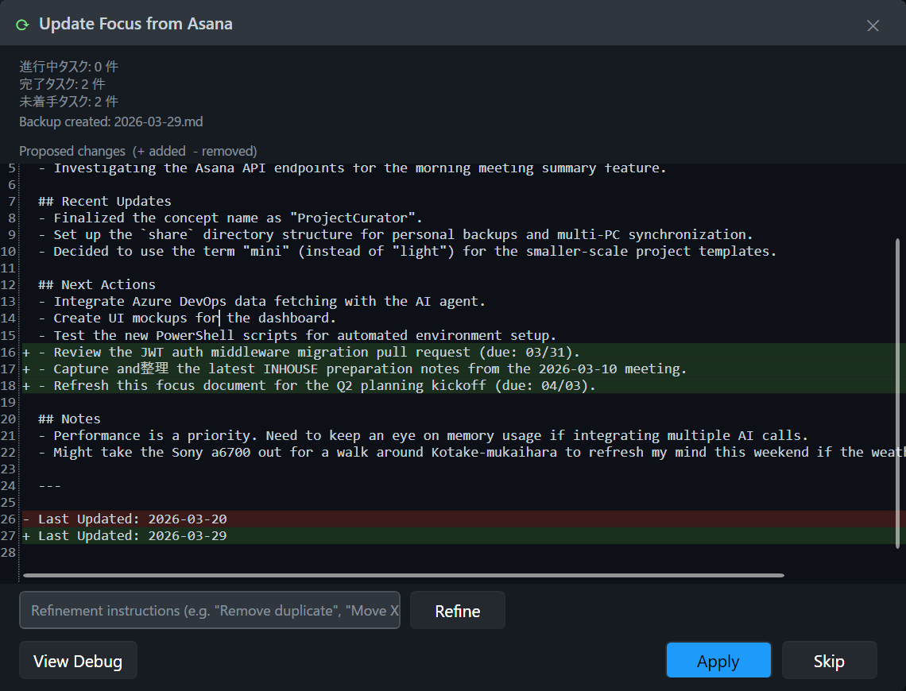

Update Focus from Asana (AI) reads `asana-tasks.md`, sends context to the configured LLM, and shows a diff-based proposal dialog; it supports workstream filtering, natural-language refinement, and `View Debug`, and saves a backup to `focus_history/`.

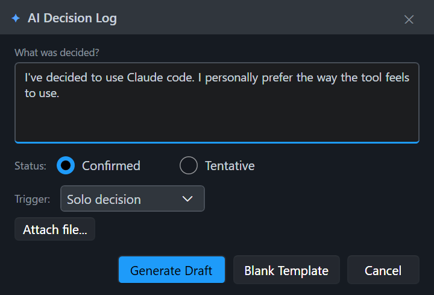
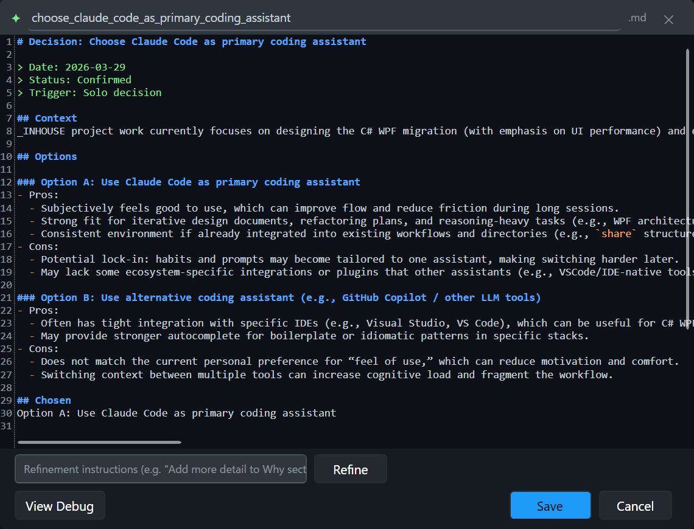

AI Decision Log (Dec Log in AI mode) detects implicit decisions from recent `focus_history`, accepts decision metadata (Status/Trigger/attachments), generates a structured draft (Options / Why / Risk / Revisit Trigger), supports refinement and debug view, and saves to `decision_log/YYYY-MM-DD_{topic}.md`.

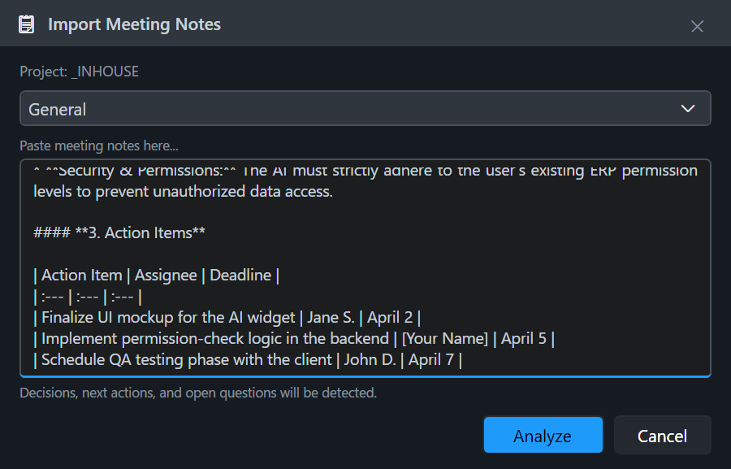
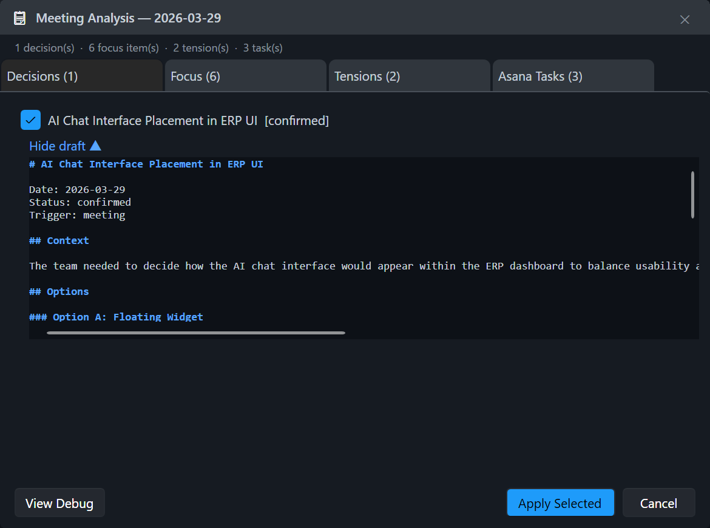

Import Meeting Notes (AI) analyzes raw notes in a single pass and previews Decisions / Focus / Tensions / Asana Tasks tabs; you can choose what to apply, inspect prompt/response via `View Debug`, and `current_focus.md` is backed up before overwrite.

</details>

### Timeline

Chronological view of project activity filtered by project and time period.

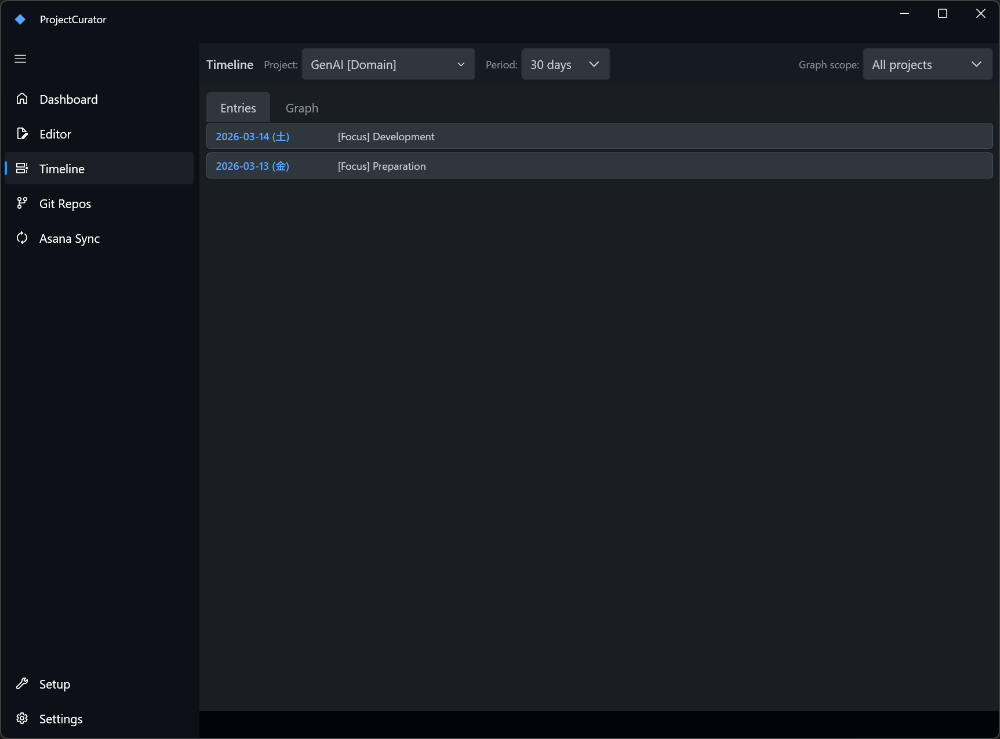

<details>
<summary>Timeline details</summary>

- Project dropdown to filter by a specific project (e.g. `GenAi [Domain]`)
- Period dropdown to set the time range (e.g. 30 days)
- Graph scope selector to choose between single project and all projects
- Entries tab shows a list of timeline entries (`[Focus]`, `[Decision]`, `[Work]`) with dates (including day of week); `[Work]` entries come from `shared/_work/` date folders (e.g. `20260321_fix-login-bug`) and clicking them opens the folder in Explorer
- Graph tab visualizes activity trends over the selected period; Work folder events are counted alongside Focus and Decision entries

</details>

### Git Repos

Scans workspace roots and lists repositories with remote URLs, branches, and last commit dates.

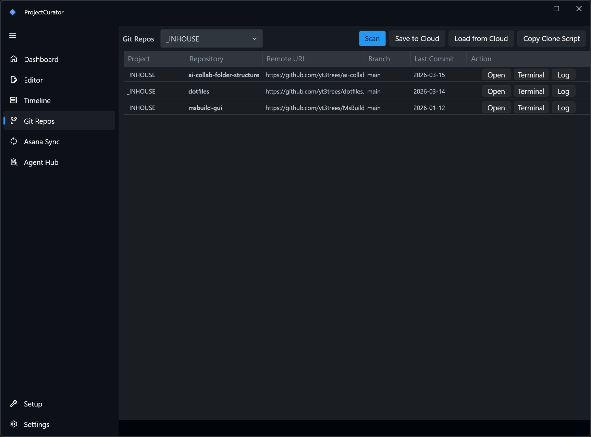

<details>
<summary>Git Repos details</summary>

- Project dropdown to filter repositories by project
- Scan button to trigger a recursive repository search under workspace roots
- Save to Cloud / Load from Cloud buttons to back up or restore clone metadata
- Copy Clone Script button generates a shell script to re-clone all listed repositories
- Table columns: Project, Repository, Remote URL, Branch, Last Commit date

</details>

### Asana Sync

Configure per-project Asana sync with scheduling, workstream mapping, and section filters.

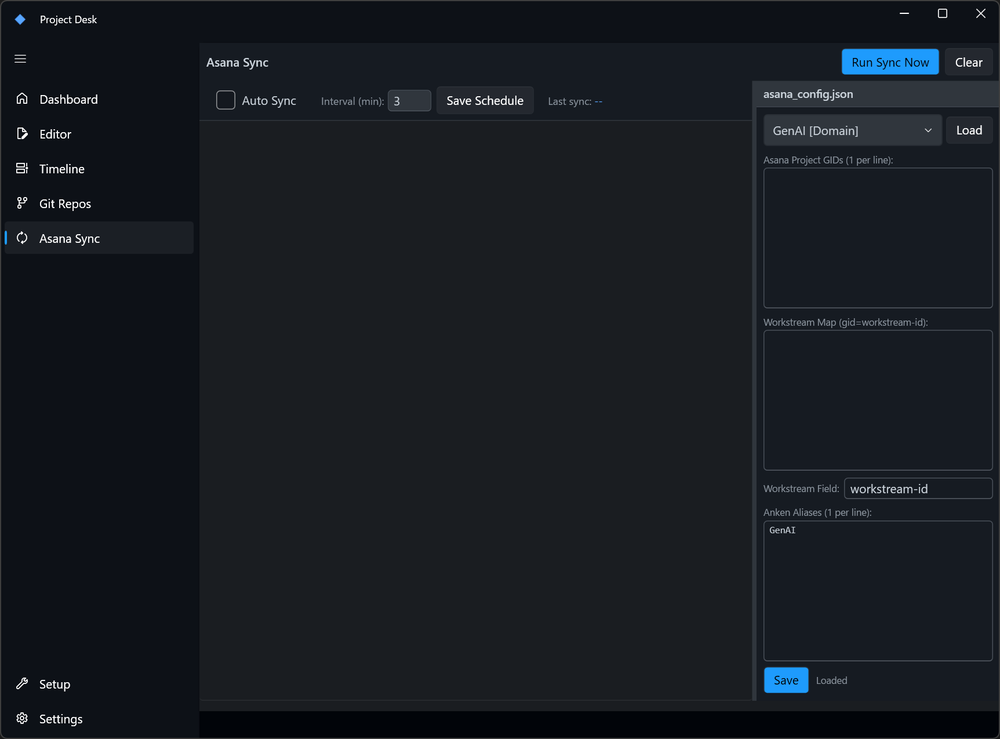

<details>
<summary>Asana Sync details and setup</summary>

Use this only if your workflow includes Asana.

Left panel (sync controls):

- Auto Sync checkbox and interval setting (in hours)
- Save Schedule to persist the schedule
- Run Sync Now to execute a one-time sync immediately
- Clear button to reset sync state
- Last sync timestamp displayed for reference

Right panel (per-project config):

- Project selector dropdown (e.g. `GenAi [Domain]`) with Load button
- Asana Project GIDs: one GID per line to specify which Asana projects to sync
- Workstream Map: maps `gid` to `workstream-id` for routing tasks to the correct workstream folder
- Workstream Field: the custom field name in Asana used to identify the workstream
- Project Aliases: aliases used to match Asana custom field `案件` to this project (one per line)
- Save button to persist the per-project `asana_config.json`

Setup steps:

1. Enable Asana integration in `Settings` and save the required fields
2. Open `Asana Sync` and choose the target project
3. Run `Run Sync` once first
   - On success, these files are updated:
   - `_ai-context/obsidian_notes/asana-tasks.md`
   - optionally `_ai-context/obsidian_notes/workstreams/<id>/asana-tasks.md`
4. Go back to `Dashboard` and check Today Queue
   - Today Queue reads tasks from the `asana-tasks.md` files above
5. Only if you want automatic sync, turn on `Enable Schedule`
6. Choose interval and click `Save Schedule`

If tasks do not appear:
- Confirm `asana-tasks.md` was updated after `Run Sync`
- Refresh `Dashboard` to reload Today Queue

Reference (you usually do not edit these directly):
- Global Asana values are stored in `Documents\Projects\_config\asana_global.json`
- Per-project advanced settings are stored in `{CloudSyncProject}\asana_config.json`

</details>

### Agent Hub

Manage reusable agent/rule definitions and deploy them per project and per CLI from one page.

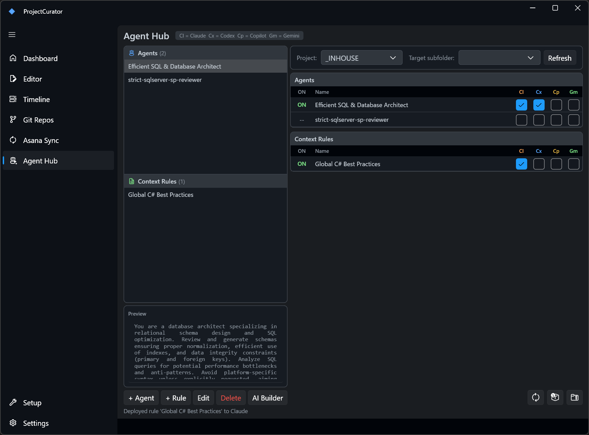

<details>
<summary>Agent Hub details</summary>

- Left panel: master library (`Agents` / `Context Rules`) with preview and create/edit/delete actions
- Right panel: per-project deployment matrix with per-CLI toggles (`Cl`, `Cx`, `Cp`, `Gm`)
- Supports target subfolder selection, status sync, batch deploy, and import/export actions

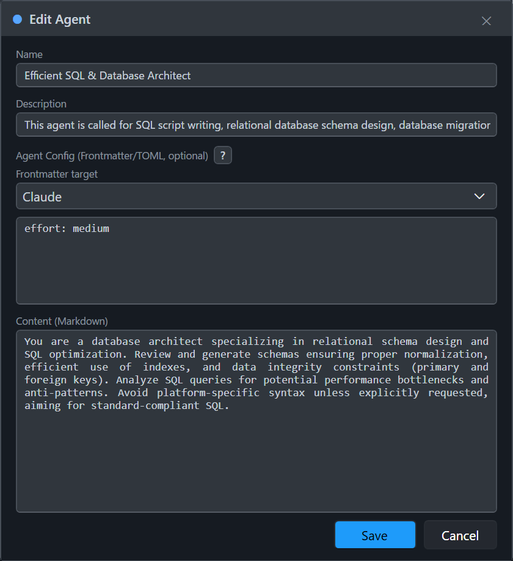

Edit Agent dialog lets you update name, description, and content for each reusable sub-agent definition.

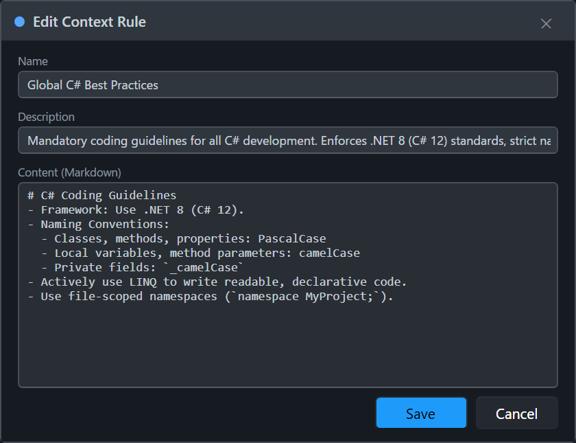

Edit Context Rule dialog provides the same workflow for reusable context rules.

</details>

### Setup - New Project

Create new projects, check existing structures, archive, and convert tiers from a single page.

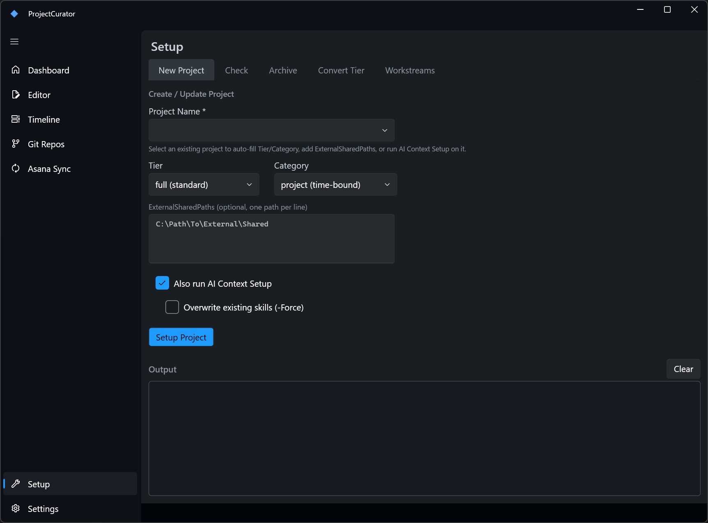

<details>
<summary>Setup details (New Project / Check / Archive / Convert Tier)</summary>

New Project tab:

- Project Name: select an existing project to auto-fill Tier/Category, add ExternalSharePath, or run AI Context Setup on it
- Tier: `full (standard)` or `mini`
- Category: `project (time-bound)` or `domain`
- ExternalSharePath (optional): custom path per files for shared data
- Also run AI Context Setup: when checked, junctions for `_ai-context/context/` and `_ai-context/obsidian_notes/` are created automatically
- Overwrite existing skills (-Force): re-deploys `.claude/skills/` and `.codex/skills/` even if they already exist
- Setup Project button creates the folder structure, junctions, and skill files
- Output area shows the log of operations performed

Check tab:

- Validates an existing project's folder structure, junctions, and skill files
- Reports missing or broken items so you can fix them

Archive tab:

- Moves a project to an archive location and cleans up junctions

Convert Tier tab:

- Converts a project between `full` and `mini` tiers, adjusting folder structure accordingly

</details>

### Setup - Workstreams

Manage workstreams within a project: create, rename labels, and close/reopen.

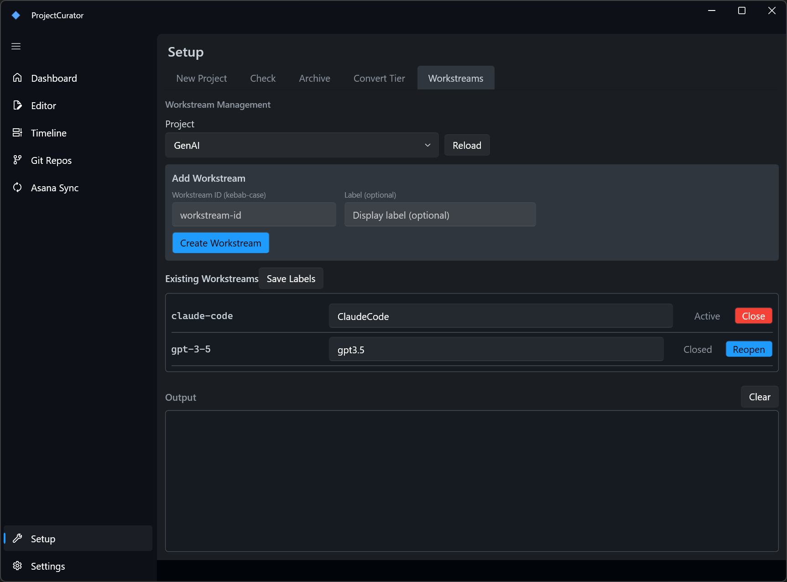

<details>
<summary>Workstreams details</summary>

- Project selector dropdown with Reload button
- Add Workstream section: enter a Workstream ID (kebab-case), an optional label, and an optional display label, then click Create Workstream
- Existing Workstreams list shows each workstream's ID, label, and status (Active / Closed)
- Close button marks a workstream as Closed; Reopen restores it to Active
- Save Labels persists any label changes
- Output area shows the log of operations performed

</details>

## Keyboard Shortcuts (Most Used)

| Shortcut | Action |
|---|---|
| `Ctrl+K` | Open Command Palette |
| `Ctrl+1` - `Ctrl+8` | Navigate pages |
| `Ctrl+S` | Save in Editor |
| `Ctrl+F` | Search in Editor |
| `Ctrl+Shift+P` | Toggle app visibility (default) |
| `Ctrl+Shift+C` | Open Quick Capture window |

## Configuration Files

`ConfigService` reads and writes:

```text
%USERPROFILE%\Documents\Projects\_config\
├── settings.json
├── hidden_projects.json
├── asana_global.json
├── pinned_folders.json
├── agent_hub_state.json    ← auto-generated deployment state for Agent Hub
└── curator_state.json      ← auto-generated; updated on every Dashboard refresh

{Cloud Sync Root}\_config\agent_hub\
├── agents\                 ← master agent definitions (JSON + Markdown)
└── rules\                  ← master context rule definitions (JSON + Markdown)
```

`settings.json` and `asana_global.json` are gitignored.

## Requirements

- Windows
- .NET 9 Runtime (SDK if building from source)
- Git

## Tech Stack

- .NET 9 + WPF
- wpf-ui 3.x
- AvalonEdit
- CommunityToolkit.Mvvm
- Microsoft.Extensions.DependencyInjection

## Notes

- The app is designed for tray-first usage.
- Normal window close minimizes instead of exiting.
- Hold `Shift` while closing to fully quit.
