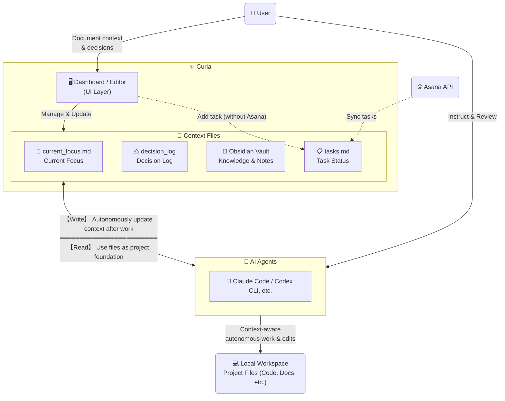
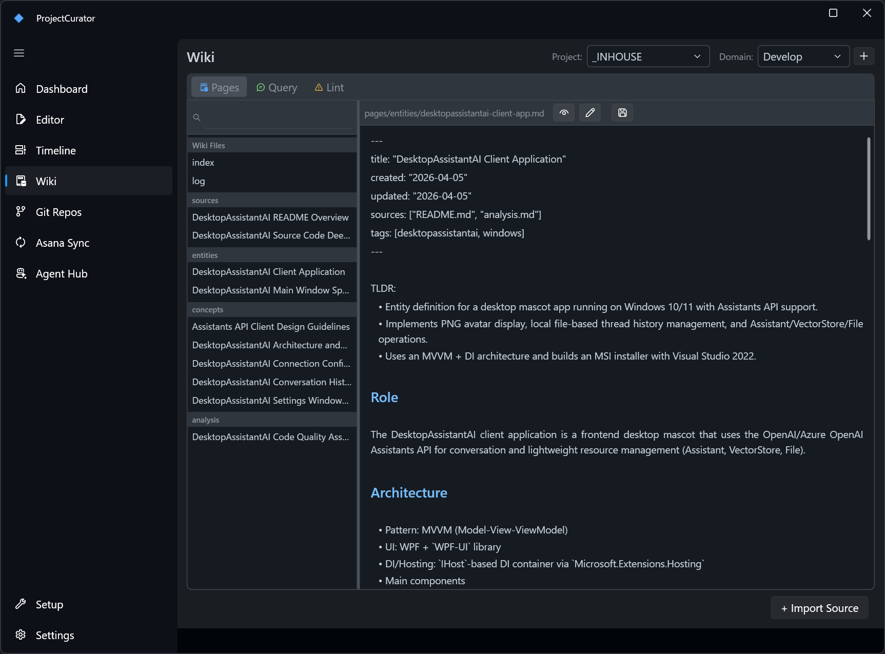

# Curia

[日本語版はこちら](README-ja.md)

A Windows desktop app for streamlining project management and context switching.

https://github.com/user-attachments/assets/092f578e-d4bf-4b08-90dd-7b4d151ab0a7

https://github.com/user-attachments/assets/e4eb870c-c551-449f-8ca6-264e4f168ece

## Who It Is For

- People managing multiple active projects, or one complex long-term project
- Users who want local folders primed for AI agent collaboration (Claude Code, Codex CLI, etc.)
- Users who want to build up `current_focus.md` and `decision_log` as a persistent project memory, browsable from one Dashboard

Asana integration is completely optional — the app works great as a standalone context manager.

## Core Features

| Page | What You Can Do |
|---|---|
| Dashboard | Project health overview, Today Queue, AI-powered What's Next suggestions |
| Editor | Markdown context editing with AI-powered focus updates, decision logging, and meeting notes import |
| Timeline | Review recent project activity in chronological order |
| Git Repos | Recursively scan workspace roots for repositories |
| Asana Sync | Sync Asana tasks to project/workstream Markdown outputs |
| Wiki | LLM-powered knowledge base: import sources, query, and lint for consistency |
| Agent Hub | Manage reusable sub-agent/context-rule library and deploy per project, per CLI |
| Setup | Create/check/archive projects, tier conversion, workstream management |
| Settings | Hotkey, workspace roots, LLM API configuration |

## Screenshots

| Dashboard | Editor |
|---|---|
|  |  |

| Agent Hub | Wiki |
|---|---|
|  |  |

| AI: What's Next | AI: Import Meeting Notes |
|---|---|
|  |  |

See the [UI Guide](docs/ui-guide.md) for all pages and AI feature screenshots.

## Quick Start (5 Minutes)

### 1. Download the app from GitHub Releases

- Open the [latest GitHub Release](https://github.com/yt3trees/Curia/releases)
- Download the `.zip` file
- Extract it to any folder you want (for example, `C:\Tools\Curia\`)

### 2. Launch `Curia.exe`

- Double-click `Curia.exe`
- If Windows SmartScreen appears, click `More info` -> `Run anyway`

### 3. Configure required paths

Open `Settings`, set these values, then save:
*(Note: If you don't use Box/OneDrive or Obsidian, you can simply point these to any local folders on your PC.)*

- `Local Projects Root` (parent folder for your local working projects)
- `Cloud Sync Root` (parent folder synced by Box for shared project files)
- `Obsidian Vault Root` (parent folder for your Obsidian vault, or just a general notes folder)

Required config files are created automatically when you save.

### 4. Optional: Set up Asana integration

See [Asana Setup](docs/asana-setup.md) for full instructions.

### 5. Optional: Set up LLM / AI features

Supports OpenAI, Azure OpenAI, Claude Code CLI, Gemini CLI, Codex CLI, and GitHub Copilot CLI. See [AI Features](docs/ai-features.md#setup-ja) for full setup instructions.

### 6. Create Your First Project

1. Open the `Setup` page
2. Type your project name into `Project Name` (e.g., `TestProject`)
3. Click `Setup Project` (this automatically creates the folder structure and required Markdown files)
4. Go to `Dashboard` to see your new project
5. Open `Editor` and start updating `current_focus.md`

Your environment is now ready. Configure Asana Sync later if needed.

## Requirements

- Windows
- Git
- .NET 9 SDK is needed only when building from source (release builds are self-contained and require no runtime)

Tech stack: .NET 9 + WPF, wpf-ui 3.x, AvalonEdit, CommunityToolkit.Mvvm

## Documentation

- [Daily Workflow](docs/daily-workflow.md) - Recommended daily flow, core context files, feature map
- [AI Features](docs/ai-features.md) - LLM setup, What's Next, Decision Log, Meeting Notes import, Quick Capture
- [Wiki Features](docs/wiki-features.md) - Building a project knowledge base: import sources, ask questions, lint for quality
- [AI Agent Collaboration & Agent Hub](docs/ai-agent-collaboration.md) - Working with Claude Code / Codex CLI, context file conventions, and managing reusable agent definitions per project and CLI
- [UI Guide](docs/ui-guide.md) - Screenshots and detailed operation guide for every page
- [Asana Setup](docs/asana-setup.md) - Asana credentials, sync configuration, and Asana Sync page reference
- [Folder Layout](docs/folder-layout.md) - Project folder structure, junctions, and what Setup creates
- [Configuration](docs/configuration.md) - Config file reference and keyboard shortcuts

## Notes

- The app is designed for tray-first usage.
- Normal window close minimizes instead of exiting.
- Hold `Shift` while closing to fully quit.
