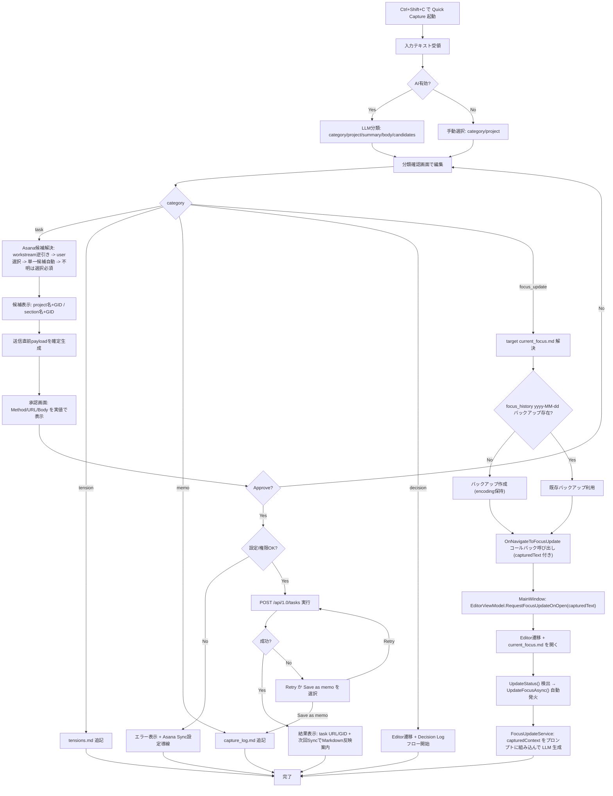

# Global Capture + AI Auto-Routing - 実装計画

グローバルホットキーでどこからでもフリーテキストを入力し、AIが「これはタスクか、テンションか、フォーカス更新か、意思決定か」を自動判定して適切なファイル/サービスにルーティングする機能。

ナビゲーション不要、ファイルを開く必要なし。思いついた瞬間にキャプチャして、AIが振り分ける。

`task` は `asana-tasks.md` 追記ではなく、Asana API への直接起票を主経路にする。

## コンセプト

```
どこからでも Ctrl+Shift+C → 軽量キャプチャウィンドウが出現
  ↓
「Xプロジェクトの認証、JWTじゃなくてセッションベースにしたほうがいいかも。
 パフォーマンス的にステートレスが有利だけど、既存のミドルウェアとの整合性が...」
  ↓ Enter で送信
AI が分類:
  種別: tension (未解決の技術課題)
  プロジェクト: ProjectAlpha (「認証」「ミドルウェア」から推定)
  要約: 認証方式の再検討 - JWT vs セッションベース
  ↓
ユーザーに確認 → tensions.md に追記
```

## 方針

- 専用のグローバルホットキー (Ctrl+Shift+C) でキャプチャウィンドウを起動
- 既存の HotkeyService を拡張し、複数ホットキーに対応
- キャプチャウィンドウは MainWindow とは独立した軽量ウィンドウ
- AI 分類は LlmClientService.ChatCompletionAsync で 1 回の呼び出し
- AI 無効時はキャプチャ自体は使えるが、手動でカテゴリとプロジェクトを選択
- `task` は Asana API に直接起票し、Markdown は補助ログとしてのみ扱う
- Asana 起票先は AI 推定 + 既存設定 (`asana_project_gids`, `workstream_project_map`) で解決し、曖昧な場合のみ人が確認する
- 起票候補 UI は GID 単体ではなく `プロジェクト名 (GID)` / `セクション名 (GID)` で表示する
- ルーティング先への書き込みは既存サービス (FileEncodingService 等) を利用
- 新規サービス: CaptureService (分類 + ルーティングのオーケストレーション)
- 新規ウィンドウ: CaptureWindow.xaml (軽量入力 UI)

## ルーティング先の定義

| カテゴリ | 振り分け先 | 書き込み方式 |
|---|---|---|
| task | Asana API (`POST /tasks`) | `projects` / `name` / `notes` / `due_on` / `assignee` を指定して直接起票。担当者は常に自分 (user_gid)。成功時のみ必要に応じて補助ログ更新 |
| tension | プロジェクトの `tensions.md` | 末尾に箇条書きで追記 |
| focus_update | `EditorViewModel.UpdateFocusAsync()` | Editor に遷移 → current_focus.md を開く → `UpdateFocusAsync` を自動発火。キャプチャ入力内容を LLM プロンプトのコンテキストとして渡す |
| decision | DecisionLogGeneratorService | Editor に遷移して AI Decision Log フローを起動 |
| memo | `_config/capture_log.md` | タイムスタンプ付きで追記 (どこにも属さないメモ) |

### task 起票先の決定ルール

1. `workstream_hint` がある場合: `workstream_project_map` を逆引きして Asana project GID を一意に決定  
2. ユーザーが起票先 Asana project を明示選択した場合: その選択を優先  
3. 候補 project が 1 件のみの場合: 自動決定  
4. それ以外: 候補を UI に表示し、ユーザーに選択させる (自動投入しない)

上記で project/section が解決しても、Asana への `POST /tasks` 実行前に必ず承認ステップを挟む。  
承認画面には「実際に送信する HTTP リクエスト内容 (method/url/body)」を表示し、承認時点の確定値のみを表示する。

セクションは以下:

1. AI が `section_candidate_gid` を返し、選択済み project の section 一覧に存在すれば採用  
2. 不明・不一致の場合は未選択にし、必要時のみユーザーに選択させる  
3. section 未指定でも task 起票は可能

## UI 設計

### キャプチャウィンドウ (初期状態)

```
┌──────────────────────────────────────────────────────────┐
│  Quick Capture                                     [×]   │
├──────────────────────────────────────────────────────────┤
│                                                          │
│  ┌────────────────────────────────────────────────────┐  │
│  │ (入力エリア: 複数行 TextBox)                       │  │
│  │                                                    │  │
│  │                                                    │  │
│  └────────────────────────────────────────────────────┘  │
│                                                          │
│  Project: [Auto-detect ▼]          [Capture ▶] [Cancel]  │
│                                                          │
└──────────────────────────────────────────────────────────┘
```

- ウィンドウサイズ: 520px 幅、高さは SizeToContent (画面に応じて変化)
- カーソルがあるモニターの作業領域中央に表示 (マルチモニター対応)
- Esc で閉じる、Ctrl+Enter で送信
- Project ドロップダウン: "Auto-detect" (デフォルト) + 全プロジェクトリスト
- AI 無効時: Project ドロップダウンの隣に Category ドロップダウンも表示

### 分類結果の確認 (AI 応答後)

```
┌──────────────────────────────────────────────────────────┐
│  Quick Capture                                     [×]   │
├──────────────────────────────────────────────────────────┤
│                                                          │
│  "認証方式の再検討 - JWTじゃなくてセッションベースに     │
│   したほうがいいかも..."                                  │
│                                                          │
│  ─────────────────────────────────────────────────────── │
│                                                          │
│  Category:  🔶 Tension                          [▼]     │
│  Project:   ProjectAlpha                        [▼]     │
│  Summary:   認証方式の再検討 - JWT vs Session   [edit]  │
│                                                          │
│                    [Route ▶] [Back] [Cancel]             │
│                                                          │
└──────────────────────────────────────────────────────────┘
```

- AI の分類結果を表示。ユーザーはドロップダウンで上書き可能
- Summary は AI が生成した要約 (編集可能)
- [Route] で確定、[Back] で入力画面に戻る
- Category / Project の変更は即座に反映 (LLM 再呼び出しなし)

### ルーティング完了

```
┌──────────────────────────────────────────────────────────┐
│  Quick Capture                                     [×]   │
├──────────────────────────────────────────────────────────┤
│                                                          │
│  ✓ Added to ProjectAlpha/tensions.md                     │
│                                                          │
│                              [Open File] [Close]         │
│                                                          │
└──────────────────────────────────────────────────────────┘
```

- [Open File] で該当ファイルを Editor で開く
- focus_update / decision の場合は [Route] で直接 Editor に遷移

## アーキテクチャ

```
CaptureWindow.xaml / .xaml.cs (新規)
  └── [Capture] ボタン (Ctrl+Enter)
        │
        ▼
CaptureService (新規)
  ├── ClassifyAsync(input, projectHint?, ct)
  │     ├── プロンプト構築 (入力テキスト + プロジェクト一覧)
  │     ├── LlmClientService.ChatCompletionAsync()
  │     └── JSON 解析 → CaptureClassification
  │
  └── RouteAsync(classification, originalInput, ct)
        ├── task     → CreateAsanaTaskAsync() (Asana API)
        ├── tension  → AppendToTensionsAsync()
        ├── memo     → AppendToCaptureLogAsync()
        ├── focus_update → return NavigationRequest (Editor + focus)
        └── decision     → return NavigationRequest (Editor + decision)
              │
              ▼
        FileEncodingService (既存: ファイル読み書き)

HotkeyService (既存: 拡張)
  └── 複数ホットキー対応
        ├── HOTKEY_ID = 9000 (既存: アプリ切り替え)
        └── HOTKEY_ID = 9001 (新規: キャプチャ)

MainWindow.xaml.cs (既存: 変更)
  └── キャプチャホットキー受信 → CaptureWindow 表示
```

## データモデル

### CaptureClassification

```csharp
public class CaptureClassification
{
    public string Category { get; set; }    // "task" | "tension" | "focus_update" | "decision" | "memo"
    public string ProjectName { get; set; } // マッチしたプロジェクト名 or ""
    public string Summary { get; set; }     // AI 生成の要約 (1行)
    public string Body { get; set; }        // ルーティング先に書き込む整形済みテキスト
    public string WorkstreamHint { get; set; } = "";
    public string AsanaProjectCandidateGid { get; set; } = "";
    public string AsanaSectionCandidateGid { get; set; } = "";
    public string DueOn { get; set; } = ""; // YYYY-MM-DD or ""
    public double Confidence { get; set; }  // 0.0-1.0 (低い場合はユーザー確認を強調)
    public string Reasoning { get; set; }   // 分類理由 (デバッグ用)
}
```

### CaptureRouteResult

```csharp
public class CaptureRouteResult
{
    public bool Success { get; set; }
    public string Message { get; set; }           // "Added to ProjectAlpha/tensions.md"
    public string? TargetFilePath { get; set; }   // 書き込み先のフルパス
    public string? AsanaTaskGid { get; set; }     // task の場合に設定
    public string? AsanaTaskUrl { get; set; }     // task の場合に設定
    public string? AsanaProjectGid { get; set; }  // 実際に起票した project
    public string? AsanaSectionGid { get; set; }  // 指定した場合のみ
    public bool RequiresNavigation { get; set; }  // true = Editor 遷移が必要
    public string? NavigationProjectName { get; set; }
    public string? NavigationFilePath { get; set; }
}
```

## 実装タスク

### Phase 1: HotkeyService の複数ホットキー対応

- [x] 1-1. HotkeyService にキャプチャ用ホットキーの登録機能を追加
  - 新しい定数: `CAPTURE_HOTKEY_ID = 9001`
  - `RegisterCapture(Window window)` メソッドを追加
  - WndProc で HOTKEY_ID を分岐して異なるコールバックを呼ぶ
  - `OnCaptureActivated` コールバックプロパティを追加
  - ファイル: `Services/HotkeyService.cs`

- [x] 1-2. Win32Interop に CAPTURE_HOTKEY_ID 定数を追加
  - ファイル: `Helpers/Win32Interop.cs`

- [x] 1-3. AppConfig にキャプチャホットキー設定を追加
  - `CaptureHotkey` プロパティ (HotkeyConfig 型、デフォルト: Ctrl+Shift+C)
  - ファイル: `Models/AppConfig.cs`

- [x] 1-4. Settings UI にキャプチャホットキー設定を追加
  - 既存のホットキー設定 UI と同パターン
  - ファイル: `Views/Pages/SettingsPage.xaml`, `ViewModels/SettingsViewModel.cs`

### Phase 2: CaptureService (分類エンジン)

- [x] 2-1. CaptureClassification / CaptureRouteResult モデルを作成
  - ファイル: `Models/CaptureModels.cs` (新規)

- [x] 2-2. CaptureService の骨格を作成
  - コンストラクタ DI: LlmClientService, ConfigService, FileEncodingService, ProjectDiscoveryService
  - ファイル: `Services/CaptureService.cs` (新規)

- [x] 2-3. ClassifyAsync() を実装
  - プロジェクト一覧を取得 (ProjectDiscoveryService)
  - System Prompt + User Prompt を構築
  - BuildUserPrompt 内でフォーカスファイルを同期読み込みするため、`Task.Run()` でバックグラウンド実行 (UI スレッドブロック防止)
  - LlmClientService.ChatCompletionAsync() を呼び出し
  - JSON レスポンスを CaptureClassification に解析
  - パース失敗時: category="memo" にフォールバック
  - ファイル: `Services/CaptureService.cs`

- [x] 2-4. AI 無効時の手動分類パスを実装
  - ClassifyAsync を呼ばず、ユーザー選択の category + project で CaptureClassification を構築
  - Summary は入力テキストの先頭 50 文字
  - Body は入力テキスト全文
  - ファイル: `Services/CaptureService.cs`

### Phase 3: CaptureService (ルーティングエンジン)

- [x] 3-1. RouteAsync() のディスパッチロジックを実装
  - category に基づいて個別メソッドに振り分け
  - ファイル: `Services/CaptureService.cs`

- [x] 3-2. CreateAsanaTaskAsync() を実装 (task ルート)
  - `asana_config.json` から `asana_project_gids` と `workstream_project_map` を読み込み、投入先 Asana Project GID を決定
  - Asana metadata 取得 API を追加:
    - `GET /projects/{gid}` で表示名を取得
    - `GET /projects/{gid}/sections` で section 一覧を取得
    - 短時間キャッシュして連続起票時の API 呼び出しを抑制
  - project 解決は「workstream逆引き → user選択 → 単一候補自動 → UI確認」の順で判定
  - section 解決は「AI候補一致なら採用 / 不明なら未指定 or UI確認」
  - `AsanaSyncService` と同じトークン解決ルールを使う (`ASANA_TOKEN` → `_config/asana_global.json`)
  - Asana API `POST https://app.asana.com/api/1.0/tasks` を呼び出し
  - payload 例: `name`(summary), `notes`(body+原文), `projects`([projectGid]), `due_on`(任意), `memberships`(section指定時)
  - 送信直前に `TaskCreateRequestPreview` を生成し、承認ダイアログ表示後にのみ API 実行
  - Preview は AI 推定値ではなく「最終選択済みの確定値」から組み立てる
  - 成功時は `gid` / URL を `CaptureRouteResult` に返却
  - ファイル: `Services/CaptureService.cs` (+ 必要なら `Services/AsanaTaskCreateService.cs` 新規)

- [x] 3-3. Asana 起票の補助ログ (任意) を実装
  - 直接起票成功時のみ、`asana-tasks.md` へ即時追記するかを設定で切り替え
  - デフォルトは OFF (Asana Sync による反映を正とする)
  - ファイル: `Services/CaptureService.cs`, `Models/AppConfig.cs`, `ViewModels/SettingsViewModel.cs`

- [x] 3-4. AppendToTensionsAsync() を実装 (tension ルート)
  - プロジェクトの tensions.md パスを解決 (AiContextContentPath 配下)
  - ファイル末尾に `- {summary}: {body の1行要約}` を追記
  - ファイルが存在しない場合: ヘッダー付きで新規作成
  - ファイル: `Services/CaptureService.cs`

- [x] 3-5. AppendToCaptureLogAsync() を実装 (memo ルート)
  - `_config/capture_log.md` に追記
  - フォーマット: `## {yyyy-MM-dd HH:mm}\n{original input}\n`
  - ファイル: `Services/CaptureService.cs`

- [x] 3-6. focus_update / decision ルートの NavigationRequest 生成を実装
  - focus_update: ターゲットプロジェクトの current_focus.md パスを解決し、`RequiresNavigation = true` の CaptureRouteResult を返す
  - focus_update でナビゲーション前に `focus_history/yyyy-MM-dd.md` のバックアップ存在確認を実施 (冪等)
  - decision: ターゲットプロジェクト名を返す (NavigationFilePath = null)
  - 実際のファイル編集は既存の EditorViewModel フローに委譲
  - ファイル: `Services/CaptureService.cs`

- [x] 3-7. focus_update ルート: EditorViewModel.UpdateFocusAsync との連携
  - `CaptureWindow.OnNavigateToFocusUpdate` コールバック (シグネチャ: `Action<string, string, string>`: projectName, filePath, capturedText)
  - MainWindow が `EditorViewModel.RequestFocusUpdateOnOpen(capturedText)` を呼んでフラグとキャプチャ内容を保存
  - `EditorViewModel.UpdateStatus()` で `_capturedContextForFocusUpdate != null` かつ current_focus.md が開かれたタイミングで `UpdateFocusAsync()` を自動発火
  - `FocusUpdateService.GenerateProposalAsync()` の新規パラメータ `capturedContext` にキャプチャ入力を渡す
  - LLM プロンプトに "User intent captured via Quick Capture" セクションとして追加
  - 変更ファイル: `Services/FocusUpdateService.cs`, `ViewModels/EditorViewModel.cs`, `Views/CaptureWindow.cs`, `MainWindow.xaml.cs`

### Phase 4: CaptureWindow (UI)

- [x] 4-1. CaptureWindow.xaml を作成
  - WindowStyle=None、最小限のフレームレスウィンドウ
  - ダークモードテーマリソース (AppSurface0/1、AppText)
  - WindowChrome 適用 (白枠防止)
  - サイズ: 520x240、Topmost=true
  - ファイル: `Views/CaptureWindow.cs` (コードビハインドのみ、XAML なし)

- [x] 4-2. CaptureWindow.xaml.cs の初期入力画面を実装
  - TextBox (AcceptsReturn=true、複数行)
  - Project ComboBox ("Auto-detect" + プロジェクトリスト)
  - [Capture] ボタン (Ctrl+Enter) + [Cancel] ボタン (Esc)
  - ウィンドウ位置: カーソルがあるモニターの作業領域中央 (System.Windows.Forms.Screen でモニター取得、DPI スケール対応)
  - フォーカス: TextBox に自動フォーカス
  - ファイル: `Views/CaptureWindow.cs`

- [x] 4-3. 分類結果の確認画面を実装
  - AI 応答後に入力エリアを読み取り専用に切り替え
  - Category ドロップダウン (AI 結果をデフォルト選択、手動変更可能)
  - Project ドロップダウン (AI 結果をデフォルト選択、手動変更可能)
  - task の場合のみ Asana Project / Section / Due Date / の追加行を表示
  - Asana Project ドロップダウン (表示形式: `{project name} ({gid})`)
  - Section ドロップダウン (任意。表示形式: `{section name} ({gid})`)
  - Due Date TextBox (YYYY-MM-DD、AI 提案を初期値、空欄で期限なし)
  - project/section が一意に決まるときは自動選択し、曖昧時だけ選択必須にする
  - Summary TextBox (編集可能)
  - [Route] [Back] [Cancel] ボタン
  - 確認画面表示時は Category/Project ComboBox の SelectionChanged を一時アンサブスクライブして `LoadAsanaProjectsForCurrentProjectAsync` の多重呼び出しを防ぐ
  - ファイル: `Views/CaptureWindow.cs`

- [x] 4-4. task 起票承認画面を実装
  - task の [Route] 押下時は即送信せず、承認ダイアログを表示
  - ダイアログに以下を表示:
    - `POST https://app.asana.com/api/1.0/tasks`
    - Request Body (JSON, 実際の送信内容)
    - 対象 project/section の表示名 + GID
  - 表示する Body は最終入力値で再構成し、AI の生出力はそのまま表示しない
  - JSON シリアライズは `JavaScriptEncoder.UnsafeRelaxedJsonEscaping` を使用 (日本語が `\uXXXX` にならないよう対策)
  - [Approve & Create] で送信、[Back to Edit] で編集画面に戻る
  - Due Date に不正なフォーマットが入力された場合は Route 時点でバリデーションエラーを表示
  - ファイル: `Views/CaptureWindow.cs`

- [x] 4-5. ルーティング完了画面を実装
  - 成功メッセージ表示
  - task 成功時は [Open Asana] ボタンを表示
  - [Open File] ボタン (テキスト追記系)
  - focus_update / decision の場合: 自動で Editor に遷移してウィンドウを閉じる
  - ※ 2秒後自動クローズは未実装
  - ファイル: `Views/CaptureWindow.cs`

- [x] 4-6. AI 無効時の手動モード UI
  - Category ドロップダウンを入力画面に表示 (AI 分類をスキップ)
  - Project ドロップダウン必須 (Auto-detect なし)
  - [Capture] で分類確認はスキップ可能だが、task の Asana起票承認画面は必ず表示
  - ファイル: `Views/CaptureWindow.cs`

- [x] 4-7. ローディング表示
  - AI 分類中にスピナー (ProgressBar IsIndeterminate=true) を表示
  - [Cancel] で CancellationTokenSource をキャンセル
  - Window の `MinHeight` を設定しない (SizeToContent で自動縮小)。MinHeight があると Loading 画面のコンテンツより大きいウィンドウが残り背景色のみ見えるバグが発生するため
  - ファイル: `Views/CaptureWindow.cs`

- [x] 4-8. Due Date フィールドを Confirm 画面に追加 (task のみ)
  - TextBox (`YYYY-MM-DD`、ヒントテキスト付き)
  - AI が `due_on` を提案していれば初期値としてセット、空欄なら空のまま
  - Category が task のときのみ表示
  - ファイル: `Views/CaptureWindow.cs`

- [x] 4-9. 担当者を常に自分に自動設定
  - `asana_global.json` の `user_gid` を読んで Asana タスクの `assignee` フィールドに設定
  - UI での選択は不要 (常に自分固定)
  - ファイル: `Services/CaptureService.cs`

### Phase 5: MainWindow / App 統合

- [x] 5-1. App.xaml.cs に CaptureService と CaptureWindow の DI 登録
  - CaptureService: Singleton
  - CaptureWindow: Transient (毎回新しいインスタンス)
  - ファイル: `App.xaml.cs`

- [x] 5-2. MainWindow.xaml.cs にキャプチャホットキーハンドラを追加
  - `_hotkeyService.OnCaptureActivated = ShowCaptureWindow;`
  - ShowCaptureWindow: CaptureWindow を生成して ShowDialog
  - ルーティング結果が NavigationRequest の場合: Editor に遷移
  - ファイル: `MainWindow.xaml.cs`

- [x] 5-3. CaptureWindow から MainWindow への遷移コールバックを設定
  - `OnNavigateToFile`: 通常ファイル遷移 → `NavigateToEditorAndOpenFile(project, filePath)`
  - `OnNavigateToFocusUpdate` (focus_update 専用、シグネチャ `Action<string, string, string>`): `NavigateToEditorAndTriggerFocusUpdate(project, filePath, capturedText)` を呼び、`EditorViewModel.RequestFocusUpdateOnOpen(capturedText)` → `NavigateToProjectAndOpenFile` → EditorPage 遷移 の順で実行
  - `OnNavigateToDecision`: `NavigateToEditor(project)` + DecisionLog フロー起動
  - ファイル: `MainWindow.xaml.cs`

### Phase 6: エラーハンドリングと品質

- [x] 6-1. LLM API エラー時のフォールバック
  - API エラー → 手動モードに切り替え (Category/Project ドロップダウンを表示)
  - エラーメッセージをウィンドウ内に表示 (モーダルダイアログではなく)
  - ファイル: `Views/CaptureWindow.cs`

- [x] 6-2. プロジェクト未検出時の処理
  - AI がプロジェクト名を特定できなかった場合 → Project ドロップダウンを必須入力に
  - category が memo の場合はプロジェクト不要
  - ファイル: `Views/CaptureWindow.cs`

- [x] 6-3. Asana 候補解決不可時の処理
  - `asana_project_gids` が空、または逆引き不一致の場合は task 起票を停止
  - UI に「Asana project 設定不足」を表示し、`Asana Sync` 設定画面への導線を出す
  - ファイル: `Services/CaptureService.cs`, `Views/CaptureWindow.cs`

- [x] 6-4. ファイル書き込み失敗時の処理
  - パスが存在しない、権限エラー等 → エラーメッセージ + memo にフォールバック
  - ファイル: `Services/CaptureService.cs`

- [x] 6-5. Asana API 起票失敗時の処理
  - 4xx/5xx を UI に表示 (status code + メッセージ断片)
  - 自動で `asana-tasks.md` 追記にはフォールバックしない
  - [Retry] と [Save as memo] を提示
  - ファイル: `Services/CaptureService.cs`, `Views/CaptureWindow.cs`

- [x] 6-6. 空入力の防止
  - TextBox が空の場合 [Capture] ボタンを無効化
  - ファイル: `Views/CaptureWindow.cs`

- [x] 6-7. 連続キャプチャ対応
  - ルーティング完了後、[New Capture] ボタンで入力画面に戻る (ウィンドウ再生成なし)
  - ファイル: `Views/CaptureWindow.cs`

- [x] 6-8. 重複起票ガード
  - 同一 summary + project で短時間に連続送信した場合、確認ダイアログを出す
  - `capture_log.md` に `asana_task_gid` を記録し、重複判定に利用
  - ファイル: `Services/CaptureService.cs`

## プロンプト設計

### System Prompt

```
You are a classifier for a multi-project manager's quick capture system.
Your job is to analyze free-form input and classify it into the most appropriate category,
identify which project it belongs to, and generate a concise summary.

## Categories
- "task": An actionable to-do item. Something that needs to be done.
  Examples: "○○を実装する", "レビューを依頼する", "ドキュメントを更新する"
- "tension": An unresolved question, concern, trade-off, or risk. Not yet a decision.
  Examples: "AとBどちらがいいか迷っている", "パフォーマンスが心配", "○○との整合性が..."
- "focus_update": A shift in priorities or focus. The user wants to record a change in what they're working on.
  Examples: "今週は○○に集中する", "方針転換: ○○を先にやる", "○○は後回しにする"
- "decision": A concluded choice. The user has decided something and wants to record it.
  Examples: "○○に決めた", "○○を採用する", "○○ではなく○○でいく"
- "memo": General note, idea, or thought that doesn't fit other categories.
  Examples: "○○について調べたい", "来週の会議で○○を話す", random thoughts

## Output rules
- Return a single JSON object. No explanation, no markdown fences.
- Fields:
  {
    "category": "task" | "tension" | "focus_update" | "decision" | "memo",
    "project": "exact project name from the list, or empty string if unclear",
    "summary": "concise one-line summary (max 80 chars)",
    "body": "detail text for routing target (task uses this as Asana notes)",
    "workstream_hint": "candidate workstream id or empty string",
    "project_candidate_gid": "candidate Asana project gid or empty string",
    "section_candidate_gid": "candidate Asana section gid or empty string",
    "due_on": "YYYY-MM-DD or empty string",
    "confidence": 0.0 to 1.0,
    "reasoning": "brief explanation of classification"
  }

## Project matching rules
- Match based on keywords, project names, technology mentions, or domain context
- If the input explicitly mentions a project name, use that
- If ambiguous between projects, set confidence < 0.5 and leave project empty
- Project names are case-insensitive for matching
- If task destination is ambiguous across multiple Asana projects, prefer leaving candidate gid empty
- section candidate is optional; return empty if not confident

## Body formatting rules
- For "task": actionable detail text for Asana notes (plain text, no markdown checkbox)
- For "tension": "- {question or concern, naturally phrased}"
- For "focus_update": the full input text, lightly edited for clarity
- For "decision": the full input text, structured as "Decision: X. Reason: Y"
- For "memo": the full input text as-is
```

### User Prompt 構造

```
## Available Projects
{For each project:}
- {ProjectName} (Tier: {tier}) - Focus: {first 100 chars of current_focus.md or "no focus file"}

## User Input
{raw input text}

## Context
- Date: {today YYYY-MM-DD}
- User-selected project: {selected project name or "auto-detect"}

Classify the input above.
```

## 実装時の必須品質要件

以下は「検討事項」ではなく、実装時に満たす前提条件とする。

### 0) 人間承認ゲート (task は必須)

Asana への task 起票は常に「承認画面 -> 承認 -> API送信」の順にする。  
自動送信モードは設けない。  
承認画面には、実際に送信する request をそのまま表示する:

- Method: `POST`
- URL: `https://app.asana.com/api/1.0/tasks`
- Body: 最終確定値から生成した JSON

表示する request は AI の推定説明ではなく、送信直前 payload の実体であることを保証する。  
`Authorization` ヘッダー値など機密は表示しない。

### 1) 重複起票を防ぐ実行制御

task 起票は同一入力の多重送信を防ぐ。  
`CaptureWindow` で Route 実行中は task 送信ボタンを無効化し、サービス側でも idempotency 相当のキー (`project + summary + hash(body)` など) を短時間保持する。  
同一キーの再送が発生した場合は自動再起票せず、既存起票結果を再表示するか、ユーザー確認を必須にする。

### 2) Asana 権限エラーを先に見える化

候補 project の表示と task 作成可否は別問題として扱う。  
`projects/{gid}` 取得が成功しても起票権限がない場合があるため、`POST /tasks` の 4xx は「設定不備」ではなく「権限不足/制約違反」として UI に明示する。  
ユーザーの次アクションが即わかる文言 (対象 project 名、status code、要修正点) を返す。

### 3) project / section の整合性検証

section 指定時は、選択中 project 配下の section であることを必ず検証する。  
不整合な組み合わせは送信前に補正し、補正不能なら section を未指定に戻してユーザー確認を要求する。  
`memberships` 利用時は project/section の組が正当であることを前提に payload を組み立てる。

### 4) 「Asana作成済み」と「Markdown反映」の非同期差を明示

task 作成成功後、`asana-tasks.md` への反映は Asana Sync 実行タイミングに依存する。  
そのため完了画面では「Asana起票は完了」「Markdown反映は次回同期で更新」の2段階状態を明示し、誤解を防ぐ。  
必要なら「今すぐ同期」導線を追加する。

### 5) metadata キャッシュの鮮度管理

project 名/section 名の取得結果は短期キャッシュでよいが、永続固定はしない。  
TTL (例: 10分) を設け、期限切れ時は再取得する。  
UI には再取得手段 (Refresh) を用意し、運用変更に追随できるようにする。

### 6) AI 推定の自動適用条件を固定

AI が返す `project_candidate_gid` / `section_candidate_gid` / `due_on` は信頼度条件付きで適用する。  
confidence が閾値未満、または候補が実在しない場合は自動適用しない。  
低信頼時は「候補として提案」扱いにして、最終決定はユーザーに委ねる。

### 7) 機密文字列の送信前チェック

入力文から API key / token / secret らしき文字列を検出した場合は、そのまま Asana notes に送らない。  
自動マスクまたは送信前確認を必須化し、誤送信の既定動作を安全側に倒す。  
この判定ログはローカルにのみ残し、外部送信しない。

### 8) 日付解釈のタイムゾーンを固定

`due_on` は日時ではなく日付で扱う。  
解釈基準は実行端末ローカル日付で固定し、UI 表示でも同一基準を維持する。  
曖昧な自然言語日付 (例: 「来週金曜」) を AI が返した場合は必ず ISO 日付に正規化してから送信する。

### 9) 運用時に追跡可能な構造化ログ

失敗解析できるように、少なくとも以下を構造化して記録する:  
分類結果、project 解決経路、section 解決経路、送信 payload 概要 (機密除去)、API status、返却 task gid。  
ログはデバッグに使える粒度を保ちつつ、機密情報は保存しない。

### 10) 設定不足時の復旧導線

`asana_project_gids` 未設定や候補解決不能時は、失敗で終わらせず Asana Sync 設定画面へ遷移可能にする。  
ユーザーが「何を直せばよいか」をメッセージで特定できる文言を必須とする。

### 11) 最低限のテスト可能性を担保

自動テストが無い前提でも、起票ロジックの核心は分離して検証可能にする。  
具体的には「project 選定」「section 選定」「payload 生成」「重複送信抑止」を pure に近い関数で分離し、単体検証しやすい形で実装する。  
UI 依存コードに選定ロジックを埋め込まない。

### 12) current_focus 更新前のバックアップ存在保証

`current_focus.md` を更新する全経路 (focus_update, Update Focus from Asana 連携含む) で、更新前バックアップの存在確認を必須化する。  
基準は既存 `FocusUpdateService.CreateBackupAsync` に合わせる:

- 保存先: `current_focus.md` と同階層の `focus_history/`
- ファイル名: `yyyy-MM-dd.md`
- 当日分が存在すれば `AlreadyExists` 扱いでそのまま利用
- 無ければ current_focus.md の内容とエンコーディングを保持して作成

更新処理本体に入る前にこのチェックを通過しない場合は、更新を実行しない。

## ファイル追加/変更一覧

### 新規ファイル

| ファイル | 説明 |
|---|---|
| `Models/CaptureModels.cs` | CaptureClassification, CaptureRouteResult, AsanaTaskCreatePreview 等のモデル |
| `Services/CaptureService.cs` | AI 分類 + ルーティング + Asana 起票のオーケストレーション (AsanaTaskCreateService は別ファイルにせず統合) |
| `Views/CaptureWindow.cs` | キャプチャウィンドウ (コードビハインドのみ。XAML ファイルなし) |

### 変更ファイル

| ファイル | 変更内容 |
|---|---|
| `Services/HotkeyService.cs` | 複数ホットキー対応 (CAPTURE_HOTKEY_ID 追加、OnCaptureActivated コールバック) |
| `Helpers/Win32Interop.cs` | CAPTURE_HOTKEY_ID = 9001 定数追加 |
| `Models/AppConfig.cs` | CaptureHotkey 設定追加 (デフォルト: Ctrl+Shift+C) |
| `App.xaml.cs` | CaptureService の Singleton 登録 |
| `MainWindow.xaml.cs` | キャプチャホットキーハンドラ、ShowCaptureWindow、NavigateToEditorAndTriggerFocusUpdate 追加 |
| `Services/FocusUpdateService.cs` | GenerateProposalAsync / BuildUserPrompt に capturedContext 引数追加。Quick Capture からの入力をプロンプトに組み込む |
| `ViewModels/EditorViewModel.cs` | RequestFocusUpdateOnOpen(capturedText)、_capturedContextForFocusUpdate フィールド、UpdateStatus() での自動発火ロジック追加 |
| `Views/Pages/SettingsPage.xaml` | キャプチャホットキー設定 UI + 補助ログトグル追加 |
| `ViewModels/SettingsViewModel.cs` | キャプチャホットキー設定の保存/読み込み + CaptureTaskLogEnabled |
| `Services/TrayService.cs` | OnCaptureActivated Action + Quick Capture メニュー項目追加 |
| `Views/Pages/DashboardPage.xaml` | キャプチャ履歴ボタン (Note24) 追加 |
| `Views/Pages/DashboardPage.xaml.cs` | ConfigService DI 追加 + ShowCaptureLogDialogAsync 実装 |

## 実装順序

Phase 1 (ホットキー拡張) → Phase 2 (分類エンジン) → Phase 3 (ルーティング) → Phase 4 (UI) → Phase 5 (統合) → Phase 6 (品質)

Phase 1-3 が裏側のロジック、Phase 4-5 が UI と統合。
Phase 2 完了時点でユニットテスト的な確認が可能 (コンソールから ClassifyAsync を呼べる)。
Phase 4 完了時点で E2E で動作確認可能。

### 最小動作バージョン (MVP)

Phase 2 + Phase 3 (task は Asana API 直接起票, tension/memo) + Phase 4 (4-1, 4-2 のみ) + Phase 5 で最小動作:
- ホットキーは後回し (Dashboard にボタンで代替)
- 分類確認画面なし (AI 結果をそのまま適用)。ただし task の起票承認画面は必須
- focus_update / decision ルートは後回し

## 他の計画との関係

| 観点 | Global Capture | What's Next | AI Decision Log | Smart Standup |
|---|---|---|---|---|
| LlmClientService | 共通利用 | 共通利用 | 共通利用 | 共通利用 |
| 入力 | ユーザーフリーテキスト | 自動 (メタデータ) | ユーザー入力 + 検出 | 自動 (スケジューラ) |
| 出力 | Asana起票 + ファイル振り分け | ダイアログ表示 | decision_log 保存 | standup 保存 |
| プロジェクト | AI 推定 or 手動選択 | 全プロジェクト横断 | 単一プロジェクト | 全プロジェクト横断 |
| Refine | なし (1回分類) | なし | あり (反復修正) | なし |
| 新規ファイル | 4 | 0 | 2 | 1 |
| HotkeyService 変更 | あり (複数ホットキー) | なし | なし | なし |

Global Capture は他機能と独立して実装可能。decision ルートは AI Decision Log と連携するが、必須ではない (後から接続可能)。

## 追加実装済み機能 (Phase 7)

### 7-1. キャプチャホットキー Settings UI (1-4 の完成)
- `Views/Pages/SettingsPage.xaml`: "Quick Capture Hotkey" セクション追加 (Global Hotkey 直後)
  - Ctrl/Shift/Alt/Win チェックボックス + キー入力 + Apply ボタン
  - "Append to asana-tasks.md on task creation" トグル (CaptureTaskLogEnabled) も同セクションに配置
- `ViewModels/SettingsViewModel.cs`: CaptureHotkeyCtrl/Shift/Alt/Win/Key プロパティ + ApplyCaptureHotkeyCommand + CaptureTaskLogEnabled
- `Views/Pages/SettingsPage.xaml.cs`: OnApplyCaptureHotkey ハンドラ追加

### 7-2. Asana 起票補助ログ (3-3 の完成)
- `Models/AppConfig.cs`: CaptureTaskLogEnabled プロパティ追加 (デフォルト false)
- `Services/CaptureService.cs`: CreateAsanaTaskAsync 成功時に AppendTaskToAsanaLogAsync を呼び出し
  - asana-tasks.md へ `- [ ] {name} [id:gid] (Due: date)` 形式で追記

### 7-3. ファイル書き込み失敗時のフォールバック (6-4 の完成)
- `Services/CaptureService.cs`:
  - AppendToTensionsAsync: try-catch 追加。失敗時は `[tension]` プレフィックス付きで capture_log.md へフォールバック。親ディレクトリ不存在時は Directory.CreateDirectory で作成
  - AppendToCaptureLogAsync: try-catch 追加。失敗時はエラーメッセージを返す

### 7-4. Asana API 起票失敗時の in-window エラー + Retry/Save as memo (6-5 の完成)
- `Views/CaptureWindow.cs`:
  - TaskApproval パネルにエラー TextBlock (OrangeRed) + Save as memo ボタンを追加
  - OnApproveClick: MessageBox 廃止 → インライン表示。失敗時は Approve ボタンが "Retry" に変わり Save as memo が表示される
  - OnSaveAsMemoClick: memo ルートに振り直す

### 7-5. トレイアイコン Quick Capture 導線
- `Services/TrayService.cs`: OnCaptureActivated Action 追加。コンテキストメニューに "Quick Capture" アイテムを "Show" 直後に挿入
- `MainWindow.xaml.cs`: _trayService.OnCaptureActivated = ShowCaptureWindow を追加

### 7-6. Dashboard キャプチャ履歴ボタン
- `Views/Pages/DashboardPage.xaml`: Lightbulb ボタン右隣に Note24 アイコンのボタンを常時表示
- `Views/Pages/DashboardPage.xaml.cs`:
  - ConfigService を DI で追加
  - ShowCaptureLogDialogAsync(): capture_log.md をパースして最新順 ListBox + フルコンテンツ TextBox のダイアログ表示
  - "Open in Editor" は OS のデフォルトエディタで開く (capture_log.md はプロジェクト外ファイルのため)

---

## 将来の拡張案

- 音声入力対応 (Windows Speech Recognition API でテキスト変換後に同じフローに流す)
- キャプチャ履歴の閲覧をさらに強化 (capture_log.md を Timeline ページで時系列表示)
- Asana API 直接書き戻し時の追加属性対応 (custom_fields 等)
- コンテキスト添付 (クリップボードの画像やURLを入力と一緒にキャプチャ)
- キーワードベースの即時ルーティング (「TODO:」で始まれば AI 不要で task に直接ルーティング)
- クリップボード自動入力 (ホットキー起動時に選択テキストを入力欄にセット)

## 処理ロジック (Mermaid)


