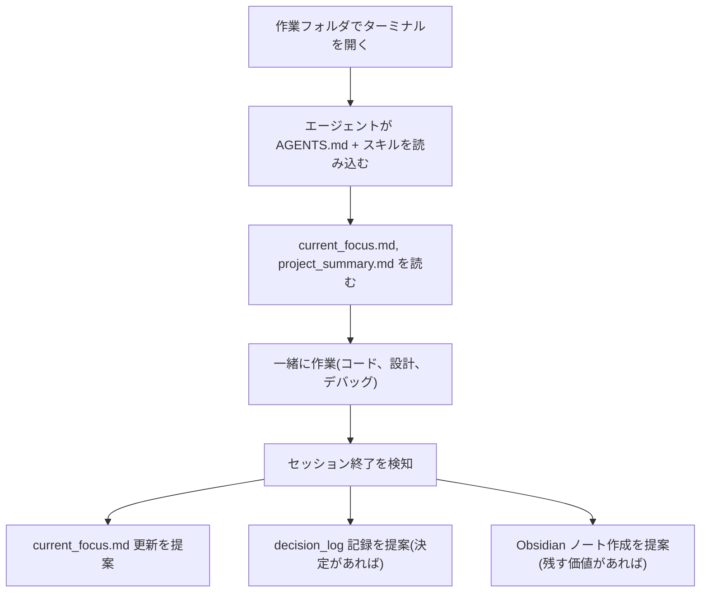
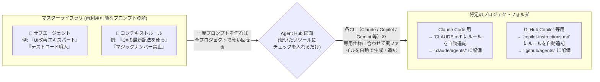

# AIエージェント協業 (Claude Code / Codex CLI)

[< READMEに戻る](../README-ja.md)

Curia は Claude Code や Codex CLI などの AI コーディングエージェントとの協業を前提に設計されています。

## 仕組み

Curia で管理されるプロジェクトには、プロジェクトルートに `AGENTS.md` と `.claude/skills/`(および `.codex/skills/`)にスキル定義が配置されます。日付管理の作業フォルダ内でターミナルを開くと:

```
shared/_work/2026/202603/20260321_fix-login-bug/
```

Claude Code や Codex CLI は上位ディレクトリの `AGENTS.md` とスキル定義を自動的に読み込みます。これにより、エージェントは以下を把握した状態で作業を開始します:

- プロジェクト構成と主要パス
- AIコンテキストファイル(`current_focus.md`、`decision_log`、`open_issues.md`)
- Obsidian Knowledge Layer のノート
- Asana タスク(同期済みの場合)

## エージェントの自律的な動作

`/project-curator` スキルにより、明示的なコマンドなしで以下が自動的に行われます:

| 動作 | トリガー |
|---|---|
| 意思決定ログ | 会話中のアーキテクチャ・技術選定の決定を検出 -> `decision_log/` への構造化記録を提案 |
| セッション終了 | 「ありがとう」等の区切りを検知 -> `current_focus.md` 更新を提案 |
| Obsidian ナレッジ | 作業完了後 -> セッション要約・技術メモの Obsidian への記録を提案 |
| Asana フォーカス更新 | 明示的な指示 (「update focus from Asana」) -> Asana タスク状況を `current_focus.md` に反映 |
| プロジェクト横断アクセス | `/project-curator` 呼び出し -> 全プロジェクトのステータス・タスク・パスを横断参照 |

すべての提案はユーザーの承認後に書き込まれます。既存の人間が書いた内容は変更しません。

## エージェントのセッションフロー



## Agent Hub (マルチCLI配備)

`Agent Hub` ページは、サブエージェント定義とコンテキストルール定義をプロジェクトごと・CLIごと(`Cl` / `Cx` / `Cp` / `Gm`)に切り替えて配備するためのコントロールセンターです。



https://github.com/user-attachments/assets/d97fde00-32ae-4220-90e0-9a25c34de40a

- マスターライブラリは `{Cloud Sync Root}\_config\agent_hub\` 配下 (`agents/` と `rules/`) に JSON + Markdown で保存されます。
- Agent の配備先:
  - Claude: `.claude/agents/<name>.md`
  - Codex: `.codex/agents/<name>.toml`
  - Copilot: `.github/agents/<name>.md`
  - Gemini: `.gemini/agents/<name>.md`
- Context Rule は `<!-- [AgentHub:<id>] -->` マーカーで囲って CLI 別ファイル (`CLAUDE.md`, `AGENTS.md`, `.github/copilot-instructions.md`, `GEMINI.md`) に追記/削除されるため、既存記述を壊しません。
- `.claude` / `.codex` / `.gemini` / `.github` はジャンクションを検出してリンク先へ書き込みます。
- 状態同期、サブフォルダ単位の配備、全プロジェクト一括配備、ライブラリZIPのImport/Export、AI Builder(AI機能有効時のみ)に対応しています。
- AI Builder では Agent または Context Rule のどちらを生成するかをラジオボタンで選択できます。Ctrl+Enter で Generate を実行でき、名前と説明はAIが自動補完します。
- 配備マトリクスの各行に `All` チェックボックスが追加され、全CLIをまとめて ON/OFF できます。
- ライブラリのインポートは ZIP のみに対応しています。保存される `.md` ファイルには YAML frontmatter が含まれるため、配備せずにそのまま利用できます。

## スキルの配置

Curia は Setup ページでプロジェクト作成・チェック時に `/project-curator` スキルを自動配置します:

- `.claude/skills/project-curator/` (Claude Code 用)
- `.codex/skills/project-curator/` (Codex CLI 用)
- `.gemini/skills/project-curator/` (Gemini CLI 用)
- `.github/skills/project-curator/` (GitHub Copilot 用)

スキルはアプリ内蔵のアセットから配置され、ジャンクション経由で共有フォルダと同期されます。Setup の `Overwrite existing skills` オプションで強制再配置できます。
