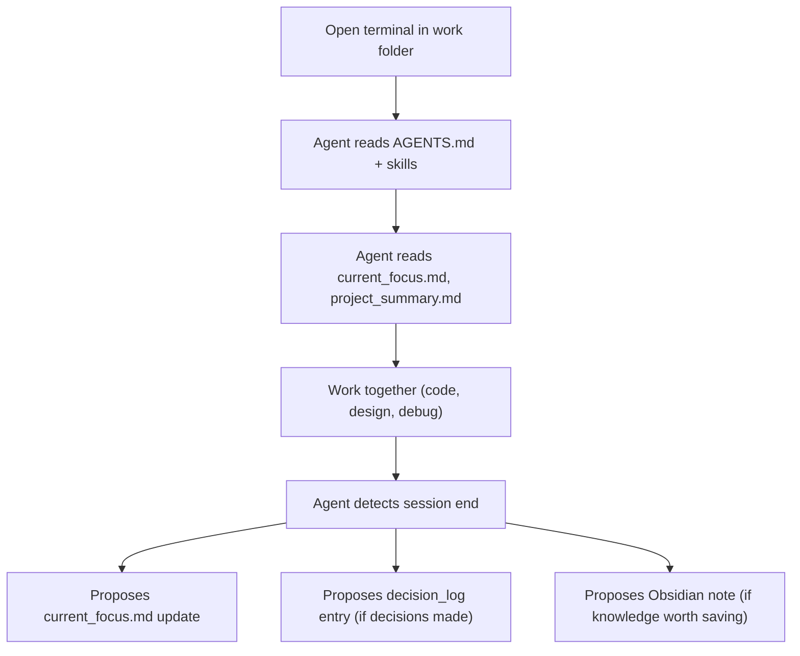
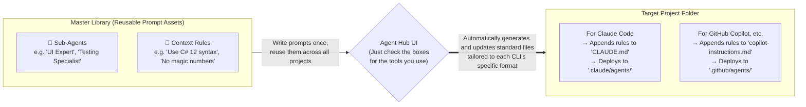

# AI Agent Collaboration (Claude Code / Codex CLI)

[< Back to README](../README.md)

Curia is designed to work alongside AI coding agents such as Claude Code and Codex CLI.

## How It Works

Each project managed by Curia contains an `AGENTS.md` at the project root and a set of embedded skills under `.claude/skills/` (and `.codex/skills/`). When you open a terminal inside a date-based work folder like:

```
shared/_work/2026/202603/20260321_fix-login-bug/
```

Claude Code or Codex CLI automatically reads the `AGENTS.md` and skill definitions above this directory. This gives the agent full awareness of:

- Project structure and key paths
- AI context files (`current_focus.md`, `decision_log`, `open_issues.md`)
- Obsidian Knowledge Layer notes
- Active Asana tasks (if synced)

## What the Agent Does Autonomously

The `/project-curator` skill enables the agent to act without explicit commands:

| Behavior | Trigger |
|---|---|
| Decision Logging | Architecture / tech decisions detected in conversation -> proposes structured logging to `decision_log/` |
| Session End | Wrap-up phrases detected -> proposes `current_focus.md` update |
| Obsidian Knowledge | After notable work -> proposes writing session summaries or technical notes to the Obsidian vault |
| Update Focus from Asana | Explicit: "update focus from Asana" -> syncs Asana task status into `current_focus.md` |
| Cross-project access | Invoke `/project-curator` -> query status, today's tasks, and file paths across all projects |

All proposals require user confirmation before writing. The agent never modifies existing human-written content.

## Typical Agent Session Flow



## Agent Hub (Multi-CLI Deployment)

The `Agent Hub` page is a control center for deploying sub-agent and context-rule definitions to each project with per-CLI toggles (`Cl` / `Cx` / `Cp` / `Gm`).




- Master library files are stored under `{Cloud Sync Root}\_config\agent_hub\` (`agents/` and `rules/` as JSON + Markdown).
- Agent deployment targets:
  - Claude: `.claude/agents/<name>.md`
  - Codex: `.codex/agents/<name>.toml`
  - Copilot: `.github/agents/<name>.md`
  - Gemini: `.gemini/agents/<name>.md`
- Context rules are appended/removed with `<!-- [AgentHub:<id>] -->` markers in CLI-specific files (`CLAUDE.md`, `AGENTS.md`, `.github/copilot-instructions.md`, `GEMINI.md`) so existing content is preserved.
- For `.claude` / `.codex` / `.gemini` / `.github`, deployment is junction-aware and writes to the junction target when present.
- Includes status sync, target subfolder deployment, batch deploy to all projects, library ZIP import/export, and AI Builder (enabled only when AI Features is on).
- AI Builder generates either an Agent or a Context Rule definition from a free-text prompt; Ctrl+Enter triggers Generate, and Name/Description are auto-filled by the AI.
- Each row in the deployment matrix has an `All` checkbox to toggle all CLI targets at once.
- Library import is ZIP-only; saved `.md` files include YAML frontmatter so they are directly usable without deploying.

## Skill Deployment

Curia automatically deploys the `/project-curator` skill when creating or checking a project from the Setup page:

- `.claude/skills/project-curator/` for Claude Code
- `.codex/skills/project-curator/` for Codex CLI
- `.gemini/skills/project-curator/` for Gemini CLI
- `.github/skills/project-curator/` for GitHub Copilot

Skills are sourced from the app's embedded assets and kept in sync with the shared folder via junctions. Use the `Overwrite existing skills` option in Setup to force re-deploy.
