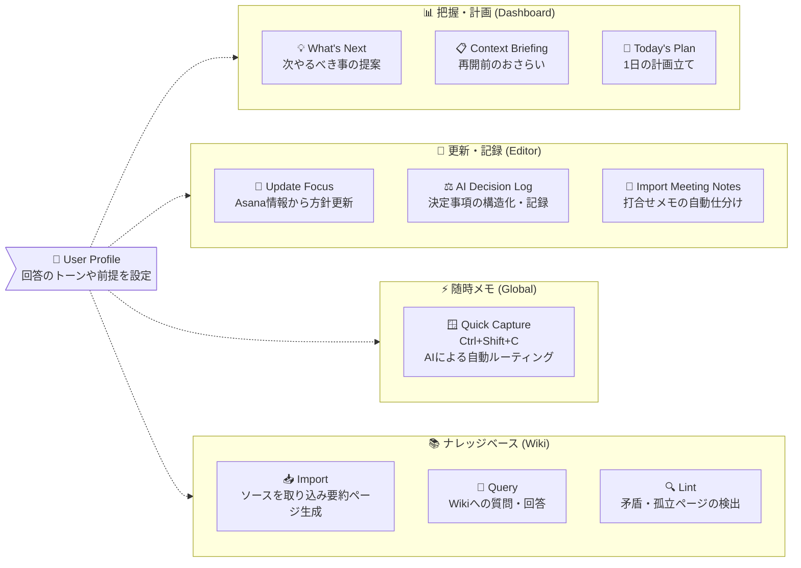
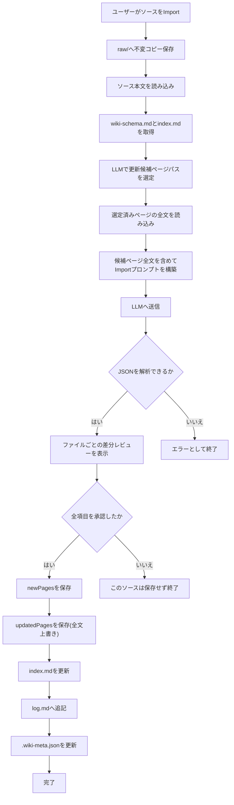
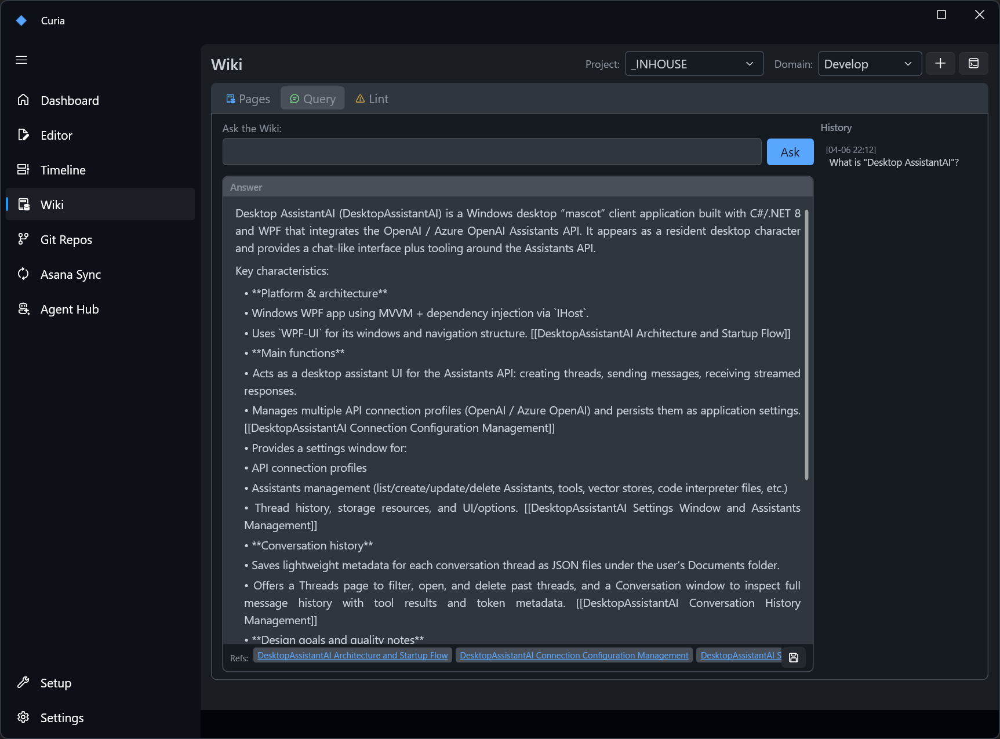
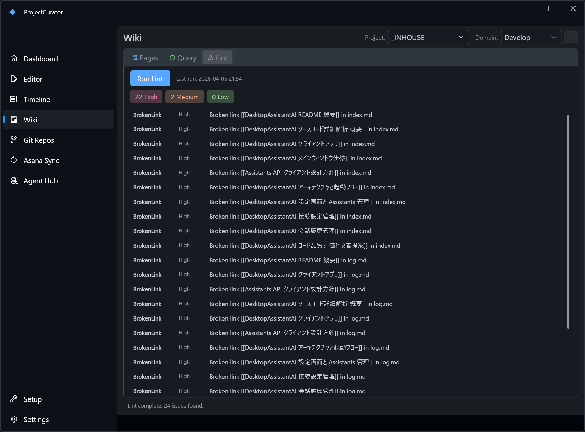

# AI機能

[< READMEに戻る](../README-ja.md)

すべての AI 機能は `Settings > LLM API` で `Enable AI Features` をオンにする必要があります。対応プロバイダー: OpenAI / Azure OpenAI。

## 目次

 - [AI機能の全体像](#ai-features-overview-ja)
 - [初期設定](#setup-ja)
 - [ユーザープロフィール](#user-profile-ja)
 - [What's Next (Dashboard)](#whats-next-dashboard-ja)
 - [Context Briefing (Dashboardカード)](#context-briefing-dashboard-card-ja)
 - [Today's Plan (Dashboard)](#todays-plan-dashboard-ja)
 - [Update Focus from Asana (Editor)](#update-focus-from-asana-editor-ja)
 - [AI Decision Log (Editor)](#ai-decision-log-editor-ja)
 - [Import Meeting Notes (Editor)](#import-meeting-notes-editor-ja)
 - [Quick Capture (グローバルホットキー)](#quick-capture-global-hotkey-ja)
 - [Wiki](#wiki-ja)
 - [Lint](#lint-ja)

<a id="ai-features-overview-ja"></a>
## AI機能の全体像

ProjectCuratorのAI機能は、「どんなシチュエーションで使うか（把握・更新・メモ）」によって大きく3つに分類されています。



<a id="setup-ja"></a>
## 初期設定

1. `Settings > LLM API` を開く
2. プロバイダーを選択し、API Key と Model を入力 (Azure の場合は Endpoint / API Version も)
3. `Test Connection` をクリック
4. テスト成功後、`Enable AI Features` をオンにして保存

<a id="user-profile-ja"></a>
## ユーザープロフィール

`Settings > LLM API > User Profile` に自分の役割・優先軸・文体などを自由記述で入力します。ここで設定したテキストは、すべての LLM 呼び出しのシステムプロンプト先頭に `## User Profile` セクションとして自動付与されます。毎回プロンプトに書かなくても、モデルがあなたの文脈を把握した状態で回答します。

記入例:

```
役割: エンジニアリングマネージャー。3～4件のプロジェクトを並行管理。
箇条書きで簡潔に。タスクを詰め込むより過負荷の日をフラグしてほしい。
current_focus.md の更新は既存のトーンを維持すること。
```

<a id="whats-next-dashboard-ja"></a>
## What's Next (Dashboard)

Dashboard ツールバーの lightbulb アイコンをクリックすると、全プロジェクト横断で優先度順の 3～5 件のアクション提案を取得できます。期限超過タスク・focus ファイルの鮮度・未コミット変更・未記録の決定事項などを LLM が分析し、緊急度順にランキングします。各提案の [Open] ボタンで該当ファイルへ直接移動できます。


<a id="context-briefing-dashboard-card-ja"></a>
## Context Briefing (Dashboardカード)

Dashboard の各プロジェクトカードにある lightbulb アイコンをクリックすると、対象プロジェクト専用の再開ブリーフィングを生成します。モデルは `current_focus.md`、直近の `decision_log`、`open_issues.md`、Asana の進行中/完了タスク、未コミット変更をまとめて読み取り、次を表示します。

- `Where you left off` (現状の要約)
- `Suggested next steps` (優先度付きアクション)
- `Key context` (再開時に必要な事実メモ)

ダイアログには `Copy`、`Open in Editor`、`View Debug` (プロンプト/レスポンス確認) が用意されています。


<a id="todays-plan-dashboard-ja"></a>
## Today's Plan (Dashboard)

Today's Plan ダイアログ(AI)では、1日の提案を時間帯別(例: Morning / Afternoon)に表示し、`Open` / `Copy` / `Save` / `View Debug` が利用できます。


<a id="update-focus-from-asana-editor-ja"></a>
## Update Focus from Asana (Editor)

Editor ツールバーの `Update Focus from Asana` ボタンをクリックすると、開いている `current_focus.md` の差分ベース更新提案を生成します。モデルは Asana タスクデータと既存ファイルを読み込み、見出し構造と文体を保持しながら変更案を提示します。バックアップは `focus_history/` に自動保存。Workstream 絞り込み・自然言語による再指示・デバッグ表示に対応しています。


<a id="ai-decision-log-editor-ja"></a>
## AI Decision Log (Editor)

Editor ツールバーの `Dec Log` ボタン (AI モード) で意思決定ログ作成ダイアログを開きます。決定内容を記述すると、モデルが Options / Why / Risk / Revisit Trigger を含む構造化ドラフトを生成します。自然言語による再指示に対応し、`open_issues.md` の解決済み項目の削除も可能。`decision_log/YYYY-MM-DD_{topic}.md` として保存されます。


<a id="import-meeting-notes-editor-ja"></a>
## Import Meeting Notes (Editor)

Editor ツールバーの `Import Meeting Notes` ボタンをクリック (または会議メモ入力ダイアログで `Ctrl+Enter`) すると、会議メモを貼り付けて LLM に1回で分析させることができます。プレビューダイアログは4つのタブで構成されます。

- Decisions タブ: 検出された意思決定をチェックボックスで一覧表示。「Show draft」で構造化された `decision_log` ドラフトをプレビュー。不要な項目はチェックを外して除外可能
- Focus タブ: LLM が `current_focus.md` 全文を再生成した提案を差分ビューで表示。既存の見出し構造・文体を保持しつつ新しい項目を統合
- Tensions タブ: `open_issues.md` に追記する内容のプレビュー(技術的疑問・トレードオフ・懸念)
- Asana Tasks タブ: 会議から抽出されたアクション項目の一覧。タスクごとに以下を設定可能:
  - Project: `asana_global.json` の `personal_project_gids` 先頭を初期選択。workstream に対応プロジェクトが設定されていればそちらを優先
  - Section: `asana_config.json` の `anken_aliases` とセクション名を照合して自動選択
  - Due Date: 任意で期限日を設定
  - Set time: チェックを入れると Hour / Minute セレクターが表示され、ローカルタイムゾーン付きの `due_at` として起票
  - チェックを入れたタスクのみ起票・追記

適用する項目を選択して `Apply Selected` をクリック。ダイアログ左下の `View Debug` ボタンで送信プロンプトと LLM レスポンスを確認できます。Decision log は `YYYY-MM-DD_{topic}.md` として保存。`current_focus.md` は更新前に `focus_history/` へ自動バックアップ。起票済みの Asana タスクは GID と期限付きで `tasks.md` へ追記されます。


<a id="quick-capture-global-hotkey-ja"></a>
## Quick Capture (グローバルホットキー)

デスクトップのどこからでも `Ctrl+Shift+C` を押すと、軽量キャプチャウィンドウが起動します。フリーテキストを入力して Enter を押すと、AI Features が有効な場合は LLM が内容を分類して自動でルーティングします。

| カテゴリ | 振り分け先 |
|---|---|
| `task` | Asana API でタスクを直接起票 (送信前に確認ステップあり) |
| `tension` | プロジェクトの `open_issues.md` に追記 |
| `focus_update` | Editor を開き、入力内容をコンテキストとして Update Focus from Asana フローを起動 |
| `decision` | Editor を開き、AI Decision Log フローを起動 |
| `memo` | `_config/capture_log.md` にタイムスタンプ付きで追記 |

AI Features が無効の場合は、カテゴリとプロジェクトを手動で選択することで引き続き利用できます。

<a id="wiki-ja"></a>
## Wiki

Wiki タブでは、ソースファイルを LLM に取り込ませてプロジェクト専用のナレッジベースを自動構築できます。
以下のパスは特に注記がない限り `wiki/<domain>/` を基準にした相対パスです。

### ページカテゴリ

Import によって生成されるページは以下の4カテゴリに分類されます。LLM が Import 時に自動で分類します。

| カテゴリ | 格納場所 | 内容 |
|---|---|---|
| Wiki Files | `wiki/<domain>/` 直下 | `index.md`(ページ一覧) と `log.md`(操作ログ)。Import/Query/Lint 実行時にアプリが更新する管理ファイル |
| sources | `pages/sources/` | 取り込んだソースファイルごとの要約ページ。1ソース = 1ページ |
| entities | `pages/entities/` | プロジェクト上の具体的な「もの」のページ。テーブル定義・画面・API・帳票・ユーザーロールなど |
| concepts | `pages/concepts/` | 設計思想や業務ルールのページ。承認フロー・ワークフロー・技術方針・判断基準など |
| analysis | `pages/analysis/` | Query タブで「Save as Wiki Page」した Q&A や比較分析のページ |

entities と concepts の違いの目安: 「それは何か(名詞)」→ entities、「それはどう動くか・なぜそうなのか(動詞・方針)」→ concepts。


### Import (ソース取り込み)

「+ Import Source」をクリックするか、Wiki タブにドラッグ＆ドロップします。LLM は以下の変更案を生成します:

- `wiki/raw/` にソースを保存 (不変コピー)
- `pages/sources/` に要約ページを作成
- 関連する `pages/entities/` と `pages/concepts/` ページを作成・更新
- `index.md` / `log.md` の更新案を生成

対応形式: `.md` / `.txt` / `.pdf` / `.docx`  
注: `.pdf` / `.docx` は選択可能ですが本文テキスト抽出は未対応のため、実運用では事前に `.md` / `.txt` へ変換が必要です。

保存前に、生成された各ページ変更は差分でレビューされます:
- 新規ページ: 空内容との差分
- 更新ページ: 現在ファイルとの差分

各項目を順番に承認します。1件でも Skip した場合は、そのソースの Import 結果は保存しません (all-or-nothing、index とページの不整合を防ぐため)。

#### Import時のLLM更新フロー



#### Import のプロンプト構成

Import の LLM 呼び出しは 2 段階です。
- 1回目: 更新候補になりそうな既存ページパスを選定
- 2回目: 選定したページの全文を渡して最終 Import 結果を生成

システムプロンプト:
- `wiki-schema.md` の全文 (LLM への運用指示書として機能)
- 出力言語の指定 (PC ロケールが日本語なら "Japanese"、それ以外は "English")
- レスポンス形式の指定: JSON のみ (コードフェンス不要)
- 各ページに YAML フロントマター (`title` / `created` / `updated` / `sources` / `tags`) を含めるよう指示
- `[[PageName]]` 形式のウィキリンクを使うよう指示
- 既存タグを優先し、類似タグの重複を避けるよう指示

ユーザープロンプトに含まれる情報:
- 現在の `index.md` の全文 (既存ページの一覧)
- 取り込むソースファイル名と本文全体
- 更新候補として選定された既存ページの全文 (既存ページのみ、最大 8 ページ)
- 既存 Wiki ページから収集したタグ語彙
- 作業指示: sources/ 要約ページの作成 / 既存ページの更新 / entities・concepts ページの新規作成 / index.md 更新差分 / log.md エントリの生成

1回目 (候補選定) のプロンプト:
- 入力: 既存ページパス一覧 + `index.md` 全文 + ソース本文
- 出力 JSON: `{"updateCandidates": ["pages/...md"]}` (既存ページのみ、最大 8 件)

LLM 応答のパース後、タグは揺れを減らすために正規化されます:
- lowercase + kebab-case 化
- 単複の簡易キー照合
- 既存タグ語彙に一致する場合は既存タグへ寄せる

LLM が返す JSON スキーマ:

```json
{
  "summary": "実行した内容の概要",
  "newPages": [{ "path": "pages/category/filename.md", "content": "Markdown全文" }],
  "updatedPages": [{ "path": "pages/category/filename.md", "diff": "更新後のMarkdown全文" }],
  "indexUpdate": "index.md の全文 (更新後)",
  "logEntry": "log.md に追記するエントリ"
}
```

updatedPages の `diff` フィールドはパッチではなく更新後の全文を返す仕様です。

### Query (Wiki への質問)

Wiki を参照しながら質問に回答します。蓄積された Wiki をそのまま渡すため、毎回ゼロから検索・合成する RAG とは異なります。

- 回答生成の前に、常に意味ベースで候補ページを選定します (最大 5 ページ)。
- 回答時に渡す本文は、選定済みページのみです (全ページは渡しません)。
- 候補選定が失敗した場合は、質問文とページのタイトル/パスのキーワード一致でフォールバックします。

「Save as Wiki Page」で回答を `pages/analysis/` に保存できます。



#### Query のプロンプト構成

`ChatCompletionAsync` を最大 2 回使います。

[1回目: 候補ページ選定] システムプロンプト:
- Wiki 検索アシスタントであること
- ファイルパスのみを 1 行ずつ返す指示

[1回目: 候補ページ選定] ユーザープロンプトに含まれる情報:
- 質問文
- `index.md` の全文

候補選定後の C# 側処理:
- 返却パスを正規化 (バッククォートや箇条書き記号を除去)
- 実在する wiki ページパスのみ採用
- 大文字小文字を無視して重複排除し、最大 5 件に制限
- 有効候補が 0 件なら、タイトル/パスと質問トークンの一致スコアでローカル選定

[2回目: 回答生成] システムプロンプト:
- Wiki の回答担当であることの宣言
- Wiki の内容のみを根拠に回答するよう指示
- 参照ページを `[[PageName]]` 形式で末尾に列挙するよう指示
- 出力言語の指定 (ロケール連動)
- `wiki-schema.md` の全文 (プロジェクト文脈)

[2回目: 回答生成] ユーザープロンプトに含まれる情報:
- 質問文
- `index.md` の全文
- 選定済み関連ページの全文 (最大 5 件)

<a id="lint-ja"></a>
### Lint

静的チェック (C# 側) と LLM チェックを組み合わせて Wiki の品質を検証します。

| チェック項目 | 内容 | 方法 |
|---|---|---|
| BrokenLink | 存在しないページへの `[[wikilink]]` | 静的 |
| Orphan | インバウンドリンクが 0 のページ (sources と管理ファイルは除外) | 静的 |
| MissingSource | `raw/` にないソース参照 (sources/ ページのフロントマターを確認) | 静的 |
| Stale | 30 日以上更新されていないページ (sources と管理ファイルは除外) | 静的 |
| Contradiction | 同一事実に対する矛盾した記述 | LLM |
| Missing | 複数ページで言及されているが未作成のトピック | LLM |

AI Features が無効の場合は静的チェックのみ実行されます。



#### Lint のプロンプト構成

LLM チェックは 1 回の `ChatCompletionAsync` です。

システムプロンプト (日本語ロケール時は日本語で送信):
- Wiki 品質監査担当であることの宣言
- チェック対象: 矛盾 (Contradiction) とページ不足 (Missing) の 2 項目
- レスポンス形式の厳密な指定:
  - `CONTRADICTION: [ページ1] vs [ページ2] — [説明]`
  - `MISSING: [トピック] — [ページ1]、[ページ2]... で言及`
  - 該当なしは `CONTRADICTION: none` / `MISSING: none`

ユーザープロンプトに含まれる情報:
- `index.md` の全文
- 全ページの 1 行要約一覧 (最大 80 件。トークン削減のためページ全文ではなく要約のみ)

LLM レスポンスは行ごとにパースして `CONTRADICTION:` / `MISSING:` プレフィックスで振り分けます。
