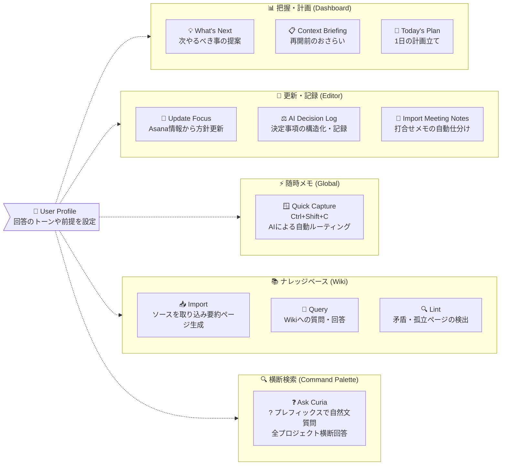

# AI機能

[< READMEに戻る](../README-ja.md)

すべての AI 機能は `Settings > LLM API` で `Enable AI Features` をオンにする必要があります。対応プロバイダー: OpenAI / Azure OpenAI / Claude Code CLI / Gemini CLI / Codex CLI / GitHub Copilot CLI。

<a id="ai-features-overview-ja"></a>
## AI機能の全体像

CuriaのAI機能は、「どんなシチュエーションで使うか（把握・更新・メモ）」によって大きく3つに分類されています。



<a id="setup-ja"></a>
## 初期設定

### API型プロバイダー (OpenAI / Azure OpenAI)

1. `Settings > LLM API` を開く
2. `OpenAI` または `Azure OpenAI` を選択し、API Key と Model を入力 (Azure は Endpoint / API Version も必要)
3. `Test Connection` をクリック
4. テスト成功後、`Enable AI Features` をオンにして保存

### CLI型プロバイダー (Claude Code CLI / Gemini CLI / Codex CLI)

認証は各 CLI ツール側で管理するため、Curia の設定画面に API Key の入力は不要です。

| プロバイダー | CLIツール | 認証方法 |
|---|---|---|
| Claude Code CLI | `claude` | `claude` を一度起動して認証 |
| Gemini CLI | `gemini` | `gemini auth login` を実行 |
| Codex CLI | `codex` | `OPENAI_API_KEY` 環境変数を設定、または Settings に API Key を入力すると Curia が自動で渡す |
| GitHub Copilot CLI | `copilot` | `gh auth login` でサインイン (Copilot アクセス権が必要) |

1. 各 CLI ツールをインストールし、認証を完了させる (上表参照)
2. `Settings > LLM API` で CLI プロバイダーを選択し、必要に応じて Model を設定
3. `Test Connection` をクリック
4. テスト成功後、`Enable AI Features` をオンにして保存

CLIプロバイダーに切り替えても API Key フィールドは残るため、APIプロバイダーに戻したいときに再入力は不要です。

### CLIの呼び出し詳細

Curia は各 CLI を Windows では `cmd.exe /c` 経由でサブプロセスとして実行します (`.cmd` スクリプトを正しく解決するため)。プロンプトはシステムプロンプトと会話履歴を1つのテキストブロックにまとめてから CLI に渡します。

CLIプロバイダーはモデル指定に非対応です。各 CLI のデフォルトモデルが使用されます。

#### Claude Code CLI

```
claude --print --output-format json
```

- プロンプトは **stdin** 経由で渡す
- `--print` で非対話 (ヘッドレス) モードに切り替え
- `--output-format json` で構造化 JSON を受け取り、`result` フィールドを抽出

#### Gemini CLI

```
gemini --prompt "TEXT" --yolo --output-format text
```

- プロンプトは `--prompt` の引数値として渡す (stdin は使わない)
- `--yolo` でツール実行の承認待ちをスキップ (非対話モードに必須)
- `--output-format text` でプレーンテキスト出力

#### Codex CLI

```
codex exec --skip-git-repo-check --json
```

- プロンプトは **stdin** 経由で渡す (Claude Code CLI と同方式)
- `--skip-git-repo-check` で Git リポジトリ外でも実行可能
- `--json` で NDJSON 構造化出力を有効化; `item.completed` / `agent_message` エントリから本文を抽出
- Settings に API Key が入力されている場合は `OPENAI_API_KEY` 環境変数として自動で渡す
- 位置引数ではなく stdin を使うことで、長いプロンプトの Windows コマンドライン長制限 (32767 文字) を回避

#### GitHub Copilot CLI

```
copilot -p "TEXT"
```

- プロンプトは `-p` の引数値として渡す
- 出力はプレーンテキストのためパース処理なし

<a id="user-profile-ja"></a>
## ユーザープロフィール

`Settings > LLM API > User Profile` に自分の役割・優先軸・文体などを自由記述で入力します。ここで設定したテキストは、すべての LLM 呼び出しのシステムプロンプト先頭に `## User Profile` セクションとして自動付与されます。毎回プロンプトに書かなくても、モデルがあなたの文脈を把握した状態で回答します。

記入例:

```
役割: エンジニアリングマネージャー。3～4件のプロジェクトを並行管理。
箇条書きで簡潔に。タスクを詰め込むより過負荷の日をフラグしてほしい。
current_focus.md の更新は既存のトーンを維持すること。
```

<a id="ask-curia-ja"></a>
## Ask Curia (Command Palette)

<a id="ask-curia-command-palette-ja"></a>
### Ask Curia

`Ctrl+K` でコマンドパレットを開き、`?` に続けて自然文で質問します。Curia が管理しているすべてのプロジェクトの AI コンテキストファイルを横断検索し、引用付きで回答を返します。

```
?Alphaプロジェクトで決めたDB方針なんだっけ
?Bさんに依頼してた件どうなった
?先月の移行に関する議論で何を決めたっけ
```

**検索対象ファイル**

| ソース | パス |
|---|---|
| Decision Log | `_ai-context/decision_log/**/*.md` |
| Focus History | `_ai-context/context/focus_history/*.md` |
| Meeting Notes | `_ai-context/meeting_notes/**/*.md` |
| Tasks | `_ai-context/obsidian_notes/tasks.md` (タスク単位) |

**処理の仕組み**

クエリは2段階の LLM 処理で行われます。Stage 1 では全プロジェクト最大 300 件のファイルのメタ情報 (タイトル + 先頭 500 文字) をスキャンして最も関連性の高い 8 件を選定します。Stage 2 では選定ファイルのフルテキストを送って引用付きの回答を生成します。

**回答パネルの見方**

- 回答文中のファイルパス引用 (`[focus_history/2026-04-11.md:L4]` など) はファイル名のみに短縮して表示します。
- 各回答下部の Sources 欄に明示引用されたファイルを一覧表示します。クリックするとそのファイルを Editor で直接開きます。
- プロジェクトが特定できないファイルはパスをクリップボードにコピーします。

**会話継続 (マルチターン)**

回答受信後、検索ボックスは `?` だけの状態にリセットされ、続けて次の質問を入力できます。過去の質問・回答はスクロール可能な会話パネルに積み重なり、LLM のコンテキストとして引き継がれます。

- パレット外をクリックして閉じても会話は保持されます。再度開くと続きから再開できます。
- 会話パネルのヘッダーにある **New** をクリックすると会話をリセットして新しいセッションを開始します。
- `Escape` でパレットを閉じます (会話は保持されます)。
- クエリ実行中に `Escape` を押すとキャンセルします。

**利用条件**

- `Enable AI Features` がオンであること。
- プロジェクトが Curia に認識されていること (Dashboard に表示されている状態)。

<a id="global-ja"></a>
## Global

<a id="quick-capture-global-hotkey-ja"></a>
### Quick Capture (グローバルホットキー)

デスクトップのどこからでも `Ctrl+Shift+C` を押すと、軽量キャプチャウィンドウが起動します。フリーテキストを入力して Enter を押すと、AI Features が有効な場合は LLM が内容を分類して自動でルーティングします。

| カテゴリ | 振り分け先 |
|---|---|
| `task` | Asana API でタスクを直接起票 (送信前に確認ステップあり) |
| `tension` | プロジェクトの `open_issues.md` に追記 |
| `focus_update` | Editor を開き、入力内容をコンテキストとして Update Focus from Asana フローを起動 |
| `decision` | Editor を開き、AI Decision Log フローを起動 |
| `memo` | `_config/capture_log.md` にタイムスタンプ付きで追記 |

AI Features が無効の場合は、カテゴリとプロジェクトを手動で選択することで引き続き利用できます。

<a id="dashboard-ja"></a>
## Dashboard

<a id="whats-next-dashboard-ja"></a>
### What's Next

Dashboard ツールバーの lightbulb アイコンをクリックすると、全プロジェクト横断で優先度順の 3～5 件のアクション提案を取得できます。期限超過タスク・focus ファイルの鮮度・未コミット変更・未記録の決定事項などを LLM が分析し、緊急度順にランキングします。各提案の [Open] ボタンで該当ファイルへ直接移動できます。


<a id="context-briefing-dashboard-card-ja"></a>
### Context Briefing (Dashboardカード)

Dashboard の各プロジェクトカードにある lightbulb アイコンをクリックすると、対象プロジェクト専用の再開ブリーフィングを生成します。モデルは `current_focus.md`、直近の `decision_log`、`open_issues.md`、Asana の進行中/完了タスク、未コミット変更をまとめて読み取り、次を表示します。

- `Where you left off` (現状の要約)
- `Suggested next steps` (優先度付きアクション)
- `Key context` (再開時に必要な事実メモ)

ダイアログには `Copy`、`Open in Editor`、`View Debug` (プロンプト/レスポンス確認) が用意されています。


<a id="todays-plan-dashboard-ja"></a>
### Today's Plan

Today's Plan ダイアログ(AI)では、1日の提案を時間帯別(例: Morning / Afternoon)に表示し、`Open` / `Copy` / `Save` / `View Debug` が利用できます。


<a id="editor-ja"></a>
## Editor

<a id="update-focus-from-asana-editor-ja"></a>
### Update Focus from Asana

Editor ツールバーの `Update Focus from Asana` ボタンをクリックすると、開いている `current_focus.md` の差分ベース更新提案を生成します。モデルは Asana タスクデータと既存ファイルを読み込み、見出し構造と文体を保持しながら変更案を提示します。バックアップは `focus_history/` に自動保存。Workstream 絞り込み・自然言語による再指示・デバッグ表示に対応しています。


<a id="ai-decision-log-editor-ja"></a>
### AI Decision Log

Editor ツールバーの `Dec Log` ボタン (AI モード) で意思決定ログ作成ダイアログを開きます。決定内容を記述すると、モデルが Options / Why / Risk / Revisit Trigger を含む構造化ドラフトを生成します。自然言語による再指示に対応し、`open_issues.md` の解決済み項目の削除も可能。`decision_log/YYYY-MM-DD_{topic}.md` として保存されます。


<a id="import-meeting-notes-editor-ja"></a>
### Import Meeting Notes

Editor ツールバーの `Import Meeting Notes` ボタンをクリック (または会議メモ入力ダイアログで `Ctrl+Enter`) すると、会議メモを貼り付けて LLM に1回で分析させることができます。プレビューダイアログは4つのタブで構成されます。

- Decisions タブ: 検出された意思決定をチェックボックスで一覧表示。「Show draft」で構造化された `decision_log` ドラフトをプレビュー。不要な項目はチェックを外して除外可能
- Focus タブ: LLM が `current_focus.md` 全文を再生成した提案を差分ビューで表示。既存の見出し構造・文体を保持しつつ新しい項目を統合
- Tensions タブ: `open_issues.md` に追記する内容のプレビュー(技術的疑問・トレードオフ・懸念)
- Asana Tasks タブ: 会議から抽出されたアクション項目の一覧。タスクごとに以下を設定可能:
  - Project: `asana_global.json` の `personal_project_gids` 先頭を初期選択。workstream に対応プロジェクトが設定されていればそちらを優先
  - Section: `asana_config.json` の `anken_aliases` とセクション名を照合して自動選択
  - Due Date: 任意で期限日を設定
  - Set time: チェックを入れると Hour / Minute セレクターが表示され、ローカルタイムゾーン付きの `due_at` として起票
  - チェックを入れたタスクのみ起票・追記

適用する項目を選択して `Apply Selected` をクリック。ダイアログ左下の `View Debug` ボタンで送信プロンプトと LLM レスポンスを確認できます。Decision log は `YYYY-MM-DD_{topic}.md` として保存。`current_focus.md` は更新前に `focus_history/` へ自動バックアップ。起票済みの Asana タスクは GID と期限付きで `tasks.md` へ追記されます。


<a id="wiki-ja"></a>
## Wiki

Wiki の詳細は、読みやすさのため [Wiki機能ドキュメント](wiki-features-ja.md) に分離しました。

