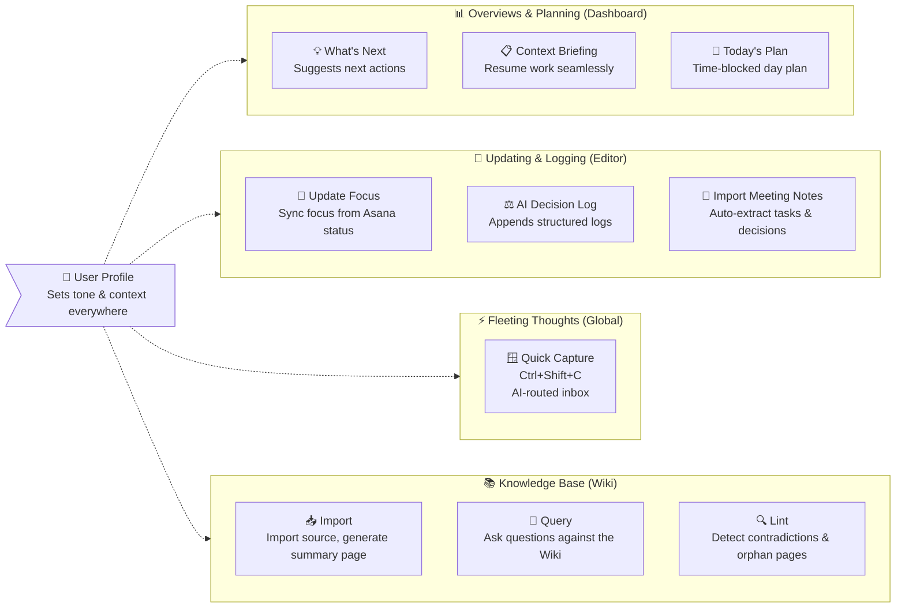

# AI Features

[< Back to README](../README.md)

All AI features require `Enable AI Features` to be on (Settings > LLM API). Supported providers: OpenAI and Azure OpenAI.

<a id="ai-features-overview"></a>
## AI Features Overview

The AI features in ProjectCurator are categorized into three main situations: Planning (Dashboard), Updating/Logging (Editor), and Capturing thoughts (Global).



<a id="setup"></a>
## Setup

1. Open `Settings > LLM API`
2. Choose provider, enter API Key and Model (and Endpoint / API Version for Azure)
3. Click `Test Connection`
4. Once the test passes, toggle `Enable AI Features` on and save

<a id="user-profile"></a>
## User Profile

Enter a free-text description of your role, priorities, and working style in `Settings > LLM API > User Profile`. This text is prepended as a `## User Profile` section to the system prompt of every LLM call, so the model has your context without repeating it in each prompt.

Example:

```
Role: Engineering manager. I work across 3-4 parallel projects.
Prefer concise bullet points. Flag overloaded days rather than packing in tasks.
Language: respond in Japanese unless the document is already in English.
```

<a id="global"></a>
## Global

<a id="quick-capture-global-hotkey"></a>
### Quick Capture (Global Hotkey)

Press `Ctrl+Shift+C` from anywhere on your desktop to open a lightweight capture window. Type a free-text note and press Enter. If AI Features is enabled, an LLM classifies the input and routes it automatically:

| Category | Destination |
|---|---|
| `task` | Creates a task in Asana via API (requires confirmation before submitting) |
| `tension` | Appends to the project's `open_issues.md` |
| `focus_update` | Opens Editor and triggers the Update Focus from Asana flow with your input as additional context |
| `decision` | Opens Editor and launches the AI Decision Log flow |
| `memo` | Appends a timestamped entry to `_config/capture_log.md` |

When AI Features is disabled, you can still use Quick Capture by selecting the category and project manually.

<a id="dashboard"></a>
## Dashboard

<a id="whats-next-dashboard"></a>
### What's Next

Click the lightbulb icon in the Dashboard toolbar to get 3-5 AI-prioritized action suggestions across all projects. The model analyzes overdue tasks, stale focus files, uncommitted changes, and unrecorded decisions, then ranks actions by urgency. Each suggestion has an Open button to navigate directly to the relevant file.


<a id="context-briefing-dashboard-card"></a>
### Context Briefing (Dashboard Card)

Click the lightbulb icon on a project card to generate a project-specific resume briefing. The model reads `current_focus.md`, recent `decision_log` entries, `open_issues.md`, active/completed Asana tasks, and uncommitted repo signals, then outputs:

- `Where you left off` (short narrative summary)
- `Suggested next steps` (prioritized action list)
- `Key context` (compact facts to re-enter work quickly)

The dialog supports `Copy`, `Open in Editor`, and `View Debug` (prompt/response inspection).


<a id="todays-plan-dashboard"></a>
### Today's Plan

Today's Plan dialog provides a time-blocked day plan (for example, Morning / Afternoon), with `Open`, `Copy`, `Save`, and `View Debug` actions.


<a id="editor"></a>
## Editor

<a id="update-focus-from-asana-editor"></a>
### Update Focus from Asana

Click the `Update Focus from Asana` button in the Editor toolbar to generate a diff-based update proposal for the open `current_focus.md`. The model reads Asana task data and the existing file, then proposes changes while preserving your heading structure and writing style. A backup is saved to `focus_history/` automatically. Supports workstream filtering, natural-language refinement, and a debug view.


<a id="ai-decision-log-editor"></a>
### AI Decision Log

Click `Dec Log` in the Editor toolbar (AI mode) to open the decision log assistant. Describe what was decided; the model generates a structured draft with Options / Why / Risk / Revisit Trigger sections. Supports natural-language refinement and optionally removes the resolved item from `open_issues.md`. Saves as `decision_log/YYYY-MM-DD_{topic}.md`.


<a id="import-meeting-notes-editor"></a>
### Import Meeting Notes

Click the `Import Meeting Notes` button in the Editor toolbar (or press `Ctrl+Enter` in the notes input dialog) to paste raw meeting notes and have the LLM analyze them in a single pass. The model produces four types of output, each shown in a separate tab of the preview dialog:

- Decisions tab: one checkbox per decision detected; click "Show draft" to preview the structured `decision_log` draft; uncheck any decision to skip it
- Focus tab: diff-based view of the AI-generated update to `current_focus.md`; the LLM rewrites the full file integrating new items while preserving the existing structure and writing style
- Tensions tab: preview of items to be appended to `open_issues.md` (technical questions, tradeoffs, concerns)
- Asana Tasks tab: list of action items proposed for Asana. Each task has its own controls:
  - Project ComboBox: defaults to the first entry in `personal_project_gids` (`asana_global.json`), or the workstream's mapped project if configured
  - Section ComboBox: auto-selected by matching `anken_aliases` (from `asana_config.json`) against the section name; falls back to `(none)`
  - Due Date picker (optional)
  - Set time checkbox: when checked, reveals Hour / Minute selectors (15-minute increments); produces an ISO 8601 `due_at` value with local timezone offset
  - Check each task to include; uncheck to skip

Select which items to apply and click `Apply Selected`. A `View Debug` button in the dialog shows the full LLM prompt and response. Decision logs are saved as `YYYY-MM-DD_{topic}.md`; `current_focus.md` is backed up to `focus_history/` before updating. Created Asana tasks are appended to `tasks.md` with their GID and due date.


<a id="wiki"></a>
## Wiki

Wiki documentation has been moved to [Wiki Features](wiki-features.md) to keep this page focused and easier to scan.

