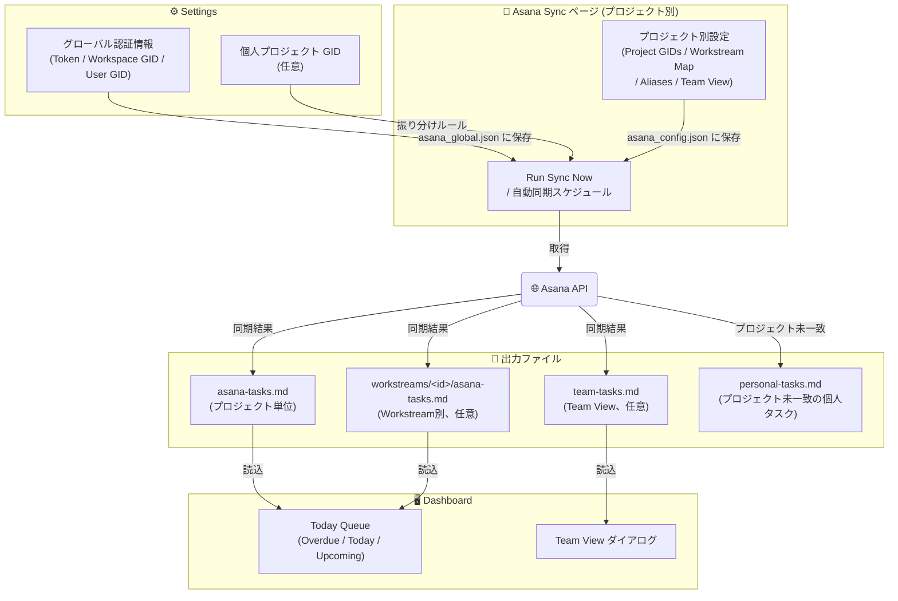

# Asana連携設定

[< README に戻る](../README-ja.md)

Asana連携に関する設定をまとめたページです。グローバル認証情報、プロジェクト別同期設定、Asana Sync画面の操作方法を説明します。

Asanaを使わない場合はこの設定は不要です。アプリはAsanaなしでも単独のコンテキストマネージャーとして動作します。

## 1. グローバル認証情報の設定

Asanaトークンは Developer Console(`https://app.asana.com/0/my-apps`)で作成・確認します。

`Settings` を開き、`Asana Global Config` に以下の値を入力して保存します。

- `Asana Token`
- `Workspace GID`
- `User GID`

## 2. 個人プロジェクトGIDの設定 (任意)

特定プロジェクトに属さない個人タスクを各プロジェクトに振り分けたい場合:

- `Settings` で `Personal Project GIDs` に個人用Asanaプロジェクトの GID を追加する
  - `Setup` ページで構成される各プロジェクトの通常設定とは別に、GTD的な個人プロジェクトなど特定プロジェクトに属さないタスクを登録する
- Asana同期時、これらの個人タスクはタスクの `Project` カスタムフィールドの値で振り分けられる
  - `Project` フィールドの値がローカルプロジェクト名と一致 → そのプロジェクトの Dashboard Today Queue に追加される
  - どのプロジェクトにも一致しない → 専用の個人タスク用Markdownファイルに出力される

## 3. 初回同期

1. `Asana Sync` ページを開く
2. プロジェクトをドロップダウンで選択して `Load` をクリック
3. `Asana Project GIDs` にAsanaプロジェクトのGIDを1件以上入力
4. `Run Sync Now` をクリックして手動同期を実行
   - 成功すると以下のファイルが更新される:
   - `_ai-context/obsidian_notes/asana-tasks.md`
   - Workstream設定がある場合は `_ai-context/obsidian_notes/workstreams/<id>/asana-tasks.md` も更新される
5. `Dashboard` に移動して Today Queue を確認する

タスクが表示されない場合:
- `Run Sync` 実行後に `asana-tasks.md` が更新されているか確認する
- `Dashboard` を更新して Today Queue を再読み込みする

## 4. 自動同期の設定 (任意)

1. `Asana Sync` ページで `Auto Sync` にチェックを入れ、間隔(時間単位)を設定する
2. `Save Schedule` をクリックする

## Asana Sync ページ リファレンス

左パネル (同期コントロール):

- Auto Sync チェックボックスと間隔設定(時間単位)
- Save Schedule: スケジュールを保存
- Run Sync Now: 即時に1回同期を実行
- Clear: 同期状態をリセット
- 最終同期日時の表示

右パネル (プロジェクト別設定):

- プロジェクト選択ドロップダウンと Load ボタン
- Asana Project GIDs: 同期対象のAsanaプロジェクトGIDを1行1件で入力
- Workstream Map: `gid` を `workstream-id` にマッピングしてタスクを適切なWorkstreamフォルダに振り分ける
- Workstream Field: WorkstreamをAsanaで識別するカスタムフィールド名
- Project Aliases: Asanaのカスタムフィールドとプロジェクトを照合するエイリアス(1行1件)
- Team View: チームタスクダッシュボードを有効化するオプション設定。`enabled: true` にして `project_gids` (チームメンバーを特定するAsanaプロジェクトのGID)を列挙する。Workstreamごとに異なるGIDセットを指定する場合は `workstream_project_gids` を使用する。
- Save ボタン: プロジェクト別の `asana_config.json` を保存する

## 設定ファイルの場所

グローバルAsana設定は `%USERPROFILE%\.projectcurator\asana_global.json` に保存されます。
プロジェクト別の詳細設定は `{CloudSyncProject}\asana_config.json` に保存されます。
