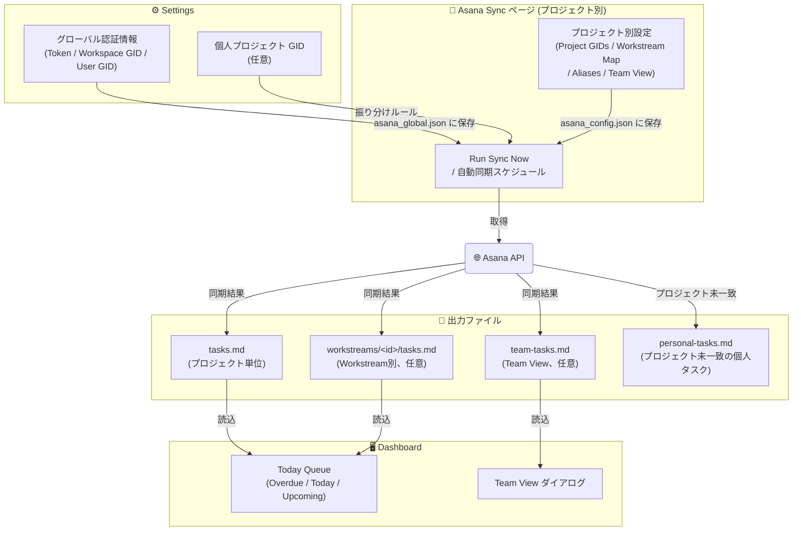

# Asana連携設定

[< README に戻る](../README-ja.md)

Asana連携に関する設定をまとめたページです。グローバル認証情報、プロジェクト別同期設定、Asana Sync画面の操作方法を説明します。

Asanaを使わない場合はこの設定は不要です。アプリはAsanaなしでも単独のコンテキストマネージャーとして動作します。



## 1. グローバル認証情報の設定

Asanaトークンは Developer Console(`https://app.asana.com/0/my-apps`)で作成・確認します。

`Settings` を開き、`Asana Global Config` に以下の値を入力して保存します。

- `Asana Token`
- `Workspace GID`
- `User GID`

## 2. 個人プロジェクトGIDの設定 (任意)

特定プロジェクトに属さない個人タスクを各プロジェクトに振り分けたい場合:

- `Settings` で `Personal Project GIDs` に個人用Asanaプロジェクトの GID を追加する
  - `Setup` ページで構成される各プロジェクトの通常設定とは別に、GTD的な個人プロジェクトなど特定プロジェクトに属さないタスクを登録する
- Asana同期時、これらの個人タスクはタスクの `Project` カスタムフィールドの値で振り分けられる
  - `Project` フィールドの値がローカルプロジェクト名と一致 → そのプロジェクトの Dashboard Today Queue に追加される
  - どのプロジェクトにも一致しない → 専用の個人タスク用Markdownファイルに出力される

## 3. 初回同期

1. `Asana Sync` ページを開く
2. プロジェクトをドロップダウンで選択して `Load` をクリック
3. `Asana Project GIDs` にAsanaプロジェクトのGIDを1件以上入力
4. `Run Sync Now` をクリックして手動同期を実行
   - 成功すると以下のファイルが更新される:
   - `_ai-context/obsidian_notes/tasks.md`
   - Workstream設定がある場合は `_ai-context/obsidian_notes/workstreams/<id>/tasks.md` も更新される
5. `Dashboard` に移動して Today Queue を確認する

タスクが表示されない場合:
- `Run Sync` 実行後に `tasks.md` が更新されているか確認する
- `Dashboard` を更新して Today Queue を再読み込みする

## 4. 自動同期の設定 (任意)

1. `Asana Sync` ページで `Auto Sync` にチェックを入れ、間隔(時間単位)を設定する
2. `Save Schedule` をクリックする

## Asana Sync ページ リファレンス


左パネル (同期コントロール):

- **Auto Sync**: チェックを入れると、アプリ起動中にバックグラウンドで定期同期を実行します。間隔は時間単位で指定します。
- **Save Schedule**: スケジュール設定を保存します。
- **Run Sync Now**: 即時に1回同期を実行します。
- **Clear**: 同期済みのキャッシュやステータスをリセットします。

右パネル (プロジェクト別設定):

プロジェクトごとに `asana_config.json` を作成・編集します。

- **Asana Project GIDs**: このプロジェクトに紐づく Asana プロジェクトの GID を1行1件で入力します。
  - ここに記載したプロジェクトのタスクは、すべてこのプロジェクトの `tasks.md` に同期されます。
- **Workstream Map**: Asana プロジェクト GID を Workstream ID にマッピングします。
  - 形式: `gid=workstream-id` (例: `123456789=development`)
  - 区切り文字は `=` のほか、`:` や `->` も使用可能です。
  - これにより、特定の Asana プロジェクトのタスクを、プロジェクトルートではなく `workstreams/<id>/tasks.md` に自動的に振り分けることができます。
- **Workstream Field**: タスクごとに Workstream を指定するための Asana カスタムフィールド名です。
  - デフォルトは `workstream-id` です。
  - **Workstream Map より優先されます。** タスクにこのカスタムフィールドが設定されている場合、その値が Workstream ID として使用されます。
- **Project Aliases**: Asana のタスクをこのプロジェクトに「配分」するための別名設定です。
  - `Settings` の `Personal Project GIDs` からタスクを取り込む際に使用されます。
  - Asana 側のカスタムフィールド `Project` (または `案件`) の値が、ローカルプロジェクト名またはここに追加したエイリアスと一致する場合、そのプロジェクトのタスクとして取り込まれます。
- **Team View**: チームメンバーのタスク状況を可視化する `team-tasks.md` の生成設定です。
  - `enabled: true`: 機能を有効にします。
  - `project_gids`: チームタスクを収集する対象の Asana プロジェクト GID リストです。
  - `workstream_project_gids`: Workstream ごとに異なるプロジェクトからタスクを収集したい場合に使用します (キーは Workstream ID)。
  - 同期を実行すると、自分のタスクを除いたメンバーごとの未完了タスクリストが `team-tasks.md` に出力されます。
- **Save**: 設定をプロジェクトディレクトリの `asana_config.json` に保存します。

## 設定ファイルの例 (asana_config.json)

UIで保存されるファイルの実体は以下のようになります。

```json
{
  "asana_project_gids": [
    "1200000000000001"
  ],
  "anken_aliases": [
    "MyProj",
    "ShortName"
  ],
  "workstream_project_map": {
    "1200000000000002": "design",
    "1200000000000003": "api"
  },
  "workstream_field_name": "ws-id",
  "team_view": {
    "enabled": true,
    "project_gids": [
      "1200000000000004"
    ]
  }
}
```

## 設定ファイルの場所

グローバルAsana設定は `%USERPROFILE%\.curia\asana_global.json` に保存されます。
プロジェクト別の詳細設定は、Cloud Sync Root 配下の各プロジェクトディレクトリ内にある `asana_config.json` に保存されます。

具体的には、プロジェクトの種別に応じて以下のパスになります（`{CloudSyncRoot}` は設定画面で指定したパスです）:

- 通常プロジェクト: `{CloudSyncRoot}/{ProjectName}/asana_config.json`
- Mini プロジェクト: `{CloudSyncRoot}/_mini/{ProjectName}/asana_config.json`
- Domain プロジェクト: `{CloudSyncRoot}/_domains/{ProjectName}/asana_config.json`
- Domain Mini プロジェクト: `{CloudSyncRoot}/_domains/_mini/{ProjectName}/asana_config.json`
