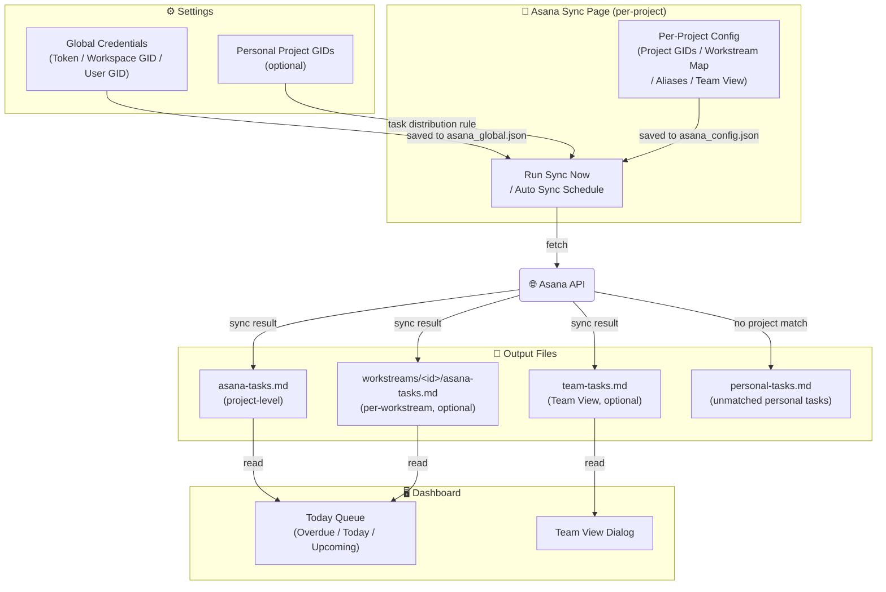

# Asana Setup

[< Back to README](../README.md)

This page covers all Asana-related configuration: global credentials, per-project sync settings, and the Asana Sync page.

Use this only if your workflow includes Asana. The app works fully as a standalone context manager without it.



## 1. Global Credentials

Create or check your Asana token in Developer Console: `https://app.asana.com/0/my-apps`

Open `Settings` and enter the following values in `Asana Global Config`:

- `Asana Token`
- `Workspace GID`
- `User GID`

Save settings.

## 2. Personal Project GIDs (optional)

If you want personal (non-project-specific) Asana tasks distributed to local projects:

- Add your personal Asana project GIDs to `Personal Project GIDs` in `Settings`
  - These are Asana projects not tied to any specific local project (e.g. a personal GTD project), separate from per-project Asana settings configured in `Setup`
- During sync, tasks from these personal projects are distributed using the task's `Project` custom field
  - If the `Project` field matches a local project name → tasks appear in that project's Dashboard Today Queue
  - If no match is found → tasks are output to a separate personal tasks Markdown file

## 3. First Sync

1. Open the `Asana Sync` page
2. Select the target project from the dropdown and click `Load`
3. Enter at least one Asana Project GID under `Asana Project GIDs`
4. Click `Run Sync Now` to execute a one-time sync
   - On success, these files are updated:
   - `_ai-context/obsidian_notes/asana-tasks.md`
   - optionally `_ai-context/obsidian_notes/workstreams/<id>/asana-tasks.md`
5. Go back to `Dashboard` and check Today Queue

If tasks do not appear:
- Confirm `asana-tasks.md` was updated after `Run Sync`
- Refresh `Dashboard` to reload Today Queue

## 4. Scheduled Sync (optional)

1. On the `Asana Sync` page, check `Auto Sync` and set the interval (hours)
2. Click `Save Schedule`

## Asana Sync Page Reference


Left panel (Sync Controls):

- **Auto Sync**: If checked, the app performs background synchronization periodically while running. The interval is specified in hours.
- **Save Schedule**: Saves the background sync schedule.
- **Run Sync Now**: Executes a one-time synchronization immediately.
- **Clear**: Resets the sync cache and status.

Right panel (Per-Project Config):

Configure the `asana_config.json` for each project.

- **Asana Project GIDs**: Enter the GIDs of the Asana projects belonging to this local project, one per line.
  - All tasks from these projects will be synced to the project's `asana-tasks.md`.
- **Workstream Map**: Map Asana Project GIDs to Workstream IDs.
  - Format: `gid=workstream-id` (e.g., `123456789=development`)
  - Separators such as `=`, `:`, and `->` are supported.
  - This allows tasks from specific Asana projects to be routed to `workstreams/<id>/asana-tasks.md` instead of the project root.
- **Workstream Field**: The name of the Asana custom field used to specify a Workstream ID directly on each task.
  - Default is `workstream-id`.
  - **This takes precedence over Workstream Map.** If a task has this custom field set, its value is used as the Workstream ID.
- **Project Aliases**: Aliases used to "distribute" tasks from personal projects to this project.
  - This is used when fetching tasks from `Personal Project GIDs` configured in `Settings`.
  - If the value of the `Project` (or `案件`) custom field in Asana matches the local project name or any alias listed here, the task is imported as a task for this project.
- **Team View**: Configuration for generating `team-tasks.md`, which visualizes the task status of team members.
  - `enabled: true`: Enables the feature.
  - `project_gids`: A list of Asana Project GIDs from which team tasks are collected.
  - `workstream_project_gids`: Used when you want to collect tasks from different projects for each workstream (keyed by Workstream ID).
  - When synced, a list of incomplete tasks for each member (excluding yourself) is output to `team-tasks.md`.
- **Save**: Saves the configuration to the project directory's `asana_config.json`.

## Configuration File Example (asana_config.json)

The actual file saved by the UI looks like this:

```json
{
  "asana_project_gids": [
    "1200000000000001"
  ],
  "anken_aliases": [
    "MyProj",
    "ShortName"
  ],
  "workstream_project_map": {
    "1200000000000002": "design",
    "1200000000000003": "api"
  },
  "workstream_field_name": "ws-id",
  "team_view": {
    "enabled": true,
    "project_gids": [
      "1200000000000004"
    ]
  }
}
```

## Config File Locations

Global Asana values are stored in the config directory (`%USERPROFILE%\.projectcurator\asana_global.json` by default).
Per-project advanced settings are stored in `asana_config.json` within each project directory under the Cloud Sync Root.

Depending on the project type, the path is as follows (where `{CloudSyncRoot}` is the path configured in Settings):

- Standard Project: `{CloudSyncRoot}/{ProjectName}/asana_config.json`
- Mini Project: `{CloudSyncRoot}/_mini/{ProjectName}/asana_config.json`
- Domain Project: `{CloudSyncRoot}/_domains/{ProjectName}/asana_config.json`
- Domain Mini Project: `{CloudSyncRoot}/_domains/_mini/{ProjectName}/asana_config.json`
