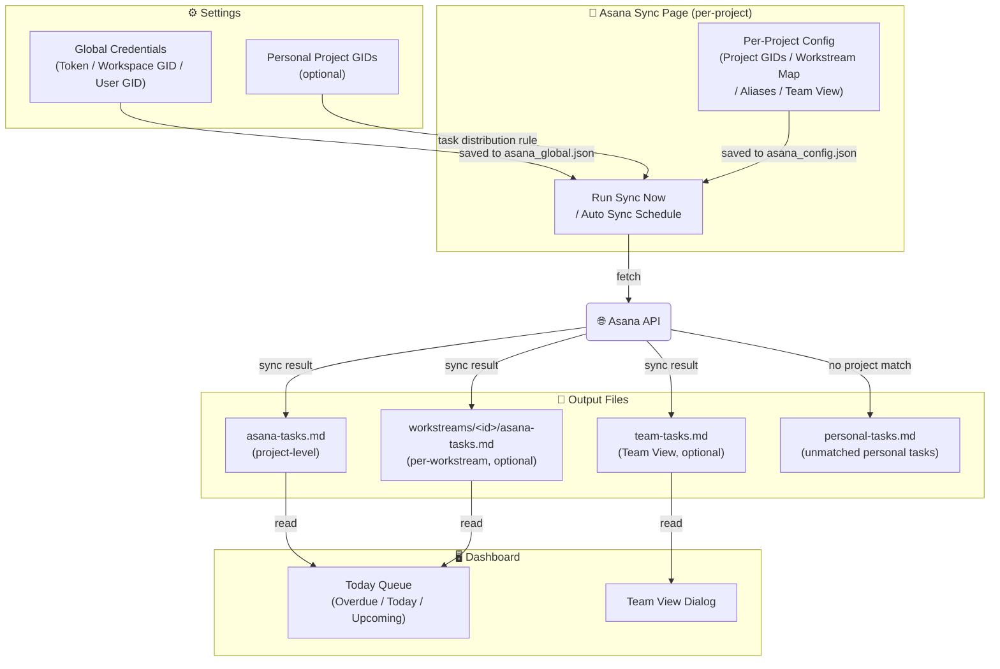

# Asana Setup

[< Back to README](../README.md)

This page covers all Asana-related configuration: global credentials, per-project sync settings, and the Asana Sync page.

Use this only if your workflow includes Asana. The app works fully as a standalone context manager without it.

## 1. Global Credentials

Create or check your Asana token in Developer Console: `https://app.asana.com/0/my-apps`

Open `Settings` and enter the following values in `Asana Global Config`:

- `Asana Token`
- `Workspace GID`
- `User GID`

Save settings.

## 2. Personal Project GIDs (optional)

If you want personal (non-project-specific) Asana tasks distributed to local projects:

- Add your personal Asana project GIDs to `Personal Project GIDs` in `Settings`
  - These are Asana projects not tied to any specific local project (e.g. a personal GTD project), separate from per-project Asana settings configured in `Setup`
- During sync, tasks from these personal projects are distributed using the task's `Project` custom field
  - If the `Project` field matches a local project name → tasks appear in that project's Dashboard Today Queue
  - If no match is found → tasks are output to a separate personal tasks Markdown file

## 3. First Sync

1. Open the `Asana Sync` page
2. Select the target project from the dropdown and click `Load`
3. Enter at least one Asana Project GID under `Asana Project GIDs`
4. Click `Run Sync Now` to execute a one-time sync
   - On success, these files are updated:
   - `_ai-context/obsidian_notes/asana-tasks.md`
   - optionally `_ai-context/obsidian_notes/workstreams/<id>/asana-tasks.md`
5. Go back to `Dashboard` and check Today Queue

If tasks do not appear:
- Confirm `asana-tasks.md` was updated after `Run Sync`
- Refresh `Dashboard` to reload Today Queue

## 4. Scheduled Sync (optional)

1. On the `Asana Sync` page, check `Auto Sync` and set the interval (hours)
2. Click `Save Schedule`

## Asana Sync Page Reference

Left panel (sync controls):

- Auto Sync checkbox and interval setting (in hours)
- Save Schedule to persist the schedule
- Run Sync Now to execute a one-time sync immediately
- Clear button to reset sync state
- Last sync timestamp displayed for reference

Right panel (per-project config):

- Project selector dropdown (e.g. GenAi [Domain]) with Load button
- Asana Project GIDs: one GID per line to specify which Asana projects to sync
- Workstream Map: maps `gid` to `workstream-id` for routing tasks to the correct workstream folder
- Workstream Field: the custom field name in Asana used to identify the workstream
- Project Aliases: aliases used to match Asana custom field to this project (one per line)
- Team View: optional section to enable the team task dashboard. Set `enabled: true` and list `project_gids` (Asana project GIDs whose assignees form the team). Use `workstream_project_gids` to specify different GID sets per workstream.
- Save button to persist the per-project `asana_config.json`

## Config File Locations

Global Asana values are stored in the config directory (`%USERPROFILE%\.projectcurator\asana_global.json` by default).
Per-project advanced settings are stored in `{CloudSyncProject}\asana_config.json`.
