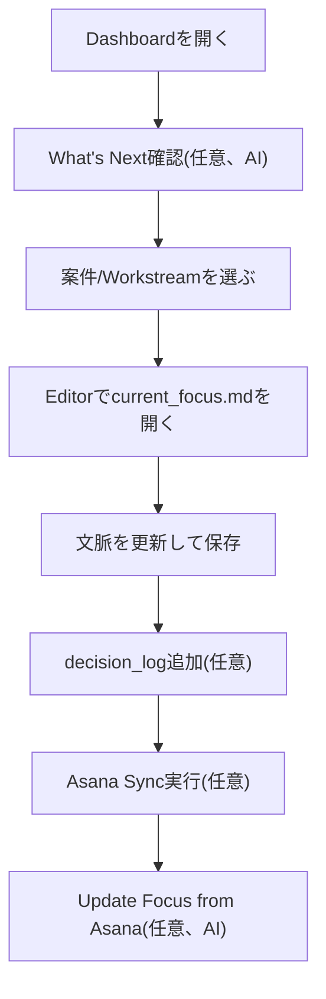
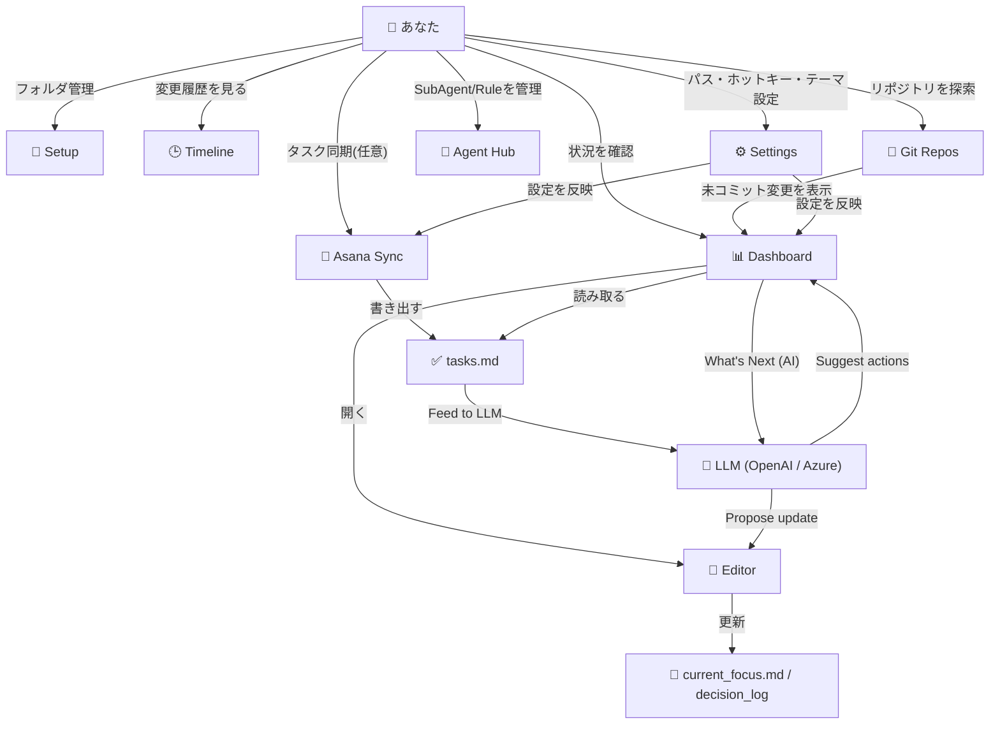

# 日々のワークフロー

[< READMEに戻る](../README-ja.md)

## おすすめ運用フロー

1. `Dashboard` を開く
2. AI機能が有効な場合は What's Next ボタンをクリックして、全プロジェクト横断の優先アクション提案を確認
3. 気になるプロジェクト/Workstreamをクリックして `current_focus.md` を開く
4. `Editor` で更新して `Ctrl+S` で保存
5. 必要なら `decision_log` を1件追加(AI機能有効時は Dec Log ボタンでAI支援ダイアログが開く)
6. 直近の会議メモがあれば `Import Meeting Notes` ボタンで分析して取り込む
7. Asanaを使う場合は `Asana Sync` を実行してToday Queueを更新
8. AI機能が有効な場合は `Update Focus from Asana` ボタンでLLMによる更新提案を取得

## タスク管理

`tasks.md` は各プロジェクトの統一タスクファイルです。Asana連携の有無によって、ファイルの更新方法が変わります。

### Asana未設定時 (ローカルタスクモード)

Asanaトークンが設定されていない場合、アプリ内で直接タスクを管理できます。

- Dashboard Today Queue の `[+]` ボタン - タスク作成フォームが開きます。タスク名・プロジェクト・任意の期日を入力して Create をクリック。
- Today Queue の `Done` ボタン - `tasks.md` 内のチェックボックスを `[ ]` から `[x]` に変更して完了済みにします。
- Editor で `tasks.md` を直接編集することも可能です。`## In Progress` / `## Completed` セクション配下に標準的なMarkdownチェックボックス形式で記述します。

### Asana設定済み時

Asanaトークンが設定されている場合、`tasks.md` は `Asana Sync` によって生成されます。Today Queue の `Done` ボタンはAsana上でタスクを完了にします。Dashboard の `[+]` ボタンは Quick Capture 経由でAsanaタスク作成フローを開きます。

## プロジェクトを支える主要ファイル

本アプリでは、以下のMarkdownファイルを育てていくことでプロジェクトのコンテキストを維持します。

- `current_focus.md` - 「今何をやっているか」「次に取り組むべきことは何か」をまとめる、プロジェクトの現在地となるファイルです。
- `open_issues.md` - 技術的な疑問、トレードオフ、未解決の懸念事項など、プロジェクトが抱える課題を記録します。
- `decision_log/` - 「なぜその技術を選んだか」「何を決定したか」を構造化して記録するフォルダです。後から経緯を思い出すための重要な記憶となります。

## 機能マップ

