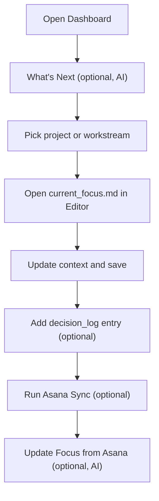
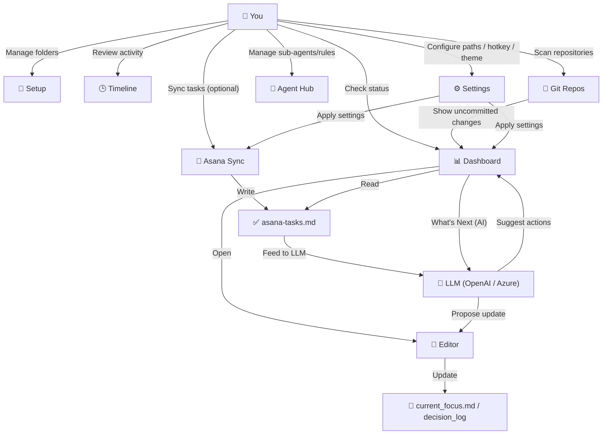

# Daily Workflow

[< Back to README](../README.md)

## Recommended Daily Flow

1. Open `Dashboard`
2. (If AI Features is enabled) Click the What's Next button to see AI-prioritized action suggestions across all projects
3. Click a project or workstream and open `current_focus.md`
4. Update context in `Editor` and save with `Ctrl+S`
5. Add a `decision_log` entry if needed (when AI Features is enabled, the Dec Log button opens an AI-assisted dialog)
6. If you have meeting notes from a recent meeting, click `Import Meeting Notes` in the Editor toolbar to analyze and apply them
7. If using Asana, run `Asana Sync` to refresh task files
8. If AI Features is enabled, click `Update Focus from Asana` in the Editor toolbar to get an LLM-generated update proposal

## Core Context Files

The application relies on maintaining the following Markdown files to preserve project context:

- `current_focus.md` - The "you are here" map of the project. Tracks what you are currently doing and what's next.
- `tensions.md` - A log of open technical questions, unmitigated risks, and unresolved trade-offs.
- `decision_log/` - A structured folder recording "why we chose this" and "what was decided" for critical architecture choices.

## Feature Map

