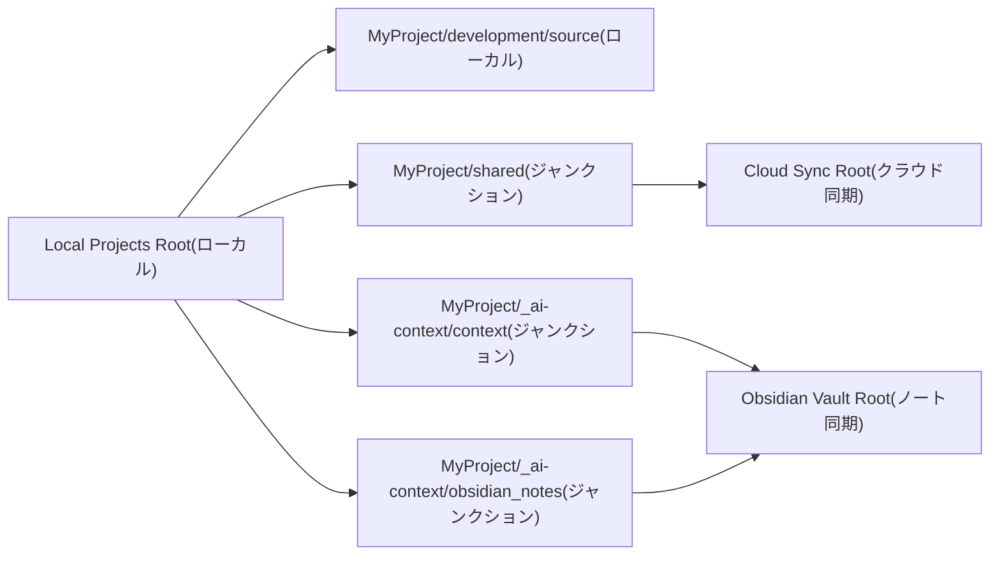
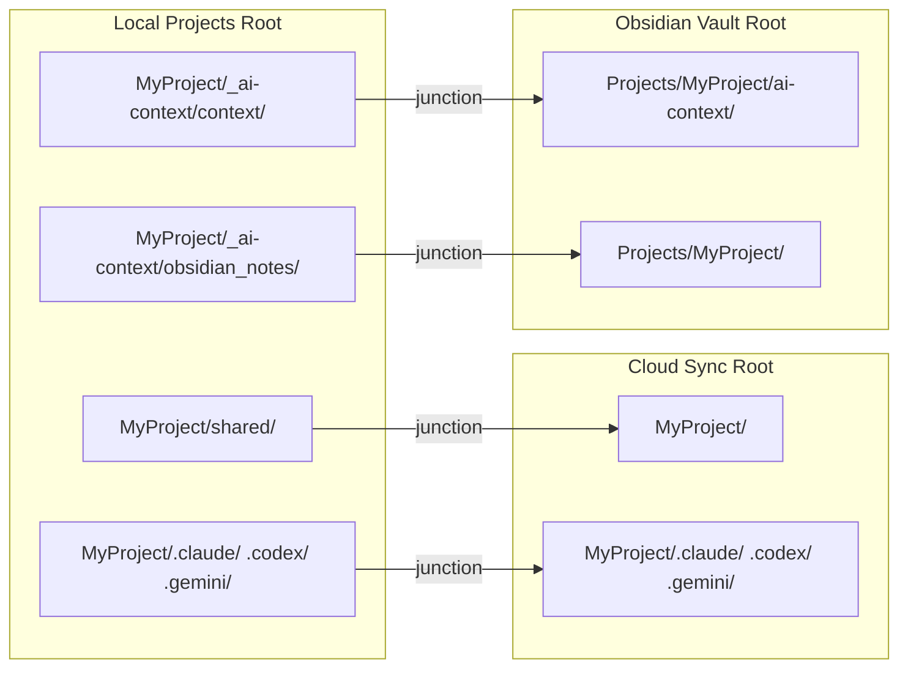

# フォルダ構成

[< READMEに戻る](../README-ja.md)

## 基本構成(ローカル管理 / クラウド同期)



```text
Local Projects Root/
└── MyProject/
    ├── development/
    │   └── source/                  # ローカル作業用リポジトリ(クラウド同期外)
    ├── shared/                      # ジャンクション -> Cloud Sync Root/MyProject/
    │   ├── _work/
    │   │   ├── <workstream-id>/      # Setupタブで作る Workstream ごとの共有作業ディレクトリ
    │   │   └── 2026/
    │   │       └── 202603/
    │   │           └── 20260321_fix-login-bug/
    │   │                                 # Command Palette の resume で作る日付管理ディレクトリ
    │   ├── docs/                    # 共有ドキュメント(例)
    │   └── assets/                  # 共有素材(例)
    └── _ai-context/
        ├── context/                 # ジャンクション -> Obsidian Vault Root/Projects/MyProject/ai-context/
        └── obsidian_notes/          # ジャンクション -> Obsidian Vault Root/Projects/MyProject/
```

要点:
- `development/source/` はローカル作業領域です。
- `shared/` は クラウド同期側のパスにリンクして管理します。
- `_ai-context/` 配下は Obsidian 側パスにリンクして扱います。
- `shared/_work/<workstream-id>/` は Workstream 単位の共有作業に使います。
- 日付管理の作業フォルダ例: `shared/_work/2026/202603/20260321_fix-login-bug/`

## テンプレートフォルダ構成(Setupで作られるもの)

`Setup Project` で `Also run AI Context Setup` をチェックして実行すると、3つのルートフォルダにまたがる標準ディレクトリ構成が自動生成されます。

### 3つのルートの役割

```text
Local Projects Root          ... ローカルマシン上のみ(クラウド同期しない)
Cloud Sync Root            ... Box Drive 等でクラウド同期(共有ファイル)
Obsidian Vault Root          ... Box Drive 等でクラウド同期(ナレッジノート)
```

この3か所は「ジャンクション」(Windowsのディレクトリリンク)で接続され、ローカルのプロジェクトフォルダ配下に統合的にアクセスできるようになっています。

### Setupが生成するフォルダツリー全体

```text
Local Projects Root/
├── .context/                          # ワークスペースレベルのコンテキスト(自動作成)
│   ├── workspace_summary.md           # 自分の役割・ツール・作業方針
│   ├── current_focus.md               # プロジェクト横断のフォーカス
│   ├── active_projects.md             # 全プロジェクトのステータス一覧
│   └── open_issues.md                    # ワークスペース全体の課題
│
└── MyProject/                         # プロジェクト1つ分
    ├── _ai-context/
    │   ├── context/        ← junction → Obsidian Vault/Projects/MyProject/ai-context/
    │   └── obsidian_notes/ ← junction → Obsidian Vault/Projects/MyProject/
    ├── _ai-workspace/                 # (full tierのみ) ローカルAI作業領域
    ├── development/
    │   └── source/                    # ローカルGitリポジトリ
    ├── shared/             ← junction → Cloud Sync Root/MyProject/
    ├── external_shared/               # (任意) 外部パスへのジャンクション
    ├── .claude/            ← junction → Cloud Sync Root/MyProject/.claude/
    ├── .codex/             ← junction → Cloud Sync Root/MyProject/.codex/
    ├── .gemini/            ← junction → Cloud Sync Root/MyProject/.gemini/
    ├── .github/            ← junction → Cloud Sync Root/MyProject/.github/
    ├── AGENTS.md                      # AIエージェント用指示書(クラウドからコピー)
    └── CLAUDE.md                      # @AGENTS.md への参照

Cloud Sync Root/
└── MyProject/
    ├── docs/                          # 共有ドキュメント
    ├── _work/                         # 共有作業フォルダ
    │   ├── <workstream-id>/           # Workstream ごとの共有作業ディレクトリ
    │   └── 2026/202603/20260321_.../  # 日付管理の作業フォルダ
    ├── .claude/skills/project-curator/  # AIスキル定義
    ├── .codex/skills/project-curator/
    ├── .gemini/skills/project-curator/
    ├── .github/skills/project-curator/
    ├── .git/forCodex                  # Codex CLI がルートとして認識するマーカー
    ├── AGENTS.md                      # AIエージェント用指示書(正本)
    ├── CLAUDE.md                      # @AGENTS.md への参照
    └── external_shared_paths          # 外部パス一覧の設定ファイル

Obsidian Vault Root/
├── ai-context/                        # グローバルAIコンテキスト
│   ├── tech-patterns/                 # プロジェクト横断の技術パターン
│   └── lessons-learned/              # プロジェクト横断の学び
│
└── Projects/
    └── MyProject/
        ├── ai-context/                # プロジェクトAIコンテキスト(= _ai-context/context/)
        │   ├── current_focus.md       # 今やっていること
        │   ├── project_summary.md     # プロジェクト概要・技術スタック・アーキテクチャ
        │   ├── open_issues.md            # 技術的疑問・トレードオフ・リスク
        │   ├── file_map.md            # ジャンクションマッピングと主要ファイル一覧
        │   ├── decision_log/          # 構造化された意思決定ログ
        │   │   └── TEMPLATE.md        # 新規決定用テンプレート
        │   ├── focus_history/         # current_focus.md の自動バックアップ
        │   ├── wiki/                  # プロジェクトWiki (Wikiタブから初期化)
        │   │   ├── wiki-schema.md     # LLMへの運用指示書(プロジェクトに合わせて編集可)
        │   │   ├── index.md           # ページカタログ(LLMが自動更新)
        │   │   ├── log.md             # 操作ログ(append-only)
        │   │   ├── .wiki-meta.json    # 統計・設定メタデータ
        │   │   ├── raw/               # 取り込み済みソースファイル(不変保存)
        │   │   └── pages/
        │   │       ├── sources/       # ソース要約ページ (1ソース = 1ページ)
        │   │       ├── entities/      # エンティティページ(テーブル・画面・API等)
        │   │       ├── concepts/      # 概念・設計方針・ワークフロー
        │   │       └── analysis/      # Query から保存した分析・Q&Aページ
        │   └── workstreams/           # Workstream 単位のコンテキスト(作成時)
        │       └── <workstream-id>/
        │           ├── current_focus.md
        │           ├── decision_log/
        │           └── focus_history/
        ├── troubleshooting/           # Obsidian ノート: トラブルシューティング
        ├── daily/                     # Obsidian ノート: 日次ログ
        ├── meetings/                  # Obsidian ノート: 会議メモ
        └── notes/                     # Obsidian ノート: 全般
```

### 自動生成されるテンプレートファイル

Setup は以下のファイルを初期テンプレート付きで生成します。既存ファイルは上書きしません。

| ファイル | テンプレート内容 |
|---|---|
| `current_focus.md` | セクション: Currently Doing / Recent Updates / Next Actions / Notes |
| `project_summary.md` | セクション: Overview / Tech Stack / Architecture / Notes |
| `open_issues.md` | セクション: Open technical questions / Unresolved trade-offs / Risks |
| `file_map.md` | ジャンクション対応表と主要ファイルパスの一覧 |
| `decision_log/TEMPLATE.md` | 意思決定記録テンプレート: Context / Options / Chosen / Why / Risks / Revisit Trigger |
| `AGENTS.md` | プロジェクト名・ディレクトリ構成入りのAIエージェント指示書 |

ワークスペースレベルのファイル(`.context/` 配下):

| ファイル | テンプレート内容 |
|---|---|
| `workspace_summary.md` | 自分の役割・ツール・作業方針 |
| `current_focus.md` | プロジェクト横断のフォーカスと優先度 |
| `active_projects.md` | 全プロジェクトのステータス一覧テンプレート |
| `open_issues.md` | ワークスペース全体の課題 |

### ジャンクションの接続関係



ジャンクションを使うことで、ローカルのプロジェクトフォルダ配下に統合ビューが構成されつつ、実データはそれぞれの同期先に格納されます。AIエージェント・Obsidian・クラウド同期アプリ等がそれぞれ必要なデータに自然にアクセスできます。
