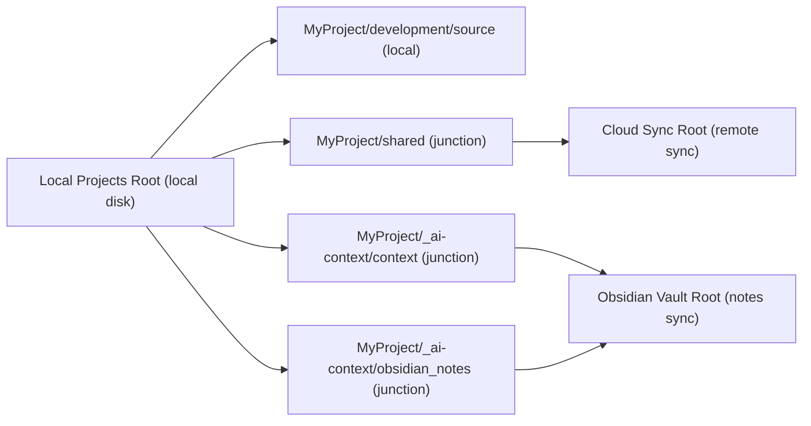
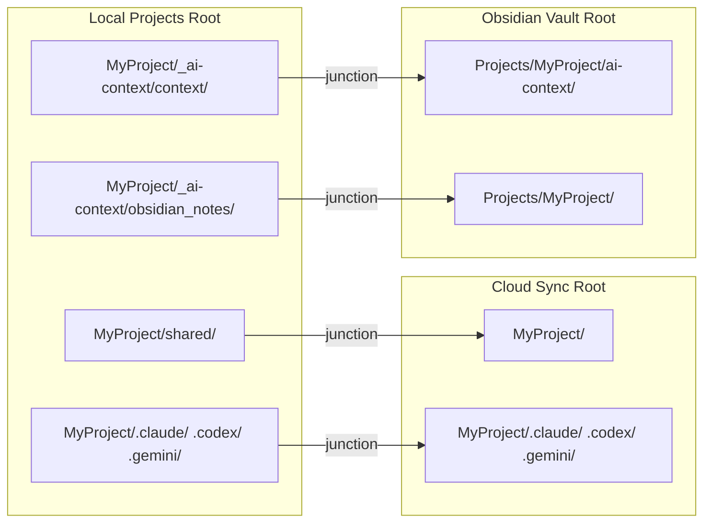

# Folder Layout

[< Back to README](../README.md)

## Basic Structure (Local vs Cloud Sync)



```text
Local Projects Root/
└── MyProject/
    ├── development/
    │   └── source/                  # Local working repos (not synced to cloud)
    ├── shared/                      # Junction -> Cloud Sync Root/MyProject/
    │   ├── _work/
    │   │   ├── <workstream-id>/      # Workstream shared directory created from Setup tab
    │   │   └── 2026/
    │   │       └── 202603/
    │   │           └── 20260321_fix-login-bug/
    │   │                                 # Date-based directory created by Command Palette "resume"
    │   ├── docs/                    # Shared documents (example)
    │   └── assets/                  # Shared assets (example)
    └── _ai-context/
        ├── context/                 # Junction -> Obsidian Vault Root/Projects/MyProject/ai-context/
        └── obsidian_notes/          # Junction -> Obsidian Vault Root/Projects/MyProject/
```

In short:
- Local-only working code lives under `development/source/`.
- Data under `shared/` is managed through the Cloud-linked location.
- Context/notes under `_ai-context/` are linked to your Obsidian vault path.
- `shared/_work/<workstream-id>/` is for workstream-level shared work.
- Date-based work folder example: `shared/_work/2026/202603/20260321_fix-login-bug/`

## Template Folder Structure (What Setup Creates)

When you run `Setup Project` with `Also run AI Context Setup` checked, ProjectCurator creates a standardized directory tree across three separate root locations. This section shows what gets created and why.

### Overview of the Three Roots

```text
Local Projects Root          ... Your local machine only (not synced)
Cloud Sync Root            ... Cloud-synced via Box Drive (or similar) (shared files)
Obsidian Vault Root          ... Cloud-synced via Box Drive (or similar) (knowledge notes)
```

These three locations are connected by junctions (Windows directory links) so that everything appears as one unified tree under the local project folder.

### Full Tree Created by Setup

```text
Local Projects Root/
├── .context/                          # Workspace-level context (auto-created)
│   ├── workspace_summary.md           # Your role, tools, working principles
│   ├── current_focus.md               # Cross-project focus (workspace level)
│   ├── active_projects.md             # Status list of all projects
│   └── open_issues.md                    # Workspace-wide open questions
│
└── MyProject/                         # One project
    ├── _ai-context/
    │   ├── context/        ← junction → Obsidian Vault/Projects/MyProject/ai-context/
    │   └── obsidian_notes/ ← junction → Obsidian Vault/Projects/MyProject/
    ├── _ai-workspace/                 # (full tier only) Local AI working area
    ├── development/
    │   └── source/                    # Git-managed local repositories
    ├── shared/             ← junction → Cloud Sync Root/MyProject/
    ├── external_shared/               # (optional) Junctions to external paths
    ├── .claude/            ← junction → Cloud Sync Root/MyProject/.claude/
    ├── .codex/             ← junction → Cloud Sync Root/MyProject/.codex/
    ├── .gemini/            ← junction → Cloud Sync Root/MyProject/.gemini/
    ├── .github/            ← junction → Cloud Sync Root/MyProject/.github/
    ├── AGENTS.md                      # AI agent instructions (copied from Cloud)
    └── CLAUDE.md                      # Points to @AGENTS.md

Cloud Sync Root/
└── MyProject/
    ├── docs/                          # Shared documents
    ├── _work/                         # Shared work folders
    │   ├── <workstream-id>/           # Workstream shared directory
    │   └── 2026/202603/20260321_.../  # Date-based work folders
    ├── .claude/skills/project-curator/  # AI skill definitions
    ├── .codex/skills/project-curator/
    ├── .gemini/skills/project-curator/
    ├── .github/skills/project-curator/
    ├── .git/forCodex                  # Marker for Codex CLI discovery
    ├── AGENTS.md                      # AI agent instructions (source of truth)
    ├── CLAUDE.md                      # Points to @AGENTS.md
    └── external_shared_paths          # Config file listing external paths

Obsidian Vault Root/
├── ai-context/                        # Global AI context
│   ├── tech-patterns/                 # Cross-project technical patterns
│   └── lessons-learned/               # Cross-project lessons
│
└── Projects/
    └── MyProject/
        ├── ai-context/                # Project AI context (= _ai-context/context/)
        │   ├── current_focus.md       # What you're working on now
        │   ├── project_summary.md     # Project overview, tech stack, architecture
        │   ├── open_issues.md            # Open questions, trade-offs, risks
        │   ├── file_map.md            # Junction mappings and key file list
        │   ├── decision_log/          # Structured decision records
        │   │   └── TEMPLATE.md        # Template for new decisions
        │   ├── focus_history/         # Auto-backups of current_focus.md
        │   ├── wiki/                  # Project knowledge base (Wiki feature)
        │   │   ├── wiki-schema.md     # LLM operating instructions for this wiki
        │   │   ├── index.md           # Page index (auto-managed by LLM)
        │   │   ├── log.md             # Operation log (auto-managed by LLM)
        │   │   ├── .wiki-meta.json    # Stats and settings metadata
        │   │   ├── raw/               # Immutable source file copies
        │   │   └── pages/
        │   │       ├── sources/       # One summary page per imported source
        │   │       ├── entities/      # Concrete "things" (tables, screens, APIs, etc.)
        │   │       ├── concepts/      # Design policies and business rules
        │   │       └── analysis/      # Q&A pages saved from the Query tab
        │   └── workstreams/           # Per-workstream context (if created)
        │       └── <workstream-id>/
        │           ├── current_focus.md
        │           ├── decision_log/
        │           └── focus_history/
        ├── troubleshooting/           # Obsidian notes: troubleshooting
        ├── daily/                     # Obsidian notes: daily logs
        ├── meetings/                  # Obsidian notes: meeting notes
        └── notes/                     # Obsidian notes: general
```

### Auto-Generated Template Files

Setup populates the following files with starter templates. Existing files are never overwritten.

| File | Template Content |
|---|---|
| `current_focus.md` | Sections: Currently Doing / Recent Updates / Next Actions / Notes |
| `project_summary.md` | Sections: Overview / Tech Stack / Architecture / Notes |
| `open_issues.md` | Sections: Open technical questions / Unresolved trade-offs / Risks |
| `file_map.md` | Junction mapping table and key file paths for the project |
| `decision_log/TEMPLATE.md` | Full decision record template: Context / Options / Chosen / Why / Risks / Revisit Trigger |
| `AGENTS.md` | AI agent instructions with project name and directory structure |

Workspace-level files (under `.context/`):

| File | Template Content |
|---|---|
| `workspace_summary.md` | Your role, tools, and working principles |
| `current_focus.md` | Cross-project focus and priorities |
| `active_projects.md` | Status list template for all projects |
| `open_issues.md` | Workspace-wide open questions |

### How Junctions Connect Everything



By using junctions, you get a single unified view under the local project folder while the actual data lives in the appropriate synced location. AI agents, Obsidian, and your cloud sync all see their own slice of the same data.
