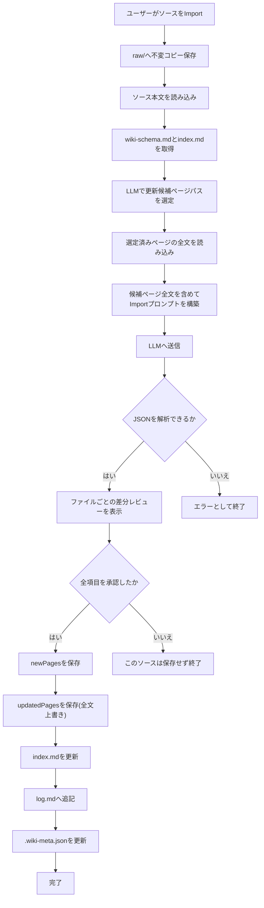

# Wiki機能

[< AI機能ドキュメントに戻る](ai-features-ja.md)

<a id="wiki-ja"></a>
## Wiki


Wiki タブでは、ソースファイルを LLM に取り込ませてプロジェクト専用のナレッジベースを自動構築できます。
以下のパスは特に注記がない限り `wiki/<domain>/` を基準にした相対パスです。

### ページカテゴリ

Import によって生成されるページは以下の4カテゴリに分類されます。LLM が Import 時に自動で分類します。

| カテゴリ | 格納場所 | 内容 |
|---|---|---|
| Wiki Files | `wiki/<domain>/` 直下 | `index.md`(ページ一覧) と `log.md`(操作ログ)。Import/Query/Lint 実行時にアプリが更新する管理ファイル |
| sources | `pages/sources/` | 取り込んだソースファイルごとの要約ページ。1ソース = 1ページ |
| entities | `pages/entities/` | プロジェクト上の具体的な「もの」のページ。テーブル定義・画面・API・帳票・ユーザーロールなど |
| concepts | `pages/concepts/` | 設計思想や業務ルールのページ。承認フロー・ワークフロー・技術方針・判断基準など |
| analysis | `pages/analysis/` | Query タブで「Save as Wiki Page」した Q&A や比較分析のページ |

entities と concepts の違いの目安: 「それは何か(名詞)」→ entities、「それはどう動くか・なぜそうなのか(動詞・方針)」→ concepts。


### Import (ソース取り込み)

「+ Import Source」をクリックするか、Wiki タブにドラッグ＆ドロップします。LLM は以下の変更案を生成します:

- `wiki/raw/` にソースを保存 (不変コピー)
- `pages/sources/` に要約ページを作成
- 関連する `pages/entities/` と `pages/concepts/` ページを作成・更新
- `index.md` / `log.md` の更新案を生成

対応形式: `.md` / `.txt` / `.pdf` / `.docx`
注:
- `.pdf` は Windows OCR で本文抽出して取り込みます (最大 20 ページ)。
- OCR エンジンが利用できない環境、または認識結果が得られない場合は抽出失敗メッセージを埋め込んで処理継続します。
- `.docx` の本文抽出は未対応のため、事前に `.md` / `.txt` へ変換してください。

保存前に、生成された各ページ変更は差分でレビューされます:
- 新規ページ: 空内容との差分
- 更新ページ: 現在ファイルとの差分

各項目を順番に承認します。1件でも Skip した場合は、そのソースの Import 結果は保存しません (all-or-nothing、index とページの不整合を防ぐため)。

#### Import時のLLM更新フロー



#### Import のプロンプト構成

Import の LLM 呼び出しは 2 段階です。
- 1回目: 更新候補になりそうな既存ページパスを選定
- 2回目: 選定したページの全文を渡して最終 Import 結果を生成

システムプロンプト:
- `wiki-schema.md` の全文 (LLM への運用指示書として機能)
- 出力言語の指定 (PC ロケールが日本語なら "Japanese"、それ以外は "English")
- レスポンス形式の指定: JSON のみ (コードフェンス不要)
- 各ページに YAML フロントマター (`title` / `created` / `updated` / `sources` / `tags`) を含めるよう指示
- `[[PageName]]` 形式のウィキリンクを使うよう指示
- 既存タグを優先し、類似タグの重複を避けるよう指示

ユーザープロンプトに含まれる情報:
- 現在の `index.md` の全文 (既存ページの一覧)
- 取り込むソースファイル名と本文全体
- 更新候補として選定された既存ページの全文 (既存ページのみ、最大 8 ページ)
- 既存 Wiki ページから収集したタグ語彙
- 作業指示: sources/ 要約ページの作成 / 既存ページの更新 / entities・concepts ページの新規作成 / index.md 更新差分 / log.md エントリの生成

1回目 (候補選定) のプロンプト:
- 入力: 既存ページパス一覧 + `index.md` 全文 + ソース本文
- 出力 JSON: `{"updateCandidates": ["pages/...md"]}` (既存ページのみ、最大 8 件)

LLM 応答のパース後、タグは揺れを減らすために正規化されます:
- lowercase + kebab-case 化
- 単複の簡易キー照合
- 既存タグ語彙に一致する場合は既存タグへ寄せる

LLM が返す JSON スキーマ:

```json
{
  "summary": "実行した内容の概要",
  "newPages": [{ "path": "pages/category/filename.md", "content": "Markdown全文" }],
  "updatedPages": [{ "path": "pages/category/filename.md", "diff": "更新後のMarkdown全文" }],
  "indexUpdate": "index.md の全文 (更新後)",
  "logEntry": "log.md に追記するエントリ"
}
```

updatedPages の `diff` フィールドはパッチではなく更新後の全文を返す仕様です。

### Query (Wiki への質問)

Wiki を参照しながら質問に回答します。蓄積された Wiki をそのまま渡すため、毎回ゼロから検索・合成する RAG とは異なります。

- 回答生成の前に、常に意味ベースで候補ページを選定します (最大 5 ページ)。
- 回答時に渡す本文は、選定済みページのみです (全ページは渡しません)。
- 候補選定が失敗した場合は、質問文とページのタイトル/パスのキーワード一致でフォールバックします。

「Save as Wiki Page」で回答を `pages/analysis/` に保存できます。


#### Query のプロンプト構成

`ChatCompletionAsync` を最大 2 回使います。

[1回目: 候補ページ選定] システムプロンプト:
- Wiki 検索アシスタントであること
- ファイルパスのみを 1 行ずつ返す指示

[1回目: 候補ページ選定] ユーザープロンプトに含まれる情報:
- 質問文
- `index.md` の全文

候補選定後の C# 側処理:
- 返却パスを正規化 (バッククォートや箇条書き記号を除去)
- 実在する wiki ページパスのみ採用
- 大文字小文字を無視して重複排除し、最大 5 件に制限
- 有効候補が 0 件なら、タイトル/パスと質問トークンの一致スコアでローカル選定

[2回目: 回答生成] システムプロンプト:
- Wiki の回答担当であることの宣言
- Wiki の内容のみを根拠に回答するよう指示
- 参照ページを `[[PageName]]` 形式で末尾に列挙するよう指示
- 出力言語の指定 (ロケール連動)
- `wiki-schema.md` の全文 (プロジェクト文脈)

[2回目: 回答生成] ユーザープロンプトに含まれる情報:
- 質問文
- `index.md` の全文
- 選定済み関連ページの全文 (最大 5 件)

<a id="lint-ja"></a>
### Lint

静的チェック (C# 側) と LLM チェックを組み合わせて Wiki の品質を検証します。

| チェック項目 | 内容 | 方法 |
|---|---|---|
| BrokenLink | 存在しないページへの `[[wikilink]]` | 静的 |
| Orphan | インバウンドリンクが 0 のページ (sources と管理ファイルは除外) | 静的 |
| MissingSource | `raw/` にないソース参照 (sources/ ページのフロントマターを確認) | 静的 |
| Stale | 30 日以上更新されていないページ (sources と管理ファイルは除外) | 静的 |
| Contradiction | 同一事実に対する矛盾した記述 | LLM |
| Missing | 複数ページで言及されているが未作成のトピック | LLM |

AI Features が無効の場合は静的チェックのみ実行されます。


#### Lint のプロンプト構成

LLM チェックは 1 回の `ChatCompletionAsync` です。

システムプロンプト (日本語ロケール時は日本語で送信):
- Wiki 品質監査担当であることの宣言
- チェック対象: 矛盾 (Contradiction) とページ不足 (Missing) の 2 項目
- レスポンス形式の厳密な指定:
  - `CONTRADICTION: [ページ1] vs [ページ2] — [説明]`
  - `MISSING: [トピック] — [ページ1]、[ページ2]... で言及`
  - 該当なしは `CONTRADICTION: none` / `MISSING: none`

ユーザープロンプトに含まれる情報:
- `index.md` の全文
- 全ページの 1 行要約一覧 (最大 80 件。トークン削減のためページ全文ではなく要約のみ)

LLM レスポンスは行ごとにパースして `CONTRADICTION:` / `MISSING:` プレフィックスで振り分けます。

