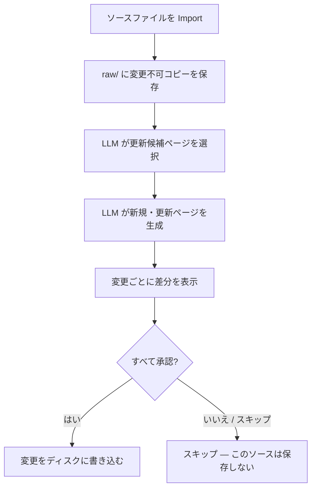

# Wiki 機能

[< AI 機能一覧に戻る](ai-features.md)

<a id="wiki"></a>
## Wiki

Wiki タブでは、ソースファイルを取り込みながら LLM がプロジェクト固有のナレッジベースを少しずつ構築・更新していきます。
特に断りのないパスは `wiki/<ドメイン名>/` からの相対パスです。

### ページカテゴリ

Import で生成されるページはカテゴリに分類されます。カテゴリは LLM が内容に基づいて自動的に割り当てます。

以下の 4 つは組み込みカテゴリで、削除できません:

| カテゴリ | 場所 | 内容 |
|---|---|---|
| Wiki ファイル | `wiki/<ドメイン名>/` 直下 | `index.md` (ページ一覧) と `log.md` (操作ログ)。Import/Query/Lint のたびに自動更新される管理ファイル |
| sources | `pages/sources/` | 取り込んだソースファイルごとの要約ページ |
| entities | `pages/entities/` | プロジェクト内の具体的な「もの」: テーブル、画面、API、帳票、ユーザーロールなど |
| concepts | `pages/concepts/` | 設計思想やビジネスルール: 承認フロー、ワークフロー、技術方針、判断基準など |
| analysis | `pages/analysis/` | Query タブで保存した Q&A ページや比較分析 |

判断の目安: 「それは何か (名詞)?」 → entities、「どう動くか・なぜそうなのか (動詞/方針)?」 → concepts。

カスタムカテゴリは Prompts タブから追加・削除できます。設定は wiki ドメインフォルダ内の `.wiki-categories.json` に保存されます。wiki ルートの `AGENTS.md` は現在のカテゴリ一覧が変わるたびに自動更新されます。


### Import (ソースを追加する)

"+ Import Source" をクリックするか、Wiki タブにファイルをドラッグ&ドロップします。

対応フォーマット: `.md` / `.txt` / `.pdf` / `.docx`
- `.pdf` は Windows OCR でテキストを抽出します (最大 20 ページ)。OCR が使用できない場合や認識結果がない場合は、抽出失敗の注記を付けて取り込みを続行します。
- `.docx` の本文テキスト抽出は未実装です。先に `.md` / `.txt` へ変換してください。

Import 中の処理の流れ:

1. ソースファイルを変更不可のコピーとして `wiki/raw/` に保存します。
2. LLM が更新が必要そうな既存ページを最大 8 件選択します。
3. 選択されたページの内容を踏まえて、LLM が sources/ 要約ページを生成し、関連する entities/ と concepts/ ページを新規作成または更新します。
4. `index.md` と `log.md` を変更内容に合わせて更新します。

保存前に、提案された変更はすべて差分表示されます (新規ページは空との差分、更新ページは現在のファイルとの差分)。1 件ずつ承認していきます。1 件でもスキップすると、そのソースの変更はすべて保存されません (インデックスとページの不整合を防ぐため、全件承認が必要です)。

#### Import の流れ



<details>
<summary>技術詳細: LLM 呼び出し</summary>

Import は LLM を 2 回呼び出します:
- 第 1 回 (候補選択): 既存ページのパス一覧・`index.md` 全文・ソース本文を入力とし、`{"updateCandidates": ["pages/...md"]}` 形式で最大 8 件の既存パスを返します。
- 第 2 回 (生成): ソース内容・`index.md`・選択ページの全文・既存タグ一覧を入力として、以下の JSON を生成します。

レスポンス受信後、タグは既存ウィキのタグ語彙を参照して正規化 (lowercase/kebab-case、単数形・複数形の統合) されます。

LLM レスポンスのスキーマ:

```json
{
  "summary": "実施内容の簡潔な説明",
  "newPages": [{ "path": "pages/category/filename.md", "content": "Markdown 全文" }],
  "updatedPages": [{ "path": "pages/category/filename.md", "diff": "更新後の Markdown 全文" }],
  "indexUpdate": "更新後の index.md 全文",
  "logEntry": "log.md に追記するエントリ"
}
```

各ページには YAML フロントマター (`title` / `created` / `updated` / `sources` / `tags`) が付き、相互参照には `[[ページ名]]` 形式のウィキリンクが使われます。

</details>

### Query (Wiki に質問する)

自然な言葉で質問すると、LLM が蓄積された wiki ページをもとに回答します。

- LLM はまず最も関連性の高いページを最大 5 件選択し、そのページの内容だけを使って回答を生成します (全 wiki 内容を読むわけではありません)。
- ページ選択に失敗した場合は、質問とタイトル/パスのキーワード一致でフォールバックします。
- "Save as Wiki Page" を押すと、回答を `pages/analysis/` に保存できます。


<details>
<summary>技術詳細: LLM 呼び出し</summary>

Query は LLM を最大 2 回呼び出します:
- 第 1 回 (候補選択): ファイルパスを 1 行ずつ返します。正規化・重複排除 (大文字小文字を区別しない) 後、最大 5 件に絞ります。有効なパスが残らない場合は、質問に対するトークン重複スコアでローカルフォールバックします。
- 第 2 回 (回答生成): 選択ページの全文を読み込み、提供された wiki 内容のみをもとに回答するよう指示されます。回答末尾には参照ページが `[[ページ名]]` 形式で列挙されます。

</details>

<a id="lint"></a>
### Lint

静的チェックと LLM 分析を組み合わせて wiki の品質を検証します。

| チェック項目 | 内容 | 方式 |
|---|---|---|
| BrokenLink | 存在しないページへの `[[ウィキリンク]]` | 静的 |
| Orphan | 他ページからのリンクがないページ (sources と管理ファイルは除外) | 静的 |
| MissingSource | `raw/` に存在しないソース参照 (sources/ ページのフロントマターを確認) | 静的 |
| Stale | 30 日以上更新がないページ (sources と管理ファイルは除外) | 静的 |
| Contradiction | 複数ページ間で同じ事実について記述が矛盾している | LLM |
| Missing | 3 ページ以上で言及されているが専用ページがないトピック | LLM |

AI 機能が無効の場合は静的チェックのみ実行されます。


<details>
<summary>技術詳細: LLM 呼び出し</summary>

LLM チェックは 1 回の呼び出しで行われます。トークン削減のため、プロンプトには各ページの全文ではなく 1 行の要約を渡します (最大 80 ページ)。LLM は以下の厳格な形式で応答します:
- `CONTRADICTION: [ページ1] vs [ページ2] — [説明]`
- `MISSING: [トピック] — mentioned in [ページ1], [ページ2]...`
- 何も見つからない場合は `CONTRADICTION: none` / `MISSING: none`

</details>

### Prompts (プロンプトのカスタマイズ)

Prompts タブでは、Import・Query・Lint それぞれの組み込みシステムプロンプトを、置き換えることなく拡張できます。

各操作に対して次の 2 フィールドを設定できます:

| フィールド | 効果 |
|---|---|
| System Prefix | 組み込みシステムプロンプトの前に追加 |
| System Suffix | 組み込みシステムプロンプトの後に追加 |

2 つのフィールドの間には組み込みプロンプトが読み取り専用で表示されるため、最終的な構成を確認できます。

カスタムプロンプトの設定は wiki ドメインフォルダ内の `.wiki-prompts.json` に保存されます。"Reset to Defaults" をクリックすると Prefix と Suffix フィールドがすべてクリアされます (組み込みプロンプト自体は変更されません)。

`wiki-schema.md` ファイルもこのタブから直接編集できます。変更は次の Import または Query 実行時に反映されます。未保存の変更がある場合は "Save Schema" ボタンの横にドットが表示されます。

カテゴリ管理もこのタブから行えます。カスタムカテゴリの追加や、デフォルト以外のカテゴリの削除が可能です。組み込みの 4 カテゴリ (sources, entities, concepts, analysis) は削除できません。
