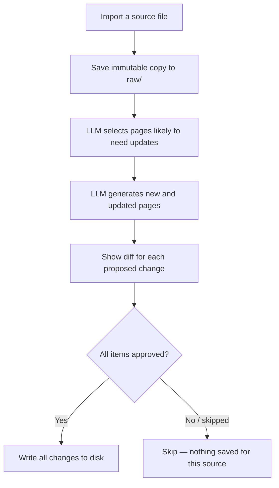

# Wiki Features

[< Back to AI Features](ai-features.md)

<a id="wiki"></a>
## Wiki

The Wiki tab lets the LLM incrementally build and maintain a project-specific knowledge base from your source files.
Unless otherwise noted, paths below are relative to `wiki/<domain>/`.

### Page Categories

Pages generated during Import are organized into categories. The LLM assigns categories automatically based on content.

Four categories are built in and cannot be removed:

| Category | Location | Contents |
|---|---|---|
| Wiki Files | `wiki/<domain>/` root | `index.md` (page list) and `log.md` (operation log). Updated automatically during Import/Query/Lint |
| sources | `pages/sources/` | One summary page per imported source file |
| entities | `pages/entities/` | Concrete "things" in the project: tables, screens, APIs, reports, user roles, etc. |
| concepts | `pages/concepts/` | Design philosophy and business rules: approval flows, workflows, technical policies, decision criteria, etc. |
| analysis | `pages/analysis/` | Q&A pages and comparative analyses saved from the Query tab |

Rule of thumb: "What is it (noun)?" → entities; "How does it work or why is it so (verb/policy)?" → concepts.

Custom categories can be added or removed from the Prompts tab. Settings are stored in `.wiki-categories.json` inside the wiki domain folder. The `AGENTS.md` file in the wiki root is automatically updated to reflect the current category list.


### Import (Add a Source)

Click "+ Import Source" or drag and drop a file onto the Wiki tab.

Supported formats: `.md` / `.txt` / `.pdf` / `.docx`.
- `.pdf` is ingested with Windows OCR text extraction (up to 20 pages). If OCR is unavailable or no text is recognized, ingestion continues with an extraction-failure note.
- `.docx` body text extraction is not implemented yet; convert to `.md` / `.txt` first.

What happens during Import:

1. The source file is saved as an immutable copy under `wiki/raw/`.
2. The LLM selects existing pages likely to need updates (up to 8).
3. Using those pages as context, the LLM generates a sources/ summary page and creates or updates related entities/ and concepts/ pages.
4. `index.md` and `log.md` are updated to reflect the changes.

Before saving, each proposed page change is shown as a diff for your review — new pages are diffed against empty content, updated pages against the current file. You approve items one by one. If you skip any item, nothing is saved for that source (all-or-nothing) to keep the index consistent.

#### Import Flow



<details>
<summary>Technical: LLM call details</summary>

Import uses 2 LLM calls:
- Call 1 (candidate selection): input is the existing page path list, full `index.md`, and source body; output is `{"updateCandidates": ["pages/...md"]}` (existing paths only, max 8).
- Call 2 (generation): input is source content, `index.md`, full content of selected pages, and existing tag vocabulary; output is the JSON below.

After parsing, tags are normalized (lowercase/kebab-case, singular/plural matching) and reused from the existing wiki tag vocabulary.

LLM response schema:

```json
{
  "summary": "brief description of what was done",
  "newPages": [{ "path": "pages/category/filename.md", "content": "full Markdown" }],
  "updatedPages": [{ "path": "pages/category/filename.md", "diff": "full updated Markdown" }],
  "indexUpdate": "full updated index.md content",
  "logEntry": "log.md entry to append"
}
```

Each page includes YAML frontmatter (`title` / `created` / `updated` / `sources` / `tags`) and uses `[[PageName]]` wikilink format for cross-references.

</details>

### Query (Ask the Wiki)

Ask questions in plain language and the LLM answers using the accumulated wiki pages.

- The LLM first selects the most relevant pages (up to 5), then generates an answer based only on those pages — not all wiki content.
- If page selection fails, a keyword fallback picks pages whose title/path best matches the question.
- Use "Save as Wiki Page" to save the answer to `pages/analysis/`.


<details>
<summary>Technical: LLM call details</summary>

Query uses up to 2 LLM calls:
- Call 1 (candidate selection): returns file paths one per line; paths are normalized, deduplicated (case-insensitive), and capped at 5. If no valid paths remain, a local fallback scores pages by token overlap against the question.
- Call 2 (answer generation): reads full content of selected pages; instructed to answer based only on provided wiki content and list referenced pages in `[[PageName]]` format at the end.

</details>

<a id="lint"></a>
### Lint

Combines static checks and LLM analysis to validate wiki quality.

| Check | Description | Method |
|---|---|---|
| BrokenLink | `[[wikilink]]` pointing to a non-existent page | Static |
| Orphan | Page with no inbound links (sources and management files excluded) | Static |
| MissingSource | Source reference not found in `raw/` (checks frontmatter of sources/ pages) | Static |
| Stale | Page not updated in 30+ days (sources and management files excluded) | Static |
| Contradiction | Conflicting descriptions of the same fact across pages | LLM |
| Missing | Topic mentioned in 3+ pages but with no dedicated page | LLM |

When AI Features is disabled, only static checks are run.


<details>
<summary>Technical: LLM call details</summary>

The LLM check is a single call. To reduce token usage, the prompt receives a one-line summary of each page (up to 80 pages) rather than full content. The LLM responds in a strict line-by-line format:
- `CONTRADICTION: [page1] vs [page2] — [description]`
- `MISSING: [topic] — mentioned in [page1], [page2]...`
- `CONTRADICTION: none` / `MISSING: none` when nothing is found

</details>

### Prompts (Prompt Customization)

The Prompts tab lets you extend the built-in system prompts for Import, Query, and Lint without replacing them entirely.

For each operation you can set:

| Field | Effect |
|---|---|
| System Prefix | Prepended before the built-in system prompt |
| System Suffix | Appended after the built-in system prompt |

The default system prompt for each operation is displayed between the two fields as read-only text, so you can see the full composed prompt at a glance.

Custom prompt settings are stored in `.wiki-prompts.json` inside the wiki domain folder. Click "Reset to Defaults" to clear all Prefix and Suffix fields (the built-in prompts themselves are not affected).

The `wiki-schema.md` file can also be edited directly from this tab. Changes take effect on the next Import or Query. A dot indicator appears next to "Save Schema" when there are unsaved changes.

Category management is also accessible from this tab: add custom categories or remove non-default ones. The four built-in categories (sources, entities, concepts, analysis) cannot be deleted.
