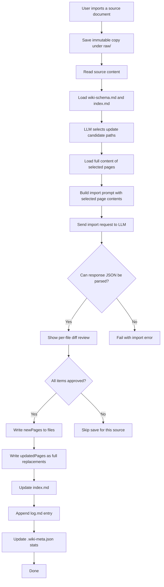

# Wiki Features

[< Back to AI Features](ai-features.md)

<a id="wiki"></a>
## Wiki


The Wiki tab lets the LLM incrementally build and maintain a project-specific knowledge base from your source files.
Unless otherwise noted, paths below are relative to `wiki/<domain>/`.

### Page Categories

Pages generated during Import are organized into four categories. The LLM assigns categories automatically.

| Category | Location | Contents |
|---|---|---|
| Wiki Files | `wiki/<domain>/` root | `index.md` (page list) and `log.md` (operation log). Management files updated by the app during Import/Query/Lint |
| sources | `pages/sources/` | One summary page per imported source file |
| entities | `pages/entities/` | Concrete "things" in the project: tables, screens, APIs, reports, user roles, etc. |
| concepts | `pages/concepts/` | Design philosophy and business rules: approval flows, workflows, technical policies, decision criteria, etc. |
| analysis | `pages/analysis/` | Q&A pages and comparative analyses saved from the Query tab |

A helpful rule of thumb: "What is it (noun)?" → entities; "How does it work or why is it so (verb/policy)?" → concepts.


### Import (Add a Source)

Click "+ Import Source" or drag and drop a file onto the Wiki tab. The LLM prepares:

- Saves the source to `wiki/raw/` (immutable copy)
- Creates a summary page in `pages/sources/`
- Creates or updates related `pages/entities/` and `pages/concepts/` pages
- Proposed updates for `index.md` and `log.md`

Supported formats: `.md` / `.txt` / `.pdf` / `.docx`.
Notes:
- `.pdf` is ingested with Windows OCR text extraction (up to 20 pages).
- If the OCR engine is unavailable or no text is recognized, ingestion continues with an extraction-failure note.
- `.docx` body text extraction is not implemented yet; convert to `.md` / `.txt` first.

Before saving, each proposed page change is shown as a diff:
- New pages: diff against empty content
- Updated pages: diff against the current file

You approve each item in sequence. If you skip any item, the import result is not saved for that source file (all-or-nothing) to avoid index/page mismatch.

#### LLM Update Flow During Import



#### Import Prompt Structure

Import now uses 2 LLM calls:
- Call 1: select existing page paths likely to need updates
- Call 2: generate final import output using full content of those selected pages

System prompt:
- Full text of `wiki-schema.md` (acts as the LLM's operating instructions for the wiki)
- Output language directive (Japanese if PC locale is Japanese, otherwise English)
- Response format directive: JSON only (no code fences)
- Instruction to include YAML frontmatter (`title` / `created` / `updated` / `sources` / `tags`) in each page
- Instruction to use `[[PageName]]` wikilink format for cross-references
- Instruction to reuse existing tags and avoid near-duplicate variants

User prompt includes:
- Full text of the current `index.md` (list of existing pages)
- Source file name and full body text
- Full content of selected update-candidate pages (existing pages only, max 8 pages)
- Existing tag vocabulary collected from current wiki pages
- Instructions: create a sources/ summary page, update existing pages with full content, create new entity/concept pages, generate the full updated index.md, generate a log.md entry

Call 1 (candidate selection) prompt:
- Input: existing page path list + full `index.md` + source body
- Output JSON: `{"updateCandidates": ["pages/...md"]}` (existing pages only, max 8)

After LLM response parsing, tags are normalized to reduce drift:
- lowercase/kebab-case normalization
- simple singular/plural key matching
- reuse of existing wiki tag vocabulary when keys match

LLM response JSON schema:

```json
{
  "summary": "brief description of what was done",
  "newPages": [{ "path": "pages/category/filename.md", "content": "full Markdown" }],
  "updatedPages": [{ "path": "pages/category/filename.md", "diff": "full updated Markdown" }],
  "indexUpdate": "full updated index.md content",
  "logEntry": "log.md entry to append"
}
```

The `diff` field in `updatedPages` returns the full updated content (not a patch).

### Query (Ask the Wiki)

Answers questions by reading the accumulated Wiki. Unlike RAG, pages are passed directly to the LLM rather than being searched and re-synthesized on every call.

- Candidate pages are always selected semantically before answer generation (max 5 pages).
- The answer call reads only those selected pages, not all pages.
- If selection fails, a keyword fallback picks pages whose title/path best match the question.

Use "Save as Wiki Page" to save the answer to `pages/analysis/`.


#### Query Prompt Structure

Query uses up to 2 `ChatCompletionAsync` calls.

[Call 1: candidate selection] System prompt:
- Declaration that the model is the wiki search assistant
- Instruction to return file paths only, one per line

[Call 1: candidate selection] User prompt includes:
- The question
- Full text of `index.md`

Selection post-processing in C#:
- Normalize each returned path (trim markdown markers and list symbols)
- Keep existing wiki page paths only
- Deduplicate (case-insensitive) and cap at 5 pages
- If no valid path remains, run local fallback scoring (token overlap against page title/path)

[Call 2: answer generation] System prompt:
- Declaration that the model is the wiki answer assistant
- Instruction to answer based ONLY on the provided wiki content
- Instruction to list referenced pages in `[[PageName]]` format at the end
- Output language directive (locale-based)
- Full text of `wiki-schema.md` (project context)

[Call 2: answer generation] User prompt includes:
- The question
- Full text of `index.md`
- Full contents of selected relevant pages (up to 5)

<a id="lint"></a>
### Lint

Combines static checks (C#) and LLM analysis to validate Wiki quality.

| Check | Description | Method |
|---|---|---|
| BrokenLink | `[[wikilink]]` pointing to a non-existent page | Static |
| Orphan | Page with no inbound links (sources and management files excluded) | Static |
| MissingSource | Source reference not found in `raw/` (checks frontmatter of sources/ pages) | Static |
| Stale | Page not updated in 30+ days (sources and management files excluded) | Static |
| Contradiction | Conflicting descriptions of the same fact across pages | LLM |
| Missing | Topic mentioned in 3+ pages but with no dedicated page | LLM |

When AI Features is disabled, only static checks are run.


#### Lint Prompt Structure

The LLM check is a single `ChatCompletionAsync` call.

System prompt (sent in Japanese when locale is Japanese):
- Declaration that the model is the wiki quality auditor
- Scope: Contradiction and Missing checks only
- Strict response format:
  - `CONTRADICTION: [page1] vs [page2] — [description]`
  - `MISSING: [topic] — mentioned in [page1], [page2]...`
  - Use `CONTRADICTION: none` / `MISSING: none` when nothing is found

User prompt includes:
- Full text of `index.md`
- One-line summary of each page (up to 80 pages; summaries rather than full content to reduce token usage)

The LLM response is parsed line by line and dispatched by `CONTRADICTION:` / `MISSING:` prefix.

